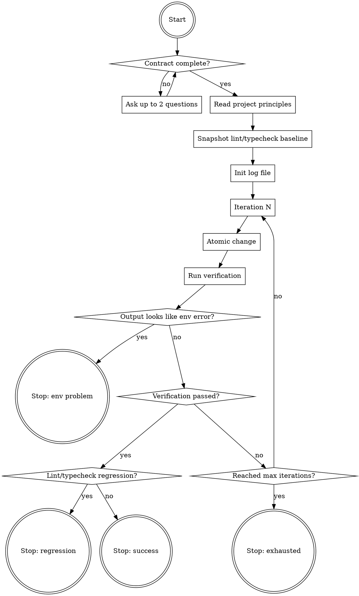

# Iterate — Autonomous Convergence Until Verification Passes

## Overview

Disciplined loop that iterates on code until a verification command passes. Different from `/loop` (which is recurring on a timer) and `systematic-debugging` (which is heavy investigation of one bug). This is a fast convergence loop — small atomic changes, verified after each one, capped, logged, respecting project principles.

The contract is **hard**: Pedro provides (1) a verifiable result and (2) a means to verify it. Without both, the skill refuses to run.

## Flow



## Process

### 1. Validate Contract (Hard Gate)

The skill needs **two items** before running:

1. **Verifiable result** — what behavior/output is expected, in plain text
2. **Means to verify** — a command or sequence Claude can execute that produces a binary pass/fail signal without human interpretation

**Accepted verification types:**

| Type | Examples |
|------|----------|
| **(a) Single deterministic command** | `npm test foo.spec`, `pytest tests/x.py`, `curl -s localhost/api/x \| jq -e '.status == "ok"'` |
| **(b) Sequence of commands** | start server → wait for ready → request → assert → tear down |
| **(c) Browser automation** | Playwright (`mcp__plugin_playwright_playwright__*`), computer-use |
| **(d) Assertion over generated file** | "after running X, file Y must contain Z" |

**Rejected — refuse the contract:**

- **LLM-as-judge** (another model judges if output is "good") — subjective, violates Pedro's "Entrega 100% ou Para e Conversa"
- **Human inspection** ("I'll look and tell you") — breaks autonomous mode

**If invocation is missing one or both items**, use `AskUserQuestion` with **at most 2 questions** (one for the goal, one for the verification command). Do not ask more.

**If Pedro replies "I don't have a way to verify"**, respond exactly: `Contrato quebrado — sem meios de verificação binária, /iterate não roda. Volte quando tiver um comando que dá pass/fail inequívoco.` Then stop.

### 2. Read Project Principles (Once, Up Front)

Before iteration 1, read all of the following that exist **locally** in the project:

- **CLAUDE.md** (root and any subdir relevant to the goal)
- **MEMORY.md** (project auto-memory)
- **AGENTS.md**
- **GEMINI.md**

Do **not** re-read the global `~/.claude/CLAUDE.md` — it's already in the system prompt.

Extract **3–7 principles applicable to the goal** and write them as bullets in the log file's `## Principles` section. These are the rails the loop runs on.

**Ambiguity rule:** if a principle is ambiguous (e.g. "respect accessibility" doesn't say if `aria-label` is mandatory), pause and ask Pedro before proceeding. Don't interpret silently.

**Violation rule:** if a proposed change would violate a listed principle, **stop and ask** before applying. Never silence the violation.

### 3. Snapshot Lint/Typecheck Baseline

Detect lint and typecheck tools (same detection as the `ship` skill):

| Look for | Tool |
|----------|------|
| **eslint.config.\***, **.eslintrc.\*** | ESLint |
| **biome.json** | Biome |
| **tsconfig.json** | tsc |
| **pyproject.toml** (ruff/mypy/pyright) | ruff, mypy, pyright |

Run lint + typecheck **once before iteration 1** and store the error count as `baseline_errors`. This is the threshold for regression detection in step 6.

**If the project has no lint/typecheck**, log a warning in the contract section: `WARNING: project has no lint/typecheck — structural regressions will not be detected between iterations.` Continue, but Pedro is on notice.

### 4. Init Log File

Create the log directory and file:

- **Path:** `./.claude/iterate/<ISO-timestamp>.md` (timestamp like `2026-05-06T21-53-00`)
- **Index:** `./.claude/iterate/INDEX.md` listing the last 10 sessions (newest first), one line each: `- [<timestamp>](./<timestamp>.md) — <goal one-liner> — <outcome>`
- **Gitignore:** if `./.claude/iterate/` is not yet in `.gitignore`, add it and tell Pedro: `Adicionei .claude/iterate/ ao .gitignore.`

**File format:**

```markdown
# Iteration session — <timestamp>

## Contract
- Goal: <text>
- Verification: <command>
- Max iterations: <N>
- Lint/typecheck baseline: <error count or "none configured">

## Principles (from CLAUDE.md/MEMORY.md/AGENTS.md/GEMINI.md)
- <bullet>
- <bullet>

## Iteration 1
- Change: <one-line description + files touched>
- Verification output: <stdout/stderr trimmed + exit code>
- Result: PASS | FAIL | AMBIGUOUS

## Iteration 2
...

## Outcome
SUCCESS at iteration N | EXHAUSTED after N | STOPPED (reason)
```

### 5. The Iteration Loop

Default `max=5`. Configurable via `--max=N` in invocation.

For each iteration up to max:

1. **Make ONE atomic change** — single file/region/hypothesis. **Batch is forbidden** — it hides causality. If you find yourself wanting to change three things, pick the most likely one and save the others for next iteration.

2. **Run the verification command** exactly as Pedro provided. Capture stdout, stderr, exit code.

3. **Classify the verification output** (see step 6 below).

4. **Append iteration block to log file** before deciding next action — log first, then act.

**No formal hypothesis required.** Use intuition. The persistent log is the safeguard against repeating the same failed attempt — before each iteration, scan previous iterations in the current log and avoid duplicating a change that already failed.

### 6. Classify Verification Output

After each verification, classify the output into one of four buckets:

**ENV PROBLEM → Stop, do not spend an iteration:**

If stderr/stdout contains any of these patterns, the failure is environmental, not code:

- `EADDRINUSE`, `address already in use`
- `ECONNREFUSED`, `connection refused`
- `ENOENT`, `no such file or directory` (when referring to system tools, not project files)
- `command not found`
- `Module not found`, `ModuleNotFoundError`, `Cannot find module`
- `permission denied`, `EACCES`
- DNS resolution failures, `getaddrinfo`
- Docker daemon not running, `Cannot connect to the Docker daemon`

**Action:** stop the loop. Log `Outcome: STOPPED (env: <pattern>)`. Report to Pedro: what looks broken in the environment, not the code. Do not try to fix code.

**REGRESSION → Stop:**

If verification passed (exit 0) BUT lint or typecheck now reports more errors than `baseline_errors`, the iteration introduced a regression.

**Action:** stop the loop. Log `Outcome: STOPPED (regression: <delta> new lint/typecheck errors)`. Report the new errors to Pedro. Do not declare success.

**SUCCESS:**

Verification passed AND no regression. Log `Outcome: SUCCESS at iteration N`. Trust the verification — do not re-run. If the verification was wrong, that's a contract problem, not the skill's problem.

**FAIL:**

Verification failed (non-zero exit) and no env pattern matched. Continue to next iteration.

### 7. Stop Conditions

The loop stops in exactly five ways:

| Reason | What happens to code |
|--------|---------------------|
| **SUCCESS** | Code stays at current state, log marked SUCCESS |
| **EXHAUSTED** (hit max iterations) | Code stays at last state (no rollback). Log marked EXHAUSTED. Report iteration history to Pedro. |
| **STOPPED (env problem)** | Code stays at current state. Report environmental issue. |
| **STOPPED (regression)** | Code stays at current state. Report new lint/typecheck errors. |
| **STOPPED (principle violation)** | Pause before applying the offending change, ask Pedro how to proceed. |

**Never:**
- Roll back automatically — destroys work that may be 80% right
- Ask "want me to continue?" mid-loop — autonomous means autonomous
- Silently apply a change that violates a listed principle

## Invocation Forms

```
/iterate goal="<text>" verify="<command>"
/iterate goal="<text>" verify="<command>" --max=10
/iterate <free text — Claude extracts goal and verify, asks if ambiguous>
/iterate
```

The last two trigger the AskUserQuestion fallback (max 2 questions) if the contract isn't complete.

## Stand-Alone

This skill does **not** invoke other skills internally. Specifically:

- It does **not** call `verification-before-completion` — verification at every iteration IS that check
- It does **not** call `systematic-debugging` — that's a heavy workflow for one deep bug, not a fast tentative loop
- It does **not** call `test-driven-development` — TDD writes tests then code; here, Pedro provides the verification (which may be a test) up front

If a deep investigation is needed mid-loop, that's a signal to stop and let Pedro decide whether to switch to `systematic-debugging` manually.

## When NOT to Use

- **No verifiable result** — if the goal is "make the UI prettier" with no objective check, the contract is broken. Don't run.
- **No means to verify** — same. Refuse the contract, do not improvise.
- **Single-shot deterministic fix** — if you already know exactly what to change, just do it. Don't wrap a 1-iteration "loop" around it.
- **Investigation phase** — if Pedro is exploring/learning the code, not converging on a behavior, this skill doesn't fit. Try `systematic-debugging` or just plain code reading.
- **Recurring task on a timer** — that's `/loop`, not `/iterate`.

## Safety Rules

- **Never declare success without running the verification command** in the current iteration
- **Never batch changes** in a single iteration — atomicity is the discipline
- **Never silence a principle violation** — pause and ask
- **Never roll back automatically** at exhaustion — Pedro decides what to do with the partial state
- **Never spend an iteration on an environment problem** — detect, stop, report
