# Princípios de Sistemas Robustos e Confiáveis

> [!info] Sobre este documento
> Consolidação de duas listas (uma ampla cobrindo design/ops/segurança + uma profunda em sistemas distribuídos) com gaps identificados em ambas. Para cada princípio você encontra o contexto onde ele importa, o mecanismo em si, e a consequência prática de ignorá-lo.
> Pensado como mapa de consulta por contexto — não é leitura linear. Volte aqui quando o problema na sua frente lembrar uma das categorias.

## Sumário

1. [[#1 · Garantias transacionais (ACID e extensões)]]
2. [[#2 · Idempotência e semântica de entrega]]
3. [[#3 · Concorrência, locking e ordering]]
4. [[#4 · Tolerância a falha e resiliência]]
5. [[#5 · Sistemas distribuídos]]
6. [[#6 · Estado e dados]]
7. [[#7 · Evolução e mudança]]
8. [[#8 · Observabilidade]]
9. [[#9 · Segurança e governança]]
10. [[#10 · Design de software]]
11. [[#11 · Escala]]
12. [[#12 · Resiliência de rede e service discovery]]
13. [[#13 · Gerenciamento de dependências e supply chain]]
14. [[#14 · Concorrência na camada de aplicação]]
15. [[#15 · Testes como garantia de sistema]]
16. [[#16 · Data lifecycle e compliance]]
17. [[#17 · Operações e resposta a incidentes]]
18. [[#18 · API design patterns]]
19. [[#19 · Infraestrutura como código]]
20. [[#TL;DR — Top 26 pra decorar]]
21. [[#Gaps que escapam de listas comuns]]
22. [[#Referências]]

---

## 1 · Garantias transacionais (ACID e extensões)

> [!abstract] Resumo da categoria
> ACID nasceu nos anos 80 descrevendo o que um banco de dados relacional precisa garantir pra ser confiável: que operações ou acontecem por inteiro ou nem começam, que regras de negócio não são violadas, que execuções concorrentes não se contaminam, e que o que foi confirmado fica confirmado. Quase quarenta anos depois isso ainda é a fundação. Em sistemas distribuídos você ganha um vocabulário adicional — linearizability, serializability, garantias de sessão — que permite negociar trade-offs com precisão em vez de prometer "consistência" como se fosse uma coisa única.

### Atomicidade

A ideia de atomicidade é antiga e brutal: uma operação acontece por inteiro ou não acontece. Não existe estado intermediário visível para o resto do sistema. Pense em uma transferência bancária — debitar da conta A e creditar na conta B precisam ser uma coisa só. Se o sistema crashar entre os dois passos, o estado correto é "nada aconteceu", não "A perdeu dinheiro que ninguém recebeu".

O mecanismo clássico é o write-ahead log: o banco escreve a intenção da mudança antes de aplicá-la, e usa esse log pra recuperar estado consistente após crash. Sem atomicidade você não tem invariantes confiáveis, porque qualquer leitura pode pegar um estado pela metade. Pior, o estado parcial costuma ser invisível por horas até alguém perceber que os saldos não batem — e aí a contaminação já está distribuída por relatórios, caches, dashboards.

### Consistência

Consistência no sentido ACID é diferente do que a sigla CAP usa, e essa confusão derruba muita conversa. Aqui consistência significa: depois que a transação termina, as invariantes do banco continuam válidas. Saldo nunca fica negativo. Foreign keys apontam pra registros que existem. Um contador agregado bate com a soma dos itens individuais.

O ponto sutil é que a consistência é uma propriedade do **modelo**, não do banco em si. O banco te dá ferramentas (constraints, triggers, transações), mas a invariante quem define é você. Se você modelou "saldo nunca pode ficar negativo" como uma regra implícita no código da aplicação em vez de uma constraint no banco, você não tem consistência — tem uma esperança bem fundamentada.

### Isolamento

Quando duas transações rodam ao mesmo tempo, o que uma vê da outra? Essa é a pergunta que isolamento responde. SQL define quatro níveis padrão e a diferença entre eles é qual tipo de anomalia cada um permite:

| Nível | Anomalias permitidas |
|---|---|
| Read uncommitted | dirty read, non-repeatable read, phantom |
| Read committed | non-repeatable read, phantom |
| Repeatable read | phantom |
| Serializable | nenhuma |

Vale conhecer o default do seu banco. Postgres usa `read committed` por padrão, o que significa que dentro de uma transação você pode ler o mesmo registro duas vezes e receber valores diferentes (porque outra transação commitou entre uma leitura e outra). Pra muito caso isso é aceitável; pra contadores e agregações concorrentes é desastre. O nível mais alto (`serializable`) elimina anomalias mas paga em throughput porque o banco precisa abortar transações que conflitam.

### Durabilidade

"Salvei" só conta como salvo quando sobrevive a uma queda de energia. Isso é durabilidade, e o mecanismo central é o `fsync` — forçar o sistema operacional a empurrar bytes pra o disco físico em vez de manter em cache. O custo é alto (milissegundos por chamada) e por isso bancos modernos batalham otimizações: agrupar fsyncs (group commit), usar SSDs com supercapacitor, ou replicar pra outra máquina antes de confirmar (quorum write).

A consequência de pular durabilidade pra ganhar performance é uma armadilha clássica: o sistema parece rápido até o primeiro crash, quando você descobre que perdeu as últimas N transações. MongoDB nos primeiros anos era famoso por isso — o default era "fire and forget", e equipes descobriam tarde que perderam pedidos.

### Linearizability

Linearizability é a garantia mais forte que existe em sistema distribuído: as operações parecem ter acontecido em uma ordem global única e instantânea, como se houvesse apenas uma máquina servindo tudo. Se a operação X termina antes da operação Y começar, Y enxerga o efeito de X. Sempre.

Isso é caríssimo de implementar porque exige coordenação entre nós em quase toda operação. Spanner, do Google, consegue com TrueTime (relógios atômicos sincronizados em cada datacenter). A maioria dos sistemas distribuídos não promete linearizability porque o custo em latência inviabiliza o produto.

### Serializability

Serializability é mais fraco: o resultado final equivale a *alguma* ordem sequencial das transações, mas não necessariamente a ordem real do tempo. O banco pode reordenar internamente pra ganhar throughput, desde que o efeito visível seja como se elas tivessem rodado uma após a outra.

Pra maioria dos sistemas transacionais isso é suficiente. Você não precisa que "transação que começou antes seja vista como antes" — só precisa que o resultado seja consistente com alguma ordem.

### Read-your-writes e monotonic reads

Essas são garantias de **sessão**, não do sistema inteiro. Read-your-writes diz: depois que eu escrevi algo, qualquer leitura minha vê o que escrevi. Monotonic reads diz: minhas leituras nunca andam pra trás no tempo.

Parecem óbvias mas são exatamente o que quebra em arquitetura read-replica. Você escreve no primário, faz refresh da página, e a leitura cai numa réplica que ainda não recebeu a replicação. Resultado: o usuário escreve, recarrega, e o dado sumiu. Sticky sessions (rotear leituras do mesmo usuário pro mesmo nó) ou roteamento explícito de leituras críticas pro primário são as defesas comuns.

---

## 2 · Idempotência e semântica de entrega

> [!abstract] Resumo da categoria
> Em qualquer sistema que faz I/O com a rede, mensagens vão duplicar, atrasar, sumir e chegar fora de ordem. Não é "se", é "quando". O sistema robusto não é o que evita isso (não dá), é o que absorve. Idempotência é o tijolo central dessa absorção — quase tudo mais nesta categoria é variação dela.

### Idempotência

Idempotência é a propriedade de uma operação produzir o mesmo resultado final independente de quantas vezes você executa. Apertar o botão do elevador 1 vez ou 17 chama o elevador exatamente uma vez — esse é o exemplo canônico. Em sistemas, o que viabiliza retry seguro.

Por que isso importa tanto? Porque retry é inevitável. Cliente faz request, servidor processa, mas a resposta se perde na rede. Cliente não sabe se deu certo, retenta. Sem idempotência, o servidor processa duas vezes — cobra duas vezes, cria pedido duplicado, envia email duplicado. Com idempotência, o segundo request é absorvido sem efeito.

Implementar idempotência geralmente significa: identificar a operação com uma chave única (vinda do cliente), guardar a chave em um store de "já vistas", e na chegada de uma chave repetida retornar a resposta original sem executar de novo. O Stripe popularizou isso com o header `Idempotency-Key`.

### Reentrância

Reentrância é primo da idempotência mas resolve um problema diferente: e se a operação for **interrompida no meio**? Você não está retentando uma chamada que terminou — você está retomando uma chamada que crashou no passo 3 de 5.

Isso é o pão e manteiga de workers e jobs longos. Worker pega job da fila, processa metade, container morre, outro worker pega o mesmo job. Pra isso funcionar sem corromper estado, cada passo precisa ser idempotente em isolamento, ou o job precisa rastrear progresso (passo 3 de 5 está feito) de forma persistente.

### Determinismo

Mesma entrada, mesmo estado, mesmo resultado. Soa óbvio, mas é violado o tempo todo: função que usa `Date.now()`, que faz random, que lê arquivo de config global, que depende da ordem de uma `Map` não-ordenada.

Determinismo é a propriedade que viabiliza cache (resultado vai ser igual da próxima vez), replay (reprocessar input antigo chega no mesmo lugar), teste (a assertion vai bater em qualquer máquina) e debug (você consegue reproduzir o bug). Quando você sacrifica determinismo, você sacrifica todas essas coisas — geralmente sem perceber.

### Semântica de entrega

Quando uma mensagem viaja entre serviços, três comportamentos possíveis:

| Semântica | Garantia | Trade-off |
|---|---|---|
| At-most-once | nunca duplica | pode perder |
| At-least-once | nunca perde | pode duplicar |
| Exactly-once (efeito) | nem perde nem duplica | exige idempotência no consumidor |

Exactly-once *puro* — entregue exatamente uma vez, processado exatamente uma vez, sem coordenação entre lados — é matematicamente impossível em sistema distribuído com falhas. O Two Generals Problem provou isso nos anos 70 e ninguém escapou de lá.

Na prática você escolhe at-least-once (sistema entrega múltiplas vezes se precisar pra não perder) e constrói idempotência do lado consumidor pra absorver as duplicatas. O efeito agregado é exactly-once mesmo a entrega não sendo.

### Retry seguro

Retry parece simples — chama de novo se falhou — mas tem armadilhas. Primeiro: precisa ser idempotente, ou você multiplica efeito. Segundo: precisa de backoff exponencial, ou você martela o serviço que já está sofrendo. Terceiro, e o mais ignorado: precisa de **jitter**, ruído aleatório no intervalo.

```python
delay = base * (2 ** attempt) + random.uniform(0, jitter_max)
```

> [!danger] Sem jitter
> Imagine que o serviço cai e mil clientes começam a retentar. Sem jitter, todos esperam exatamente 1s, depois 2s, depois 4s — sincronizados. No momento que o serviço volta, leva mil requests simultâneos na cara e cai de novo. Isso se chama **thundering herd** e já derrubou sistemas grandes (incluindo um incidente famoso da AWS S3).

### Deduplicação

Mesmo com idempotência no lado consumidor, vale ter deduplicação explícita pra evitar trabalho desnecessário. Fila confiável como Kafka ou SQS pode entregar a mesma mensagem duas vezes em cenário de falha — o consumidor recebe, processa, mas o ack se perde, e a fila redespacha.

Deduplicação geralmente usa um store separado (Redis, tabela específica) que guarda IDs de mensagens já processadas com TTL. Antes de processar, consulta. Se já viu, ignora.

### Chaves de idempotência (com TTL)

Pra operações sensíveis (pagamento, criação de pedido, envio de email transacional), você expõe explicitamente um campo `idempotency_key` na API. O cliente gera (geralmente UUID), envia no primeiro request, e se precisar retentar usa a mesma chave. O servidor mantém store de chaves vistas → respostas.

> [!warning] O TTL é parte do contrato
> Se você não define expiração, o store de chaves vaza pra sempre. Define janela explícita — Stripe usa 24h — e documenta no contrato da API. Cliente que retenta depois dessa janela está enviando "operação nova", e isso é decisão consciente.

### Resiliência a duplicidade, atraso e perda parcial

Sistema robusto trata como certo que mensagens vão chegar duplicadas, chegar fora de ordem, chegar com atraso de horas, ou que parte de uma operação multi-passo vai falhar depois que outra parte já aconteceu. Não é paranoia — é descrição precisa da realidade.

> [!quote] Falácias da computação distribuída — Peter Deutsch
> "A rede é confiável. A latência é zero. A largura de banda é infinita. A rede é segura. A topologia não muda. Há um administrador. O custo de transporte é zero. A rede é homogênea."
> Todas falsas. Cada uma já causou incidentes documentados em empresas grandes.

---

## 3 · Concorrência, locking e ordering

> [!abstract] Resumo da categoria
> Bugs de concorrência são os piores de debugar — eles aparecem intermitentemente em produção, somem quando você liga o debugger, e o stack trace nunca conta a história completa. A defesa é tratar concorrência como cidadã de primeira classe desde o início, escolhendo primitivas adequadas em vez de torcer pra "não dar conflito".

### Concorrência segura e controle de corrida

Race condition é o nome técnico pra "duas operações disputam o mesmo recurso e o resultado depende de qual chega primeiro". O exemplo clássico é o saque bancário: dois saques de R$ 100 chegam ao mesmo tempo numa conta com R$ 150. Sem proteção, ambos leem "saldo = 150", ambos calculam "150 - 100 = 50", ambos escrevem "novo saldo = 50". Conta fica com R$ 50 e R$ 200 foram sacados.

A defesa pode ser otimista (versionamento), pessimista (lock), ou estrutural (a operação inteira vira atômica no banco, com `UPDATE ... WHERE saldo >= 100`). A pior defesa é não ter defesa e descobrir o bug quando um cliente reclama de extrato negativo.

### Locking: optimistic vs pessimistic

Existem duas filosofias pra evitar disputa concorrente:

**Optimistic locking** assume que conflito é raro. Cada registro tem uma versão (`v=42`). Quando você lê, anota a versão. Quando você escreve, manda "atualiza pra novo valor SE versão ainda é 42". Se outro escreveu antes, sua versão está velha, o update retorna 0 linhas afetadas, e você tem que retentar (re-ler, re-aplicar lógica).

**Pessimistic locking** assume que conflito é frequente. Você toma um lock no registro antes de ler, segura até terminar de escrever, libera. Outros que tentem mexer ficam esperando.

| | Optimistic | Pessimistic |
|---|---|---|
| Premissa | conflito é raro | conflito é frequente |
| Mecanismo | versão/ETag, valida no commit | lock antes de mexer |
| Overhead | baixo | alto |
| Risco | retry quando conflita | deadlock, gargalo |
| Bom pra | alta leitura, baixa escrita | contenção alta no mesmo recurso |

Optimistic ganha quase sempre em sistema web típico porque a maioria dos requests não conflita de verdade. Pessimistic faz sentido em coisas como "fechar caixa do dia" onde você precisa garantir que ninguém vai mexer enquanto você consolida.

### Compare-and-swap (CAS)

CAS é a primitiva atômica fundamental: "se o valor é X, troca por Y, atomicamente, sem que ninguém possa intervir entre o teste e a troca". Hardware moderno expõe isso como instrução do processador (`CMPXCHG` em x86), e quase toda estrutura concorrente lock-free é construída em cima.

Em prática você raramente usa CAS direto — usa estruturas que usam (atomic counters, lock-free queues, optimistic locking de bancos). Mas saber que existe e como funciona ajuda a entender por que essas estruturas conseguem ser corretas sem mutex.

### Prevenção de deadlocks

Deadlock acontece quando processos ficam esperando recursos uns dos outros em ciclo: A tem o lock 1 e quer o 2, B tem o lock 2 e quer o 1. Nem A nem B avançam. Pior, deadlock costuma ser silencioso — não tem stack trace de erro, só threads paradas.

Três defesas comuns:

- **Ordenação global de locks**: estabelece uma ordem (lock 1 antes de lock 2, sempre) e todo mundo segue. Quebra ciclos antes de acontecerem.
- **Timeout em locks**: depois de N segundos esperando, desiste e retenta. Não evita o problema, mas evita que ele seja permanente.
- **Detecção**: o banco/sistema monitora ciclos de espera e mata uma transação pra quebrar o nó. Postgres faz isso com `deadlock_timeout`.

### Fencing tokens

> [!danger] Gap clássico em sistemas com locks distribuídos
> Locks distribuídos sem fencing token são teatro. Esse problema foi popularizado por Martin Kleppmann criticando o algoritmo Redlock do Redis, e vale conhecer pra não cair nele.

O cenário é o seguinte: cliente A pede um lock no Redis com TTL de 10s. Recebe. Começa a operação. Antes de terminar, sofre uma pausa de GC de 15 segundos (acontece em JVM, Go, qualquer linguagem com GC). Enquanto A está congelado, o lock expira no Redis. Cliente B pede o lock e recebe. B começa a operação. A acorda da pausa, ainda acreditando que tem o lock, e escreve no recurso. Agora A e B escreveram simultaneamente — exatamente o que o lock devia prevenir.

A defesa é o fencing token: o serviço de lock entrega um número monotonicamente crescente junto com o lock (token=33 pra A, token=34 pra B). O recurso protegido lembra do maior token que já viu e rejeita escritas com token menor. Quando A acorda e tenta escrever com token=33, o storage rejeita porque já viu token=34.

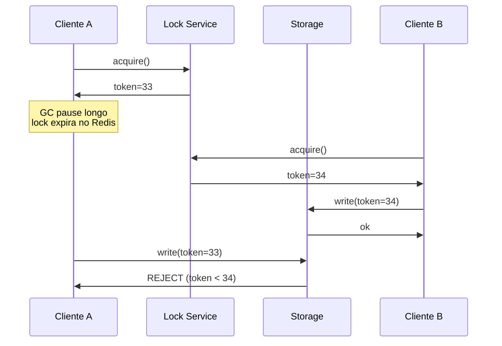

Sem fencing, o lock distribuído te dá uma falsa sensação de segurança.

### Leases

Lease é a evolução elegante do lock: ele tem TTL embutido e renova periodicamente enquanto o detentor está vivo. Se o detentor morre ou perde conexão, o lease expira sozinho e outro pode pegar. Não precisa de "alguém soltar o lock manualmente" — o tempo soluciona.

A maioria dos sistemas de coordenação modernos (etcd, Consul, Zookeeper) usa leases em vez de locks tradicionais por essa razão.

### Ordering: vector clocks e Lamport timestamps

Em sistema distribuído, "que evento aconteceu antes?" é uma pergunta difícil. Os relógios físicos das máquinas divergem (clock skew, vamos falar disso a seguir), então comparar timestamps não funciona pra eventos próximos no tempo.

A resposta é usar **relógios lógicos**:

- **Lamport timestamp** é um contador simples por nó. Sempre que envia mensagem, anexa o contador. Quem recebe atualiza seu próprio contador pra `max(meu, recebido) + 1`. Estabelece uma ordem total consistente com causalidade, mas não distingue eventos paralelos.
- **Vector clock** é mais sofisticado: cada nó mantém um vetor com o contador de todos os outros nós. Permite detectar quando dois eventos aconteceram em paralelo (nenhum causou o outro), o que Lamport timestamp esconde.

Você raramente implementa do zero — usa em sistemas como Dynamo, Riak, Cassandra que expõem essas mecânicas internamente. Mas entender é importante pra raciocinar sobre conflitos em replicação.

### Clock skew

> [!warning] Relógios físicos mentem
> Mesmo com NTP rodando, relógios de servidores diferentes divergem em dezenas a centenas de milissegundos. Em janela curta, dois eventos podem ter timestamps invertidos em relação à ordem real. Qualquer lógica que depende de comparar timestamps absolutos entre máquinas é frágil.

A defesa pra ordering crítico é não usar relógio físico — usar relógio lógico (Lamport, vector clocks) ou serviços especiais como o TrueTime do Google Spanner, que expõe a incerteza explicitamente ("agora está entre T1 e T2, com 99.999% de confiança").

Pra logging e métricas tudo bem usar timestamp físico, mas saiba que dois logs em servidores diferentes podem aparecer fora de ordem mesmo refletindo a sequência correta.

---

## 4 · Tolerância a falha e resiliência

> [!abstract] Resumo da categoria
> Em sistema de qualquer porte, falha de componente é rotina diária, não exceção. Disco enche, dependência ficou lenta, deploy quebrou. O sistema robusto é projetado pra falhar bem — degradar com graça, isolar o estrago, recuperar sozinho — não pra não falhar. Essa virada de mentalidade é a base da engenharia de confiabilidade moderna.

### Tolerância a falhas e recuperabilidade

Tolerância a falhas é a capacidade do sistema continuar funcionando mesmo com partes quebrando. Recuperabilidade é a capacidade de voltar pra estado válido depois que a falha passou. As duas andam juntas: você prepara o sistema pra absorver falhas (tolerância) e pra se reerguer depois delas (recuperabilidade).

Isso vai muito além de "ter try/catch". Significa decidir explicitamente: o que faz quando a dependência X está fora? Cache stale serve? Pode rodar em modo read-only? Manda erro pro usuário? Cada resposta dessas é uma decisão de produto, não só técnica.

### Timeout em tudo

Esta regra parece pequena mas é uma das mais importantes da lista: toda chamada que cruza um boundary (rede, processo, fila) tem que ter timeout máximo.

A intuição enganosa é "se o serviço está saudável, eu não preciso de timeout, porque a resposta vem rápido". Verdade. Mas timeout não é otimização — é defesa. No primeiro incidente em que o serviço upstream fica lento (não cai, fica lento), sua thread/conexão fica esperando indefinidamente. Em minutos, todas as threads do seu pool estão presas esperando. Você não está caído, você está paralisado, e a fila de requests novos cresce sem fim.

Timeout transforma "lentidão upstream" em "erro local rápido", e erro local rápido você sabe tratar — pode ir pra cache, pode retornar default, pode pelo menos liberar a thread pra atender outros usuários.

### Retry com backoff exponencial e jitter

Já apareceu na seção de idempotência mas vale repetir o detalhe operacional. Retry sem disciplina é amplificador de outage. Quando uma dependência está sofrendo, você não quer que seu serviço bata nela com força total — quer dar espaço pra ela respirar.

A fórmula básica é: tentativa N espera `base * 2^N` segundos antes de tentar de novo. Isso é exponencial: 1s, 2s, 4s, 8s, 16s. Cada falha aumenta o espaço.

O jitter é o detalhe que separa retry amador de retry profissional. Sem jitter, todos os clientes que falharam ao mesmo tempo retentam ao mesmo tempo. Quando a dependência se recupera, leva uma onda síncrona de requests e cai de novo. Com jitter, você adiciona ruído aleatório (`+ random(0, jitter_max)`) e a onda fica espalhada no tempo.

### Circuit breaker

Circuit breaker é uma máquina de estados que protege seu serviço de chamar uma dependência morta. Tem três estados:

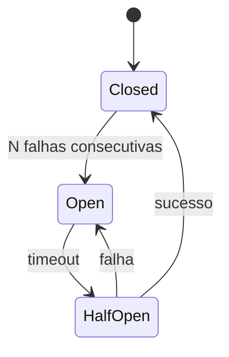

| Estado | Comportamento |
|---|---|
| Closed | Chama normalmente, conta falhas. Se passar do limite, abre. |
| Open | Falha imediato sem chamar a dependência. Não desperdiça tempo nem recursos. |
| Half-Open | Após período, deixa passar uma chamada de teste. Se passar, fecha. Se falhar, volta a abrir. |

A grande vantagem do circuit breaker não é poupar a dependência (ela já está sofrendo) — é poupar **você**. Cada chamada que você sabe que vai falhar consome thread, memória, conexão, timeout. Multiplicado por mil requests por segundo, você desperdiça tudo isso esperando 30 segundos pra falhar quando podia falhar em 1ms. Circuit breaker fechado economiza recursos pra atender o que ainda funciona.

### Bulkhead

O nome vem dos navios. Um navio bem projetado é dividido em compartimentos estanques (bulkheads), pra que um buraco em uma seção não afunde o resto. A engenharia aplica a mesma ideia: divida seus recursos em pools por dependência ou por tipo de operação.

Exemplo concreto: seu serviço chama três APIs externas (pagamento, email, analytics). Sem bulkhead, todas compartilham o mesmo pool de 100 threads HTTP. Se a API de analytics ficar lenta e segurar 80 threads esperando, sobram 20 pra pagamento e email — degradação cascateia. Com bulkhead, cada API tem pool dedicado de 30 threads. Analytics travada consome só os 30 dela; pagamento e email continuam saudáveis.

### Backpressure e rate limiting

Os dois mecanismos controlam fluxo mas têm propósitos diferentes:

| | Backpressure | Rate limiting |
|---|---|---|
| Propósito | controle de fluxo interno | proteção contra abuso |
| Direção | consumidor → produtor | servidor → cliente |
| Disparo | saturação real do sistema | política fixa |
| Exemplo | fila atinge 80% → produtor desacelera | 100 req/s por API key |

Backpressure é diálogo entre componentes: "estou saturado, desacelera". O consumidor avisa o produtor, o produtor diminui o ritmo, o sistema todo encontra equilíbrio. Sem isso, o produtor vai mandando, a fila do consumidor cresce, memória explode, OOM kill, sistema cai.

Rate limiting é defesa unilateral: "você só pode me chamar X vezes por minuto, não importa se eu aguento ou não". Serve pra proteger contra cliente abusivo, bug que dispara loop infinito, ou ataque. É política, não negociação.

### Fail-fast

Quando algo está errado, o melhor é descobrir cedo, em alto e bom som, antes que o estado errado contamine mais coisas. Fail-fast é a disciplina de validar pré-condições no boundary, lançar erro explícito ao primeiro sinal de inconsistência, e abortar operação em vez de seguir torcendo.

O oposto é a tentação de "ser resiliente" demais — engolir exceções, usar valores default quando o input está nulo, prosseguir com dado parcial. Isso amplifica o problema: o erro original some, mas o sistema gera resultado errado três passos adiante, em um lugar que não tem como rastrear de volta.

Fail-fast também ajuda em deploy. Bug introduzido em release nova fica visível na primeira hora se o sistema falha cedo; pode ficar escondido por dias se o sistema absorve em silêncio.

### Graceful degradation

Graceful degradation é o oposto do "tudo ou nada". Quando algo falha, em vez de retornar erro 500 e bloquear o usuário, você entrega uma versão reduzida do produto.

- A busca não pode rankear com ML personalizado? Devolve resultado em ordem alfabética.
- O cache caiu? Vai direto no banco, mais lento mas funcional.
- O serviço de recomendação morreu? Devolve uma lista padrão.
- Não consegue cobrar cartão de crédito agora? Coloca pedido em estado "pendente" e processa depois.

A premissa é que usuário tolera muito melhor "funcionando pior" do que "fora do ar". Implementar graceful degradation exige projetar cada feature com a pergunta "qual é o caminho degradado quando isso falha?" — e quase sempre tem um.

### Dead letter queue (DLQ)

Em sistema de mensageria, eventualmente alguma mensagem vai falhar repetidamente — formato inválido, dado corrompido, bug no consumidor. Sem DLQ, essa mensagem fica no topo da fila, falha, volta pra fila, falha, volta... loop infinito que bloqueia mensagens válidas atrás dela.

DLQ é uma fila separada onde mensagens que falharam N vezes são enviadas pra investigação manual. Resolve dois problemas: desbloqueia a fila principal e dá visibilidade explícita do problema (a fila DLQ tem tamanho que pode ser monitorado, alertado).

### Connection pooling

> [!danger] DDoS interno mais comum em produção
> Exaustão de pool de conexões é como muitos serviços caem sem ninguém entender o porquê. Pool tem 50 conexões, cada request precisa de uma, dependência fica lenta, conexões ficam ocupadas mais tempo, novas requests esperam por conexão livre, pool satura, todos os requests passam a falhar com "connection timeout", e o serviço aparenta estar fora mesmo a CPU estando ok.

A defesa é: limite explícito no pool, timeout de aquisição (não espera infinito pra pegar conexão), e métricas de saturação no monitoramento (% do pool em uso). Se você não monitora isso, não vai entender o incidente quando acontecer.

### Cold start awareness

Instância recém-iniciada mente sobre sua capacidade. JIT ainda não compilou os hot paths, cache está vazio, pool de conexões está vazio, garbage collector ainda não calibrou. Os primeiros segundos de vida ela atende em latência 5-10x pior que o normal.

Em rolling deploy, se você joga tráfego completo na instância nova logo que ela inicia, três coisas ruins acontecem: latência cresce, health check de readiness pode falhar (porque latência > threshold), Kubernetes mata o pod antes dele aquecer, deploy entra em loop. A defesa é a readiness probe esperar warm-up real (não só "processo respondendo"), e o load balancer aumentar tráfego gradualmente em conexões novas.

---

## 5 · Sistemas distribuídos

> [!abstract] Resumo da categoria
> Trade-offs explícitos beats promessas implícitas. CAP, PACELC, quorum — esses não são curiosidade acadêmica, são o vocabulário pra negociar o que o sistema vai garantir e o que não vai. Sem ele, você projeta sistema que promete o impossível e se surpreende quando a realidade cobra a fatura.

### CAP theorem

CAP é o teorema de Eric Brewer (formalizado por Gilbert e Lynch) que diz: em sistema distribuído, na presença de partição de rede, você só pode garantir duas das três propriedades simultaneamente — **C**onsistência, **A**vailability, e **P**artition tolerance.

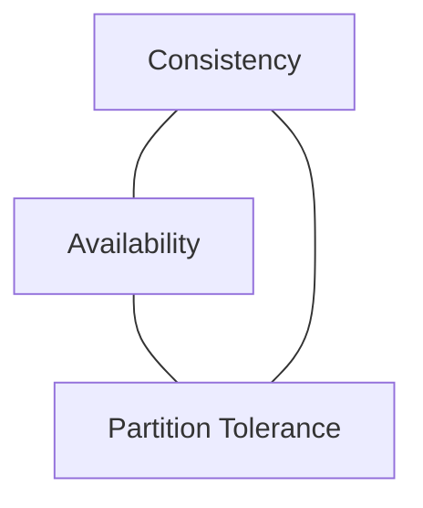

O ponto sutil é que em rede real, partição (perda de comunicação entre nós) acontece. Não é "se", é "quando". Então P não é opcional — você é obrigado a escolher entre C e A quando ela acontece. Sistemas CP (como Spanner, etcd) param de atender em partição pra preservar consistência. Sistemas AP (como Dynamo, Cassandra) continuam atendendo mas podem retornar dados inconsistentes.

Importante: CAP só vale durante a partição. Em operação normal, sistema bem desenhado pode entregar ambas. A escolha CAP é como o sistema se comporta no pior dia, não como ele se comporta no dia comum.

### PACELC

PACELC é extensão do CAP que cobre o que CAP não fala: e quando NÃO tem partição? Eric Abadi propôs adicionar o eixo Latência vs Consistência pro caso normal.

Lê assim: "se houver Partition, escolha entre Availability e Consistency; **else**, escolha entre Latency e Consistency".

| Sistema | Em P | Else (sem P) |
|---|---|---|
| DynamoDB | AP | EL |
| Spanner | CP | EC |
| Cassandra | AP | EL |
| MongoDB | CP | EC |

Por que isso importa? Porque "sistema consistente" no caminho feliz custa rodadas de coordenação entre nós. Cada operação espera quorum. Latência sobe. Se o produto pode tolerar leitura ligeiramente stale, abaixar pra "eventually consistent" no caminho feliz dá latência muito menor.

### Quorum (R + W > N)

Em sistemas com N réplicas, quorum é a regra: se você escreve em pelo menos W réplicas e lê de pelo menos R, com `R + W > N`, você tem garantia de ler o último valor escrito (porque qualquer leitura encontra pelo menos uma réplica que recebeu o último write).

Configurações comuns:

- **N=3, W=2, R=2**: tolera 1 falha em qualquer lado, consistente, padrão "boa cidadã".
- **N=3, W=3, R=1**: leitura barata e rápida, escrita cara (todos têm que confirmar). Bom pra workload de muita leitura.
- **N=3, W=1, R=1**: rápido em tudo, mas só eventually consistent. Você pode ler valor velho.

Dynamo e Cassandra deixam você configurar isso por operação. Bancos relacionais tradicionais escondem essa decisão.

### Consistência forte vs eventual: quando usar cada

Consistência forte significa "depois que eu escrevi, qualquer leitor vê o valor novo, imediatamente, em qualquer réplica". Custa coordenação. Use quando o domínio exige:

- Dinheiro (saldo, débito, transferência) — eventual aqui causa double-spend.
- Estoque (especialmente em alta concorrência) — eventual causa oversell.
- Identificadores únicos — eventual causa colisão de ID.
- Locks e mutexes — sem strong consistency, locks não funcionam.
- Autenticação e autorização — eventual aqui é falha de segurança.

Consistência eventual significa "depois que eu escrevi, leitores vão acabar vendo o valor novo, mas pode demorar". Use quando o domínio tolera:

- Feeds e timelines — "delay de 1s pra novo post aparecer" é aceitável.
- Contadores aproximados (views, likes) — divergência de 0.1% é invisível.
- Recomendações — não precisam ser exatas.
- Logs e analytics — agregação tolera latência.

Insistir em consistência forte onde eventual basta é o erro mais comum de arquitetura distribuída. Mata latência sem ganho real.

### Saga pattern

Quando uma operação envolve múltiplos serviços (criar pedido envolve estoque, pagamento, logística, notificação), você tem o problema da transação distribuída: como garantir que ou todos confirmam ou todos revertem?

A resposta tradicional era 2PC (Two-Phase Commit), que coordena todos os participantes em duas fases. Funciona mas é frágil — se o coordenador cair entre as fases, todos ficam travados esperando. Em escala moderna, ninguém usa 2PC distribuído fora de cenários muito específicos.

Saga é a alternativa moderna: você quebra a operação em passos, cada um com uma **ação compensatória** que desfaz seu efeito. Se algum passo falha, você executa as compensações dos passos anteriores em ordem reversa.

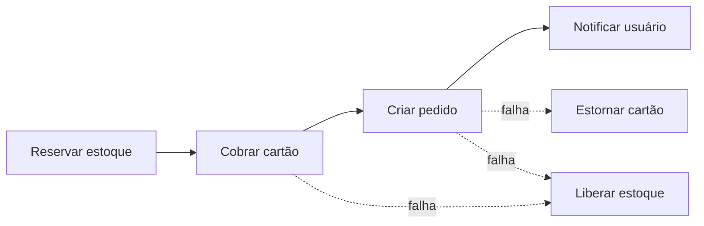

Atenção: compensação não é rollback. "Estornar cartão" é uma nova operação que acontece depois de "cobrar cartão" — não é como se a cobrança nunca tivesse acontecido. O cliente pode ver dois lançamentos no extrato (cobrança + estorno). Isso é aceitável geralmente, mas é decisão consciente.

### Outbox + Inbox pattern

Estes são pares simétricos que resolvem um problema específico em arquitetura event-driven: como garantir que "salvar no banco" e "publicar evento" são atômicos.

O cenário problemático: você quer fazer duas coisas dentro de uma operação — gravar o pedido no banco e publicar evento no Kafka. Se você grava primeiro e depois publica, e o publish falha (Kafka indisponível, processo morre entre os dois), você tem pedido sem evento. Se você publica primeiro e depois grava, e o grava falha, você tem evento sem pedido. Não existe transação distribuída barata entre banco e fila.

**Outbox** resolve o lado produtor: você grava o evento como linha de tabela na mesma transação local do banco. A operação inteira é atômica porque está toda no banco. Um processo separado (publisher) lê a tabela outbox e publica no Kafka. Se publish falhar, retenta. Se grava falhou, evento nunca existiu.

**Inbox** resolve o lado consumidor: antes de processar uma mensagem recebida, você grava o ID dela em uma tabela inbox (com unique constraint). Se já viu, ignora. Se é nova, processa.

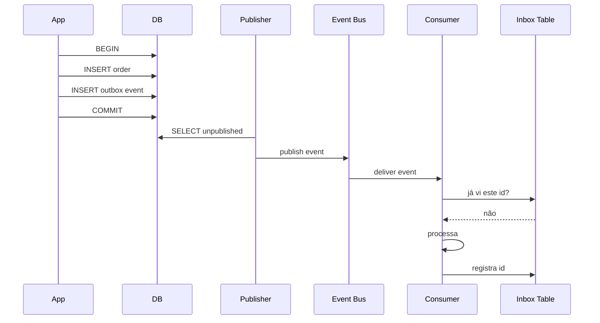

Outbox sozinho garante "publiquei pelo menos uma vez". Inbox sozinho garante "processei no máximo uma vez". Juntos garantem "processei exatamente uma vez" no efeito agregado, sem precisar de exactly-once mágico no broker.

### Event sourcing

Event sourcing inverte o jeito tradicional de modelar estado. Em vez de gravar o estado atual ("conta do João tem saldo 500"), você grava a sequência de eventos que produziram esse estado ("João depositou 200; João sacou 50; João depositou 350"). O estado atual vira uma projeção — você calcula somando os eventos.

Benefícios são grandes: auditoria total embutida (todo evento está lá), time-travel (qual era o estado da conta em 15/03?), debug histórico, projeções alternativas (mesmo log de eventos vira múltiplas views otimizadas pra leitura), replay quando você descobre bug na lógica de agregação.

Custos também: queries mais caras (precisa agregar eventos), schema de eventos vira contrato eterno (não pode mudar formato sem migração complexa), e o modelo mental é diferente do CRUD tradicional. Por isso event sourcing é forte em domínios onde auditoria/histórico é central (financeiro, regulatório) e excessivo em CRUD simples.

### CRDTs

CRDT (Conflict-free Replicated Data Type) é uma família de estruturas de dados projetadas pra mergear concorrentemente sem coordenação. Dois nós editam offline, depois sincronizam, e o resultado é sempre determinístico, sem precisar de servidor autoritativo decidir conflito.

Os exemplos mais simples: contador G-Counter (cada nó incrementa o seu próprio sub-contador, total é soma), set GS-Set (adições que nunca removem), e estruturas mais complexas pra texto colaborativo, listas ordenadas, mapas.

A vitória é offline-first e edição colaborativa real: Figma usa CRDTs pra você editar mesmo quando perde conexão, Linear pra updates simultâneos, Notion pra co-edição. Você ganha "sempre disponível" sem perder consistência eventual.

### Tail latency amplification

> [!danger] Gap em ambas as listas originais — mata em produção sem aviso

Em arquitetura fan-out — um request gera N sub-requests pra serviços/shards diferentes — a latência percebida pelo usuário é dominada pela **pior** sub-resposta, não pela média.

Matematicamente: se cada sub-request tem p99 de 100ms e você faz 10 sub-requests em paralelo, a chance de pelo menos um cair no p99 fica grande. O p99 do agregado se aproxima do p99 individual, mas amplificado.

Defesas:

- **Hedged requests**: envia 2 sub-requests pro mesmo dado em paralelo, usa a primeira resposta, cancela a segunda. Custa 2x banda mas corta cauda.
- **Timeouts agressivos**: melhor errar com cauda cortada do que travar.
- **Caches**: respostas cacheadas não viajam.

Google publicou paper famoso ("The Tail at Scale") mostrando que sistemas grandes investem pesado nessas técnicas porque atacar o p50 já não move ponteiro.

---

## 6 · Estado e dados

> [!abstract] Resumo da categoria
> Estado é a parte do sistema que cobra preço com o tempo. Decisões de modelagem e armazenamento envelhecem; código você refatora, esquema você migra com cuidado. Por isso decisões aqui merecem investimento maior que outras camadas.

### Imutabilidade quando possível

Dado imutável é dado que você só cria, nunca altera. Em vez de "atualizar registro X pra novo valor", você grava "evento de mudança em X". Em vez de mutar uma lista, retorna uma nova lista. Em vez de overrider config, append nova versão.

A vitória é que raciocínio sobre estado mutável é onde a maioria dos bugs de concorrência nasce. Se ninguém pode mudar X depois que foi criado, ninguém pode corromper X concorrentemente — o problema simplesmente não existe. Estruturas imutáveis simplificam cache (resultado não muda), simplificam histórico (todas as versões existem), simplificam testes (estado não vaza entre execuções).

Você não consegue tornar tudo imutável — banco de dados muta, arquivo de log roda. Mas pra decisões de design dentro da aplicação, prefira imutabilidade até ter motivo concreto pra mutação.

### Single source of truth

Cada fato no sistema tem um único lugar canônico onde mora. Se "endereço do usuário" mora em duas tabelas diferentes (uma em users.address, outra em billing.address), você tem o problema: qual está certo quando divergem? E vão divergir, é só questão de tempo.

A regra é dolorosa de seguir porque duplicação tem motivos legítimos (performance, autonomia de serviço, projeções otimizadas). Quando você precisa duplicar, o mecanismo de sincronização vira parte explícita do contrato — não pode ser "ah, eventualmente fica igual". Tem que ser "sincroniza via evento X com SLA Y".

Sem essa disciplina, "fonte da verdade" vira "a tabela que eu lembrei de atualizar dessa vez", e a inconsistência se acumula até o ponto de quebrar relatório, billing, compliance.

### Persistência explícita vs estado em memória

Estado importante precisa morar em storage confiável (banco, disco persistente, S3) — não em memória do processo. Isso parece óbvio mas é violado o tempo todo: cache em memória que ninguém pensou em popular após restart, sessão de usuário guardada em variável do servidor, fila in-memory que perde mensagens em crash.

A pergunta certa é: se esse processo morrer agora, o que se perde? Se a resposta é "nada importante", ok ficar em memória. Se a resposta é "última hora de pedidos", é bug crítico esperando incidente.

### Statelessness quando possível

Serviço stateless é serviço que não guarda estado local entre requests. Toda informação que ele precisa vem no request ou de storage externo. Cada instância é intercambiável.

Por que isso importa tanto pra confiabilidade? Porque scaling, restart, deploy, recuperação de falha — todos triviais. Pod morre, outro toma o lugar. Carga subiu, sobe mais instâncias. Deploy de versão nova é só substituir as instâncias uma a uma.

Estado precisa morar em algum lugar, claro. A virada é tirar ele do processo e colocar em storage compartilhado (banco, Redis, S3). O processo vira pura função de transformação: entrada → estado externo → saída. Essa é a essência do 12-factor.

### Normalização vs Desnormalização controlada

Em banco relacional, normalização é o processo de eliminar redundância — cada fato em um único lugar, com referências em vez de cópias. Resolve anomalias de inserção, atualização, deleção. É a teoria correta.

Na prática, em sistemas que leem muito mais do que escrevem, normalização total pesa: join atrás de join, query lenta, cache complexo. Desnormalização — copiar dado em múltiplos lugares pra evitar join — vira otimização legítima.

| | Normalização | Desnormalização |
|---|---|---|
| Quando | OLTP, alta consistência | leitura pesada, performance crítica |
| Risco | joins lentos em escala | inconsistência entre cópias |
| Custo | runtime | gravação + manutenção do sync |

> [!warning] Desnormalizar sem plano de sincronização é apenas adiar bug
> Quando você duplica `user.name` em dez tabelas pra acelerar leitura, qualquer mudança de nome precisa propagar pra dez lugares. Sem mecanismo explícito (CDC, eventos, triggers), garante divergência.

### Cache com invalidação clara

> [!quote] Phil Karlton
> "There are only two hard things in Computer Science: cache invalidation and naming things."

Cache resolve um problema (latência, custo de computação) e cria outro (manter o cache coerente com a fonte). Sem estratégia explícita de invalidação, cache vira fonte de bugs sutis: usuário atualiza perfil, salva, recarrega — vê o nome antigo porque o cache não foi invalidado.

As estratégias clássicas:

- **TTL (time-to-live)**: cache expira por tempo. Simples, mas durante o TTL você serve dado stale.
- **Write-through**: toda escrita atualiza cache E banco. Cache sempre coerente, mas escrita mais lenta.
- **Write-behind**: cache atualiza primeiro, banco depois (async). Rápido, mas pode perder writes em crash.
- **Cache-aside**: app gerencia explicitamente — lê do cache, se não tem busca no banco e popula.
- **Event-driven invalidation**: mudança no banco emite evento, cache escuta e invalida.

A escolha depende do trade-off latência/coerência aceitável no domínio. Não tem certo absoluto, mas tem errado absoluto: cache sem estratégia.

### Reversibilidade

Toda ação destrutiva deveria ter mecanismo de desfazer. Erro humano é constante — alguém vai apagar a tabela errada, deletar usuário ativo, alterar config em produção achando que era staging. Sem reversibilidade, todo erro é catástrofe.

Mecanismos comuns:

- **Soft delete**: em vez de DELETE, marca `deleted_at`. Restaurar é trivial.
- **Snapshots periódicos**: backup completo em momentos conhecidos.
- **Point-in-time recovery**: Postgres com WAL permite restaurar pra qualquer segundo no passado.
- **Versionamento de objeto**: S3 mantém versões antigas de cada objeto.
- **Audit log com replay**: re-aplicar eventos até o ponto anterior ao erro.

Build essas mecânicas como parte da plataforma, não como afterthought depois de incidente.

---

## 7 · Evolução e mudança

> [!abstract] Resumo da categoria
> O primeiro deploy é fácil. O problema é o 500° deploy, com versões de cliente diferentes em produção, integrações externas legadas, dados antigos que precisam continuar lendo, e zero downtime exigido. Esta categoria é sobre projetar pra essa realidade desde o começo.

### Versionamento

APIs, eventos e schemas precisam de versionamento explícito desde o primeiro dia. Sem isso, o primeiro cliente vira refém da forma original — pra sempre. Qualquer mudança quebra integração existente, e quanto mais integrações você tem, mais cara cada mudança fica.

Estratégias comuns: versão no path (`/v1/users`, `/v2/users`), versão no header (`Accept: application/vnd.api.v2+json`), versão no nome do evento (`UserCreated.v2`). Não tem certo absoluto, mas tem que escolher uma e aplicar consistente.

### Backwards vs Forwards compatibility — distinção importante

Estes dois conceitos parecem o mesmo mas resolvem problemas diferentes:

**Backwards compatibility** significa: versão nova consegue ler dados/mensagens da versão antiga. É o que você precisa quando atualiza o servidor mas alguns clientes ainda usam o protocolo velho.

**Forwards compatibility** significa: versão antiga consegue tolerar dados/mensagens da versão nova (geralmente ignorando campos novos). É o que você precisa em rolling deploy, onde versão N+1 já está em algumas instâncias enquanto versão N ainda está em outras, e elas se comunicam entre si.

| | Backwards | Forwards |
|---|---|---|
| Direção | versão N+1 lê dados de N | versão N tolera dados de N+1 |
| Quando importa | upgrade do servidor antes dos clientes | rolling deploy com versões coexistindo |
| Exemplo | nova API aceita formato antigo de payload | cliente antigo ignora campo novo no response |

Sua lista popular agrupa as duas como "compatibilidade retroativa" mas durante rolling deploy elas precisam coexistir em paralelo. Sem forwards, deploy vira big bang coordenado.

### Schema evolution

Em sistemas com schema rígido (banco relacional, Protobuf, Avro), evolução precisa seguir regras de ouro pra não quebrar leitura/escrita de versões diferentes:

- **Adicionar campo opcional**: ok, versões antigas ignoram.
- **Adicionar campo obrigatório**: precisa de default, ou versões antigas quebram ao escrever.
- **Remover campo**: nunca. Deprecate e pare de usar, mas mantenha lendo.
- **Renumerar tag (Protobuf) ou ID (Avro)**: nunca. O número É a identidade.
- **Mudar tipo**: nunca, exceto se compatível (int32 → int64 é safe; int → string não é).

Protobuf e Avro te protegem se você seguir essas regras. Se você quebrar, eles obedecem porque eles confiam em você — e a integração corrompe silenciosamente.

### Migrações seguras (expand → migrate → contract)

Migração de schema em produção sem downtime exige fazer em fases:

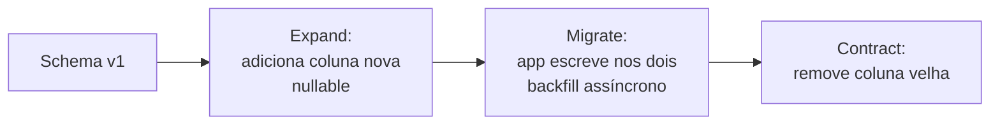

A fase **expand** adiciona o que é novo sem remover o que existe. Schema fica gordo temporariamente mas continua aceitando versão antiga e nova. A fase **migrate** muda a aplicação pra usar o novo, e migra dados existentes em backfill async. A fase **contract** remove o velho, depois que ninguém mais usa.

Cada fase é reversível em isolamento. Big-bang migration (alter table inteiro em uma janela de manutenção) força downtime, torna rollback impossível ou caro, e concentra risco. Expand/migrate/contract dilui o risco no tempo.

### Feature flags

Feature flag é um boolean (geralmente externo, configurável em runtime) que liga ou desliga uma funcionalidade. A vitória é desacoplar **deploy** de **release**: você pode subir código pra produção sem ativar a feature, ativar pra 1% de usuários pra testar em real, ligar/desligar sem precisar de novo deploy.

Vantagens em cascata: rollback de feature problemática sem revert de código, A/B testing, dark launches (rodar o código novo em produção mas descartar o resultado, só pra medir performance), kill switches em emergência. O custo é complexidade — o código tem N caminhos vivos, e é fácil esquecer de remover flag depois que feature consolidou.

### Deploy seguro

Releases têm que ser caminhos de baixo risco, ensaiados, com volta. As estratégias modernas:

- **Canário**: manda 1% do tráfego pra versão nova, observa métricas, vai aumentando. Detecta regressão antes de afetar todos.
- **Blue-green**: duas versões inteiras (blue atual, green nova) coexistem, switch atômico via load balancer. Rollback é flip do switch.
- **Rolling**: atualiza instâncias gradualmente, mantém serviço disponível durante todo o processo.

Cada estratégia tem trade-off de complexidade, custo de infra, granularidade de rollback. O importante é ter uma e treinar nela.

### Rollback possível

> [!danger] Rollback às 3am só funciona se foi ensaiado às 15h
> Toda equipe diz que tem rollback. Poucas testaram fora de incidente real. No primeiro incidente, descobrem que migração de banco não tem volta, que a feature flag não estava configurada, que a versão N-1 não conhece o schema novo. Rollback ensaiado é rollback que funciona.

---

## 8 · Observabilidade

> [!abstract] Resumo da categoria
> Não dá pra consertar o que não dá pra ver. Os três pilares — logs, métricas, traces — respondem perguntas diferentes e funcionam juntos. Sistema observável não significa "tem dashboard"; significa que você consegue responder perguntas que ainda nem foram feitas com a telemetria que já existe.

### Os três pilares

| Pilar | Responde | Granularidade | Custo |
|---|---|---|---|
| **Logs** | O que aconteceu? | Evento individual | Alto (volume) |
| **Métricas** | Quanto/quantos/quão rápido? | Agregado | Baixo |
| **Traces** | Como esse request fluiu? | Request individual | Médio (amostragem) |

Logs são granulares e caros — você grava tudo que aconteceu mas paga em storage e processamento. Métricas são baratas porque agregam (1 milhão de requests vira "counter += 1000000"), mas perdem detalhe individual. Traces ficam no meio: granulares por request mas geralmente amostrados (você guarda 1% dos requests com detalhe completo, ou 100% dos que falharam).

### Logs estruturados

Log "string solta" é log que você consegue ler com os olhos mas não consultar com SQL/grep avançado. Em escala isso é inútil — você precisa filtrar por usuário, agregar por endpoint, alertar quando taxa de erro sobe. Tudo isso exige logs estruturados, geralmente em JSON, com campos consistentes.

```json
{"ts": "2026-05-11T17:01:23Z", "level": "error", "service": "payment",
 "request_id": "req_abc", "user_id": "u_42", "error": "card_declined",
 "amount_cents": 5000}
```

A diferença não é estilo — é o que ferramentas downstream (Elastic, Datadog, BigQuery, Loki) podem fazer com o log. Texto solto é grep ingênuo. JSON é query.

### Métricas: por que percentis e não média

> [!danger] Média mente em latência
> Sistema com p50=50ms e p99=5s tem média baixa (algo como 100ms) mas experiência terrível pra 1% dos usuários — que é muita gente se você tem volume. A média esconde a cauda exatamente onde dói.

A solução é medir em percentis. p50 (mediana) é a experiência típica. p95 é a experiência da maioria. p99 é a cauda — onde usuários sofrem. SLOs sérios são definidos em p99 ou p99.9.

Em prática você quer histogramas (não médias) que permitem calcular qualquer percentil retroativamente. Ferramentas modernas (Prometheus, Datadog) usam histogramas como primitiva.

### Distributed tracing

Em microserviços, um request do usuário atravessa múltiplos serviços. Sem rastreio coordenado você fica perdido tentando entender onde a latência foi gasta ou em qual serviço o erro nasceu.

Tracing distribuído resolve isso propagando um **trace ID** único pelo request inteiro, com **span IDs** pra cada sub-operação. Cada serviço grava seu span (start, end, metadados) com o trace ID, e ferramenta de visualização (Jaeger, Zipkin, Honeycomb) monta o waterfall completo.

Sem tracing, debug em microserviços é correlacionar timestamps de logs em N serviços e torcer. Com tracing, você abre a view e vê exatamente quanto tempo foi gasto em cada hop.

### Health checks: liveness ≠ readiness

Esta distinção é fundamental em orquestração (Kubernetes, ECS) e ignorá-la causa cascatas operacionais.

| | Liveness | Readiness |
|---|---|---|
| Pergunta | "Estou vivo?" | "Posso receber tráfego?" |
| Falha → | Mata o pod e reinicia | Tira do load balancer (mas não mata) |
| Verifica | Processo respondendo, não travou | Dependências ok, warm-up completo, pool cheio |

A armadilha clássica: você configura liveness probe apertada demais (timeout curto, threshold baixo), e quando o serviço fica sob pressão ou em cold start ele falha o liveness. Kubernetes mata e reinicia. Pod novo entra cold, falha de novo, mata de novo. Você está em loop de morte enquanto o problema real é só "está mais lento que de costume".

Liveness deveria ser quase imortal — só responde "morto" quando o processo realmente travou. Readiness é onde você expressa "ainda não pronto", e Kubernetes responde só removendo do tráfego, sem matar.

### SLO, SLA e error budget

SLO (Service Level Objective) é a meta de confiabilidade que você se compromete internamente: "99.9% dos requests respondem em menos de 200ms no mês". SLA (Service Level Agreement) é o mesmo conceito mas contratual, com penalidade financeira por violar.

A grande contribuição da SRE moderna foi o **error budget**: se sua SLO é 99.9%, você tem 0.1% × tempo total = ~43 minutos por mês de "ok falhar". Esse orçamento é gasto em incidentes e em risco de release. Se você gastou o budget no mês, freezes de feature, foco em confiabilidade. Se sobrou budget, pode tomar mais risco em releases.

Sem SLO/error budget, conversas sobre "tá estável o suficiente?" viram opinião. Com eles, viram dado.

### Alertas acionáveis

Alerta sem ação é fadiga. Fadiga ignora o alerta que importa. A disciplina é: cada alerta precisa indicar problema real, ter playbook claro de o que fazer, e ser desligável se virar ruído crônico.

Boas perguntas pra cada alerta novo: alguém precisa acordar de madrugada por isso? Se sim, o que essa pessoa faz quando recebe? Se a resposta é "olhar e ignorar porque sempre se resolve sozinho", o alerta não devia existir. Se a resposta é "consultar dashboard X, rodar comando Y", isso é o playbook — anexa ao alerta.

### Replayability e reprodutibilidade

Replayability é a capacidade de reprocessar entrada antiga e chegar no mesmo resultado. Salva em incidente: se você descobre bug que processou 10 mil eventos errado, você corrige o código, replaya os eventos, sistema fica como se o bug nunca tivesse existido.

Reprodutibilidade é poder reproduzir bugs em ambiente controlado. Bug que não reproduz é bug que você "conserta" no escuro — pode ter sumido sozinho, pode estar dormente esperando trigger novo. Estado, input, configuração — tudo capturado, replayável em dev.

Ambos exigem disciplina de arquitetura desde o começo: eventos imutáveis guardados, inputs persistidos, lógica determinística. Adicionar depois é caro.

---

## 9 · Segurança e governança

> [!abstract] Resumo da categoria
> Segurança não é camada que se adiciona depois — é propriedade do design. Default seguro, dado mínimo, privilégio mínimo, blast radius limitado. Quando comprometido (não "se"), você quer que o estrago seja contido.

### Autenticação vs Autorização

| | Autenticação (AuthN) | Autorização (AuthZ) |
|---|---|---|
| Pergunta | Quem é você? | O que você pode fazer? |
| Mecanismo | senha, token, certificado, biometria | RBAC, ABAC, ACL, policies |
| Falha | 401 Unauthorized | 403 Forbidden |

Autenticação prova identidade — você é o João. Autorização decide poderes — o João pode deletar pedido? Confundir os dois é vulnerabilidade clássica: sistema autentica o usuário, assume que autenticado significa autorizado, e qualquer usuário logado pode fazer qualquer coisa.

A defesa correta é checar ambos em cada endpoint sensível. AuthN no boundary do sistema (middleware comum), AuthZ no boundary da feature (cada operação verifica se este usuário pode fazer esta ação neste recurso).

### Privilégio mínimo

Cada usuário, serviço, processo, role tem só as permissões estritamente necessárias pro seu trabalho. Service account que faz backup precisa ler dados — não precisa de DELETE. API key de integração precisa criar pedidos — não precisa de admin.

O cálculo de risco é simples: quando algo é comprometido (credenciais vazadas, dependência maliciosa, bug de injection), o atacante herda os privilégios do componente comprometido. Service account com `*:*` significa "atacante tem acesso total ao sistema". Mesmo componente com privilégio mínimo significa "atacante pode fazer apenas o que essa peça já fazia" — blast radius contido.

A implementação tem custo (criar e gerenciar roles granulares), mas é investimento que paga no primeiro incidente.

### Encryption in transit + at rest

TLS em qualquer comunicação que cruza rede, AES (ou equivalente moderno) em qualquer dado em disco. Isso é default não-negociável em 2026 — sem isso, você está apostando que ninguém vai sniffar tráfego, roubar disco, copiar backup.

Vazamentos acontecem por caminhos surpreendentes: backup esquecido em bucket público, log com dado sensível chegando em terceiros, disco descartado sem wipe. Criptografia não previne esses cenários — limita o estrago quando acontecem. Dado criptografado vazado é dado inútil pro atacante (até a chave ser comprometida).

### Secret rotation

Credenciais precisam expirar e rodar automaticamente. Senha de service account, API key, certificado, chave de criptografia — todas com prazo de validade conhecido e rotação programada.

Sem rotação, qualquer vazamento é permanente. Credencial que vazou há dois anos ainda pode estar funcionando hoje, e você nem sabe que vazou. Com rotação periódica, vazamento tem prazo de validade — virou pó depois do próximo ciclo.

A implementação envolve: gerenciador de secrets (Vault, AWS Secrets Manager, GCP Secret Manager), aplicações que lêem secrets do gerenciador em runtime (não em build), e processo automático de rotação que coordena geração nova + propagação + retirada da velha.

### Validação de entrada vs Sanitização

São coisas relacionadas mas com papéis diferentes:

**Validação** decide se o input é aceitável. Se um campo é email, tem `@`? Se é número, está no range esperado? Se é string, tamanho ok? Validação aceita ou rejeita — não transforma.

**Sanitização** transforma input pra uso seguro em um contexto específico. HTML escape antes de renderizar (evita XSS). Parametrização antes de consulta SQL (evita SQL injection). Encoding antes de inclusão em shell (evita command injection).

| | Validação | Sanitização |
|---|---|---|
| Ação | aceita ou rejeita | transforma |
| Quando | borda do sistema | antes de uso em contexto sensível |
| Exemplo | email tem `@`? | escape HTML pra renderizar com segurança |

Sem validação na borda, dados absurdos contaminam o sistema (NaN onde devia ser inteiro, strings de 10MB onde devia ser nome). Sem sanitização no uso, você é vulnerável a injection. As duas trabalham juntas.

### Auditabilidade e audit log

Auditabilidade é a propriedade de poder responder "quem fez o quê, quando, com qual resultado". Compliance exige (GDPR, HIPAA, SOC2), debug precisa, incident response depende.

O audit log é o mecanismo: registro imutável de ações sensíveis. Imutabilidade é crítica — se atacante pode editar o log, o log é teatro. Implementações sérias usam append-only storage, hash chains (cada entrada inclui hash da anterior, tampering invalida cadeia), ou storage externo controlado por outra entidade (cross-account em AWS, por exemplo).

### Segurança por padrão e privacidade por design

Comportamento padrão é o mais seguro possível. Novo recurso é criado privado, não público. Bucket S3 novo recusa acesso anônimo. Porta de admin não escuta na internet por default. Toda permissão é negada até ser explicitamente concedida.

Privacidade por design vai um passo adiante: você coleta, armazena e expõe o **mínimo** possível de dado pessoal. Não coleta CPF se não precisa. Não loga senha mesmo hasheada. Não retém log de 5 anos se a regra de negócio só pede 90 dias. Dado que não existe não vaza. Dado mínimo facilita compliance.

Essa disciplina parece restritiva mas é libertadora — você não precisa proteger o que não tem.

---

## 10 · Design de software

> [!abstract] Resumo da categoria
> Estes princípios não são "boas práticas de pureza" — são o que separa sistema que evolui bem em 5 anos de sistema que vira pântano em 18 meses. Eles parecem custar tempo no começo e pagar muito caro depois.

### Separação de responsabilidades, baixo acoplamento, alta coesão

São os três tijolos clássicos do design modular:

**Separação de responsabilidades** é a regra de "cada módulo tem uma razão pra mudar". Se o módulo de pagamento muda quando o pricing muda, quando o gateway muda, quando o relatório fiscal muda, quando o webhook de notificação muda — ele tem quatro responsabilidades misturadas, e cada mudança arrisca quebrar as outras três.

**Baixo acoplamento** é a regra de "módulos dependem o mínimo possível uns dos outros". Quanto mais conexões você tem, mais mudanças cascateiam. Acoplamento alto significa que mudar uma coisa exige mudar várias outras — produtividade despenca exponencialmente.

**Alta coesão** é a regra de "coisas relacionadas ficam juntas". Toda a lógica de pagamento mora no módulo de pagamento, não espalhada em controllers, helpers, utils, services. Quando você precisa entender pagamento, vai a um lugar.

As três juntas formam a base do design modular sustentável. Violar uma sempre puxa as outras.

### Contratos explícitos

Toda integração entre componentes (API, evento, fila) precisa de contrato explícito: formato, semântica, garantias. Schema em OpenAPI, Protobuf, JSON Schema. Documentação de quando o evento é emitido, o que ele garante, o que ele não garante.

Sem contrato explícito, cada consumidor interpreta o que entendeu do contrato implícito. Eventualmente um produz dado fora do esperado, o outro processa errado, ninguém percebe até virar incidente. Contrato escrito é fonte da verdade compartilhada.

### Limites entre domínios (DDD)

Em sistemas que crescem, cada domínio (pagamento, catálogo, identidade, logística) precisa de fronteira clara. Não só fronteira física (microserviço) — fronteira semântica.

"Cliente" significa coisas diferentes em domínios diferentes. Pra logística, cliente é endereço de entrega + janela disponível. Pra billing, cliente é fonte de pagamento + histórico de fatura. Pra atendimento, cliente é histórico de interação + preferências.

Sem fronteira clara, "cliente" vira um modelo gigante tentando ser tudo, e cada domínio puxa requisitos conflitantes. Com fronteira, cada domínio tem seu próprio modelo de cliente, e a tradução entre eles acontece nas bordas (anti-corruption layer — camada que isola o modelo interno de mudanças em domínios vizinhos).

### Modelagem correta de invariantes

Regras críticas do negócio precisam ser protegidas no modelo, não espalhadas em controllers. Se "saldo nunca negativo" é regra crítica, ela mora na entidade Conta — qualquer operação que tente saque maior que saldo falha lá, sempre.

A armadilha comum é validar invariante em N lugares (controller, service, view) sem proteger no modelo. Eventualmente alguém esquece um lugar, regra é violada em produção, e o estado corrompido contamina daí pra frente. Invariante no modelo é invariante que não pode ser violada — o código simplesmente não permite.

### Boundaries de consistência explícitas

Em sistema distribuído, onde termina a consistência forte e começa a eventual? Essa transição precisa ser documentada e visível, não implícita.

Por exemplo: dentro do serviço de pedido, "pedido + itens + valor total" são fortemente consistentes (transação local). Mas entre serviço de pedido e serviço de estoque, é eventual — pode haver janela de segundos onde pedido foi criado mas estoque ainda não foi decrementado.

Se essa janela é segundos, ok. Se é minutos, talvez problema. Se é "depende, varia, ninguém sabe", é bug esperando incidente.

### Evitar efeitos colaterais ocultos

Função/método não altera coisas inesperadas. Se a assinatura diz `calculatePrice(items)` e retorna preço, ela não deve gravar log, atualizar cache, emitir evento, alterar estado global. Esses são efeitos colaterais escondidos atrás de uma assinatura inocente.

Efeito colateral oculto torna código intestável (você precisa mockar tudo que ele escondeu), imprevisível (chamar duas vezes faz coisas diferentes) e perigoso em refactoring (mover a função pode quebrar coisas distantes). Pure functions — entrada → saída, nada mais — são testáveis, paralelizáveis, cacheáveis.

### Configuração externa ao código (12-factor)

Config muda entre ambientes (dev, staging, produção); lógica não. Por isso config mora em variáveis de ambiente, arquivos externos, secret manager — não em constantes hardcoded no código.

Esse é o princípio 3 do 12-factor (twelve-factor app), e violá-lo causa dores específicas: redeploy só pra mudar uma URL, credencial vazada em commit no Git, dev mexendo em produção achando que era staging porque a URL estava errada no código.

### Testabilidade

Sistema fácil de testar tem testes. Sistema difícil de testar tem promessas de testes "quando der tempo". A testabilidade é propriedade do design — vem das outras decisões (pure functions, dependências injetadas, contratos explícitos, boundaries claras) — não é adicionada depois.

Quando você descobre que testar uma função exige levantar banco, mockar quinze dependências e capturar saídas de log, o problema não é "falta tempo pra testar". O problema é design.

### Documentação dos contratos críticos

Fluxos críticos, APIs, eventos, decisões arquiteturais (ADRs — Architecture Decision Records) precisam ser escritos. Não toda a base de código — só o que importa pra alguém entender o sistema em alto nível.

Decisão não documentada é decisão que vai ser revisitada do zero em 6 meses. Alguém vai propor "e se fizéssemos X?", e ninguém vai lembrar que "X" foi considerado e descartado com motivo concreto há um ano. ADR documenta: contexto, opções consideradas, decisão tomada, motivo. Vira memória institucional.

---

## 11 · Escala

> [!abstract] Resumo da categoria
> Escalar é trocar problemas. Você sai do "uma máquina não aguenta" e entra em "coordenação entre N máquinas". Os problemas novos são diferentes (e maiores), mas previsíveis se você projetou pra escala desde cedo.

### Escalabilidade horizontal

Existem duas formas de escalar: vertical (máquina maior) e horizontal (mais máquinas). Vertical é simples mas tem teto físico (não existe máquina infinita) e é ponto único de falha (uma máquina = um lugar pra quebrar). Horizontal escala indefinidamente e ganha resiliência junto (perder uma máquina não derruba tudo).

A condição pra escalar horizontal é statelessness (estado em storage compartilhado, não em processo) ou algum mecanismo de coordenação de estado entre instâncias (sticky sessions, sharding, consensus). Se cada instância precisa do estado local de outras, você não escala — você só multiplica problemas.

### Sharding / particionamento

Sharding é dividir dados por chave entre nós. Pequeno demais pra precisar? Tudo em uma máquina, fácil. Grande o suficiente? Particiona — usuários A-M num nó, N-Z em outro; ou hash do user_id define o shard.

Estratégias comuns:

- **Hash-based**: hash da chave determina o shard. Distribui uniformemente, mas range queries (`WHERE user_id BETWEEN X AND Y`) ficam caras (precisa consultar todos os shards).
- **Range-based**: shards organizados por faixa (user_id 1-1000 no shard A, 1001-2000 no B). Range queries baratas, mas pode ter hotspot se distribuição é desigual.
- **Geo-based**: shard por região geográfica. Latência baixa pra usuário local, mas operação cross-region complica.

> [!warning] Re-sharding é caro
> Mudar shard key depois que dados existem exige mover muito dado e coordenar tudo. Pense no padrão de acesso futuro antes de escolher.

---

## 12 · Resiliência de rede e service discovery

> [!abstract] Resumo da categoria
> A rede entre seus serviços não é um fio fixo — é um tecido vivo de resolução de nomes, rotas, proxies e health checks que muda o tempo todo. Serviço que morreu precisa sair do pool em segundos, não minutos. DNS que cacheia demais manda tráfego pra lugar nenhum. Partição de rede não é binária — pode ser parcial, assimétrica, e afetar só alguns pares de nós. Projetar pra essa realidade é o que separa infra que se recupera sozinha de infra que precisa de SSH às 3h da manhã.

### DNS caching e TTL

DNS é invisível até quebrar. Toda comunicação entre serviços começa com uma resolução de nome — `payment-service.internal` vira `10.0.3.42`. Essa resolução é cacheada em múltiplas camadas: o SO, a linguagem/runtime, o resolver da rede, o CDN. E cada camada pode segurar o resultado por tempo diferente.

O problema aparece em failover. Seu banco de dados faz failover pra outra instância, o DNS é atualizado com o novo IP, mas a aplicação ainda segura o IP antigo no cache interno da JVM (que por padrão em Java é **infinito** pra resoluções com sucesso). Resultado: failover aconteceu, DNS está correto, mas a aplicação continua mandando queries pro IP morto. Pra resolver, você precisa configurar TTL de cache DNS no runtime: JVM tem `networkaddress.cache.ttl`, Node.js tem `dns.setDefaultResultOrder`, Go resolve no SO por padrão.

| Camada | TTL padrão típico | Controle |
|---|---|---|
| Registro DNS autoritativo | 60-300s (você define) | Route53, Cloudflare, etc. |
| Resolver recursivo (ISP/cloud) | Respeita TTL do registro | Pouco controle |
| Sistema operacional | Varia (nscd, systemd-resolved) | Config local |
| Runtime/linguagem | Varia perigosamente (JVM: infinito) | Config da app |

> [!danger] DNS-based load balancing tem armadilhas
> Round-robin DNS (retornar múltiplos IPs e deixar o cliente escolher) parece load balancing grátis, mas o cliente pode cachear um IP só, ignorar a rotação, e criar hotspot. Pior: se um IP sair do pool DNS mas clientes ainda cacheiam, tráfego vai pra lugar nenhum. Pra load balancing real, use load balancer real.

### Service discovery

Em ambiente estático (3 servidores fixos, IPs conhecidos), service discovery é lista hardcoded. Em ambiente dinâmico (containers, auto-scaling, deploys contínuos), endereços mudam o tempo todo — instâncias nascem, morrem, migram. Service discovery é o mecanismo que responde "onde está o serviço X agora?".

Três abordagens dominantes:

- **DNS-based** (mais simples): serviço registra em DNS interno (Route53 Service Discovery, CoreDNS no Kubernetes). Clientes resolvem nome, recebem IP. Limitação: TTL de DNS cria lag, sem health check nativo fino.
- **Registry-based** (Consul, Eureka, etcd): serviço registra ao subir, faz heartbeat, registry remove ao morrer. Clientes consultam registry. Mais preciso, mas é mais um componente pra manter.
- **Sidecar/mesh** (Envoy, Linkerd proxy): proxy local intercepta tráfego de saída, resolve destino via control plane, faz routing inteligente. App nem sabe que service discovery existe.

Em Kubernetes, o modelo nativo (`Service` + `Endpoints`) combina DNS-based com health check via readiness probe. Funciona bem dentro do cluster, mas cross-cluster precisa de federation ou service mesh.

### Service mesh

Service mesh é a evolução de "cada serviço implementa retry, circuit breaker, mTLS, tracing" pra "a infraestrutura faz tudo isso de forma transparente". O conceito: um proxy sidecar (Envoy, Linkerd-proxy) roda ao lado de cada instância e intercepta todo tráfego de entrada e saída.

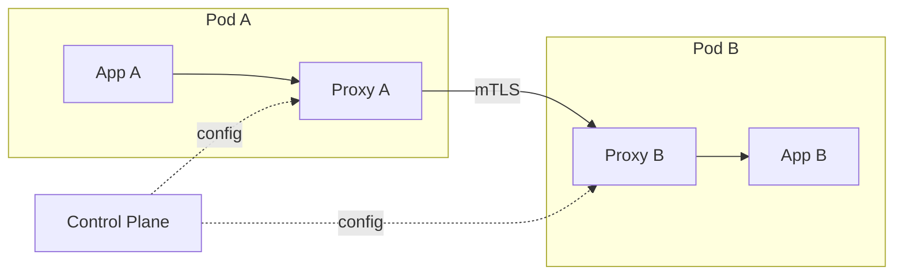

O **data plane** (os proxies) faz o trabalho pesado: mTLS entre serviços (zero-trust networking), retry, circuit breaker, observabilidade (métricas por rota, traces), load balancing avançado. O **control plane** (Istio, Linkerd control plane) distribui configuração: "serviço X usa circuit breaker com threshold 5 falhas".

A vitória é que a aplicação não precisa implementar essas coisas — o proxy faz. O custo é complexidade operacional significativa (mais um componente crítico no caminho de cada request) e overhead de latência (~1-2ms por hop). Pra equipes pequenas com poucos serviços, o custo supera o benefício. Pra organizações com dezenas de serviços e requisitos de zero-trust, compensa.

### Health-aware routing

Load balancer burro manda tráfego pra qualquer backend registrado. Load balancer inteligente só manda pra backends que estão saudáveis. A diferença é a que evita que 25% dos requests falhem quando 1 de 4 instâncias está doente.

O ciclo completo: backend falha health check → LB para de enviar tráfego → backend continua rodando (recebe tempo pra se recuperar) → passa health check → LB reintroduz gradualmente. O detalhe "gradualmente" importa: jogar tráfego completo numa instância que acabou de se recuperar é cold start problem de novo.

**Connection draining** (ou graceful shutdown) é o par: quando uma instância vai sair (deploy, scale-down), ela para de aceitar novas conexões mas termina as que estão em andamento. Kubernetes faz isso com `preStop` hook + `terminationGracePeriodSeconds`. Sem draining, requests em voo são cortados — o usuário vê erro 502 durante deploy.

### Partições de rede além do CAP

O modelo mental de "rede funciona ou não funciona" é simplificado demais. Partições reais são mais cruéis:

**Partição parcial**: nó A não alcança nó C, mas A alcança B e B alcança C. O cluster não está particionado — está parcialmente conectado. Algoritmos de consenso (Raft, Paxos) podem funcionar ou não dependendo de quem é líder e quem forma quorum.

**Partição assimétrica**: A envia pra B mas não recebe de B. Heartbeats de B pra A se perdem, A declara B morto e tenta assumir. Mas B está vivo e funcionando. Agora dois nós acham que são líder — split brain.

**Gray failures**: o nó não está morto, está doente. Responde, mas com latência de 30 segundos. Health check básico (TCP connect) passa, health check de latência falha. Dependendo do threshold, o sistema pode considerar o nó saudável quando está destruindo a experiência de quem cai nele.

> [!warning] Gray failures são piores que falhas totais
> Nó morto é detectado e removido em segundos. Nó doente pode ficar no pool por minutos, absorvendo tráfego e degradando silenciosamente. Defesa: health checks que medem latência, não só disponibilidade. E circuit breakers com threshold de latência, não só de erro.

---

## 13 · Gerenciamento de dependências e supply chain

> [!abstract] Resumo da categoria
> Seu código é 10% do que roda em produção. Os outros 90% são dependências — e cada uma é código de terceiro que você confia implicitamente pra rodar no seu servidor, com acesso ao seu banco, aos seus secrets, aos dados dos seus usuários. A cadeia de suprimentos de software é um vetor de ataque real, não teórico: event-stream (2018), SolarWinds (2020), log4shell (2021), xz-utils (2024). Gerenciar dependências é gerenciar risco.

### Lock files e pinning

Lock file (`package-lock.json`, `Cargo.lock`, `poetry.lock`, `go.sum`) é o mecanismo que garante que todo mundo — dev local, CI, produção — instala exatamente as mesmas versões. Sem lock file, `npm install` em duas máquinas diferentes pode gerar `node_modules` diferentes, porque ranges semver (`^1.2.3`) resolvem pro "mais recente compatível" no momento da instalação.

O cenário real: dev instala segunda-feira, tudo funciona. CI instala terça, dependência X soltou patch com bug, CI instala a nova versão, build quebra. Dev não consegue reproduzir porque localmente tem a versão de segunda. Com lock file, ambos instalam a mesma coisa — o lock file é a fonte de verdade, não o registry.

| Estratégia | Comportamento | Risco |
|---|---|---|
| Sem lock file | resolve versão fresh toda vez | build não-reprodutível, surpresas |
| Lock file (padrão) | fixa versão exata de toda a árvore | reprodutível, mas precisa update periódico |
| Pinning exato no manifest | `==1.2.3` no requirements.txt | máxima estabilidade, mínima atualização automática |

> [!danger] Lock file no .gitignore é bomba-relógio
> Existe uma tradição errada de colocar lock file em `.gitignore` "porque é gerado". Lock file É artefato de versionamento — a árvore exata de dependências que foi testada. Sem ele no repositório, cada clone resolve do zero. Build reprodutível vira build roleta.

### Reproducible builds

O ideal é: mesmo commit = mesmo binário, bit a bit. Isso é um reproducible build. Se você builda o mesmo código duas vezes e o resultado é diferente, você não sabe o que está rodando em produção — e auditoria vira exercício de fé.

O que impede reprodutibilidade: timestamps embutidos no binário, dependências resolvidas na hora do build, ferramentas com versão flutuante, variáveis de ambiente que mudam entre máquinas. Ferramentas como Nix e Bazel atacam isso com hermetic builds: tudo que entra no build é declarado explicitamente, nada vem do ambiente host.

Na prática total, reproducible build bit-a-bit é difícil e muitas equipes não precisam desse nível. Mas o espectro ajuda: quanto mais reprodutível, mais confiável o deploy, mais fácil auditar "o que mudou entre a versão que funciona e a que não funciona".

### Supply chain security

O ataque de supply chain injeta código malicioso em uma dependência legítima. Variantes:

- **Dependency confusion**: atacante publica pacote com mesmo nome do seu pacote interno num registry público. Se o resolver prioriza o público, instala o pacote do atacante. Afetou Apple, Microsoft, PayPal em 2021.
- **Typosquatting**: pacote com nome parecido (`crossenv` vs `cross-env`). Dev digita errado, instala malware.
- **Maintainer compromise**: atacante ganha acesso à conta do mantenedor (como no caso event-stream 2018 — mantenedor passou controle pra desconhecido que injetou código que roubava Bitcoin).
- **Build pipeline compromise**: atacante compromete o CI/CD e injeta no artefato final (SolarWinds 2020).

Defesas concretas:

- **SBOM (Software Bill of Materials)**: inventário completo de tudo que está no artefato. Quando uma CVE é publicada, você sabe em segundos se é afetado.
- **Verificação de integridade**: checksums, signatures (`npm audit signatures`, `cosign` pra containers).
- **Scoped registries**: pacotes internos só vêm do registry interno, nunca do público.
- **Dependabot / Renovate**: atualização automatizada com PR, pra não ficar em versão vulnerável por meses.

### Dependency hygiene

Cada dependência que você adiciona é um compromisso: código que você não escreveu, não revisou, não controla, mas que roda com os mesmos privilégios do seu. A higiene é manter esse compromisso sob controle.

**Dependências transitivas** são o risco oculto: você adiciona 1 pacote, ele puxa 15, que puxam mais 80. Você escolheu 1, confia em 96. `npm ls --all` num projeto Next.js típico mostra 800+ pacotes. Cada um é superfície de ataque.

**Licença** importa mais do que parece: GPL transitivo num SaaS pode ter implicações legais. AGPL obriga distribuição de código modificado se exposto via rede. Ferramentas como `license-checker`, `cargo-license`, `pip-licenses` varrem a árvore inteira.

**Cadência de atualização**: dependências abandonadas (último commit há 2 anos, issues abertas sem resposta) são risco duplo — vulnerabilidades não são corrigidas e incompatibilidades se acumulam. Melhor descobrir cedo que uma dependência morreu do que descobrir quando ela bloqueia upgrade de runtime.

### Vendoring vs registry

Vendoring é copiar o código da dependência pra dentro do seu repositório. Em vez de `npm install` baixar do registry, o código já está em `vendor/`. Trade-offs claros:

| | Vendoring | Registry |
|---|---|---|
| Reprodutibilidade | total (código está no repo) | depende de lock file + registry disponível |
| Segurança | snapshot fixo, imune a supply chain attack pós-vendor | vulnerável a registry compromise |
| Atualização | manual, trabalhoso | automatizável (Dependabot, Renovate) |
| Tamanho do repo | cresce significativamente | leve |
| Auditoria | diff visível no PR | diff escondido em node_modules |

Go popularizou vendoring como prática mainstream. Em ecossistemas com registry instável ou em ambientes air-gapped (sem internet), vendoring é a única opção. Pra maioria dos projetos web, lock file + registry confiável é suficiente — mas saber que vendoring existe é importante pra quando o registry falhar (npm teve outages que quebraram CI de metade da internet).

---

## 14 · Concorrência na camada de aplicação

> [!abstract] Resumo da categoria
> A seção 3 cobriu concorrência no nível de dados (locking, ordering, CAS). Aqui o foco é concorrência no código da aplicação — como sua linguagem e runtime lidam com múltiplas coisas acontecendo ao mesmo tempo. A escolha entre shared state e message passing, os footguns de async/await, o design de thread pools, o actor model, structured concurrency. São decisões que determinam se seu serviço escala com carga ou morre com deadlock sutil.

### Shared mutable state vs message passing

Essa é a escolha fundamental em design concorrente. Dois caminhos:

**Shared mutable state**: múltiplas threads/goroutines/coroutines acessam a mesma memória. Precisa de locks (mutex, semaphore, RWLock) pra evitar corrida. É o modelo padrão em Java, C++, Python com threading. O problema é que locks compostos são difíceis de raciocinar — pegar lock A e depois lock B funciona, até outro código pegar B e depois A. Deadlock.

**Message passing**: em vez de compartilhar memória, processos se comunicam enviando mensagens por canais. Cada processo é dono exclusivo do seu estado. Não tem lock porque não tem compartilhamento. É o modelo de Erlang, Go (channels), Rust (ownership + channels), Elixir.

> [!quote] Rob Pike
> "Don't communicate by sharing memory; share memory by communicating."

Na prática, a maioria dos sistemas usa um misto: message passing entre serviços (HTTP, filas), shared state dentro do processo (caches em memória, registries). A regra de ouro é: se o estado é compartilhado entre threads, ele precisa de proteção explícita ou precisa ser imutável. Estado mutável sem proteção é bug — pode só não ter aparecido ainda.

### Async/await pitfalls

Async/await transformou programação assíncrona de callback hell em código que parece sequencial. Mas a semelhança visual esconde armadilhas reais:

**Unhandled rejections**: em JavaScript, promise rejeitada sem `.catch()` ou `try/catch` em `await` sumia silenciosamente (Node.js antigo) ou crashava o processo (Node.js moderno com `--unhandled-rejections=throw`). Em ambos os casos, o dev acha que o código trata erro porque "tem try/catch lá em cima" — mas o try/catch de uma função síncrona não pega rejection de promise disparada sem await.

**Starvation e blocking do event loop**: em runtime single-threaded (Node.js, Python asyncio), qualquer computação CPU-intensiva dentro de uma coroutine bloqueia TODAS as outras. JSON.parse de um payload de 50MB trava o event loop por segundos. A defesa é mover trabalho pesado pra worker thread ou processo separado.

**Colored functions** (termo de Bob Nystrom): em muitas linguagens, funções async e sync são "mundos diferentes". Função sync não pode chamar async (sem bloquear). Função async contamina tudo acima dela na call stack. Isso cria bifurcação no ecossistema — bibliotecas precisam de versão sync e async, ou forçam todo mundo pra async.

| Runtime | Modelo | Armadilha principal |
|---|---|---|
| Node.js | event loop single-thread + libuv | bloquear o loop com CPU work |
| Python asyncio | event loop single-thread | misturar sync/async, blocking calls |
| Go | goroutines + scheduler M:N | goroutine leak (sem cleanup) |
| Rust tokio | async runtime multi-thread | blocking em contexto async (use `spawn_blocking`) |
| Java virtual threads (JDK 21+) | M:N scheduling | pinning em synchronized blocks |

### Thread pools e work stealing

Thread pool é um conjunto fixo de threads que processam tarefas de uma fila compartilhada. Em vez de criar thread por request (caro: cada thread consome ~1MB de stack), você reutiliza um pool de N threads.

O dimensionamento do pool é arte: pequeno demais e requests esperam na fila; grande demais e você paga overhead de context switching e memória. Regra de partida: pra I/O-bound, pool pode ser maior que número de cores (threads passam tempo esperando I/O). Pra CPU-bound, pool ≈ número de cores (mais threads que cores = overhead sem ganho).

**Work stealing** é otimização elegante: cada thread tem sua fila local. Quando a fila de uma thread esvazia, ela "rouba" trabalho da fila de outra. Distribuição automática de carga sem coordenação central. Tokio (Rust), ForkJoinPool (Java), rayon (Rust) usam work stealing.

**Queue depth e rejection policy** são decisões críticas: quando a fila do pool está cheia e chega trabalho novo, o que acontece? Em Java (`ThreadPoolExecutor`), as rejection policies incluem: `AbortPolicy` (joga exceção — fail fast), `CallerRunsPolicy` (quem envia executa — backpressure natural), `DiscardPolicy` (descarta silenciosamente — perigoso). A escolha correta depende se é melhor falhar rápido ou desacelerar o produtor.

### Actor model

O actor model (originado nos anos 70, popularizado por Erlang nos 80) trata cada unidade de computação como um **actor** independente que:
1. Tem estado privado (ninguém acessa diretamente)
2. Recebe mensagens via mailbox
3. Processa uma mensagem por vez (sem concorrência interna)
4. Pode criar outros actors e enviar mensagens

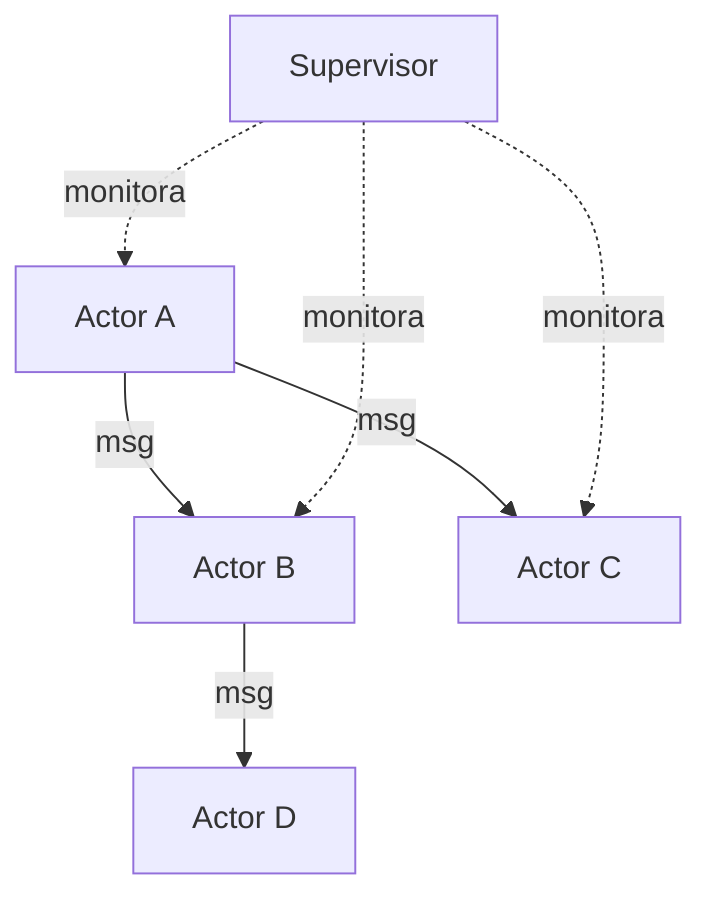

A vitória é que cada actor é single-threaded por definição — não tem race condition interna, não tem lock, não tem shared state. A concorrência vem de ter milhões de actors rodando em paralelo, cada um processando sua fila.

**Supervision trees** (conceito Erlang/OTP) adicionam resiliência: supervisores monitoram actors filhos e decidem o que fazer quando um morre — reiniciar, reiniciar todos os irmãos, escalar pra cima. O resultado é "let it crash" como filosofia: em vez de defender contra todo erro possível, deixa o actor morrer e o supervisor reconstrói. Erlang/OTP roda centrais telefônicas com 99.9999999% de uptime usando esse modelo.

**Location transparency**: actor A envia mensagem pra actor B sem saber se B está no mesmo processo, outra máquina, outro datacenter. O runtime resolve. Isso viabiliza distribuição transparente — escalar é colocar mais nós, o código não muda.

### Structured concurrency

Structured concurrency é o princípio de que a vida de uma tarefa concorrente deve ser delimitada por um escopo léxico — como variáveis locais. Se uma função dispara 3 tasks concorrentes, todas devem terminar (ou ser canceladas) antes da função retornar.

O problema que resolve: em concorrência não-estruturada, você dispara uma goroutine/task/thread e "esquece". Se ela falha, o erro se perde. Se o chamador cancela, a task continua rodando (goroutine leak, task leak). Se a task precisa de cleanup, ninguém chama.

```python
# Python: structured concurrency com asyncio.TaskGroup (3.11+)
async with asyncio.TaskGroup() as tg:
    tg.create_task(fetch_users())
    tg.create_task(fetch_orders())
    tg.create_task(fetch_inventory())
# Aqui, TODAS terminaram ou TODAS foram canceladas
# Se uma falha, as outras são canceladas automaticamente
```

Linguagens que adotam: Python (`TaskGroup` no 3.11), Swift (`async let`, `TaskGroup`), Java (JDK 21 `StructuredTaskScope`), Kotlin (`coroutineScope`), Trio (Python, o pioneiro). Go não tem structured concurrency nativo — goroutines são fire-and-forget por design, e gerenciar lifecycle é responsabilidade do dev (padrão `errgroup` ajuda mas não é automático).

A analogia com programação estruturada é precisa: assim como `goto` foi substituído por `if/for/while` com escopo claro, tasks soltas estão sendo substituídas por scoped task groups com lifecycle claro. O resultado é menos leaks, menos erros silenciosos, mais previsibilidade.

### Backpressure na aplicação

A seção 4 cobriu backpressure como conceito. Aqui o foco é implementação concreta na camada de aplicação.

**Bounded channels**: canal de comunicação entre producer e consumer com capacidade máxima. Go channels (`make(chan T, 100)`), Rust `tokio::sync::mpsc`, Java `ArrayBlockingQueue`. Quando o canal enche, o producer bloqueia ou recebe erro — é o sinal de backpressure. Canal unbounded é fila sem limite que vai crescer até OOM.

**Semáforos**: limitam concorrência máxima. Se você chama uma API externa que aguenta 50 requests simultâneos, um semáforo de 50 garante que a 51ª espera. Sem semáforo, 500 requests simultâneos estouram rate limit ou derrubam a dependência.

**Adaptive concurrency** (Netflix/concurrency-limits): em vez de limite fixo, o sistema mede latência em tempo real e ajusta o limite dinamicamente. Se latência sobe, reduz concorrência. Se desce, aumenta. O algoritmo mais conhecido é AIMD (Additive Increase, Multiplicative Decrease) — o mesmo princípio do TCP congestion control aplicado a requests HTTP.

> [!info] Regra prática
> Se seu sistema processa mais rápido do que consome, você precisa de backpressure ou vai acumular trabalho até explodir. Se consome mais rápido do que produz, não precisa. Na dúvida, coloque bounded queue e dimensione — é mais barato que debugar OOM em produção.

---

## 15 · Testes como garantia de sistema

> [!abstract] Resumo da categoria
> A seção 10 cobriu testabilidade como propriedade de design. Aqui o foco são estratégias de teste que vão além de unit tests — testes que verificam propriedades do sistema como um todo: contratos entre serviços, comportamento sob falha, capacidade sob carga, invariantes que humanos não pensam em testar. São os testes que pegam os bugs que escapam do "funciona na minha máquina".

### Contract testing

Em arquitetura de microserviços, o contrato entre serviço A (consumer) e serviço B (provider) é uma interface implícita: A espera que B retorne `{ "id": int, "name": string }`. Se B muda o campo pra `"full_name"`, A quebra. Sem contrato explícito testado, essa quebra só aparece em staging ou produção.

Contract testing (popularizado pelo Pact) inverte a abordagem: o **consumer** declara o que espera do provider (consumer-driven contracts). O provider roda esses contratos no seu CI pra garantir que não quebrou ninguém. Se o PR do provider viola um contrato, o CI falha antes do merge.

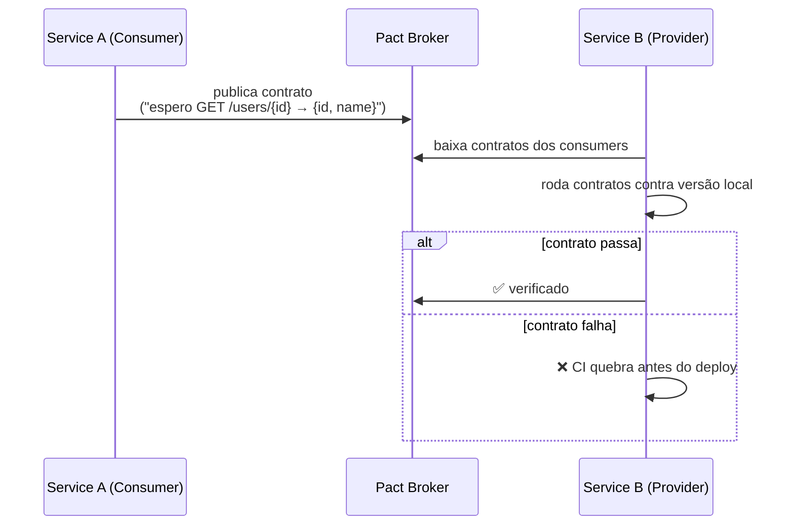

A vitória é feedback no PR: quem muda o provider sabe imediatamente se está quebrando algum consumer, sem precisar deployar em ambiente compartilhado. O custo é manter os contratos atualizados e o broker rodando. Pra equipes com poucos serviços, integração em staging pode ser suficiente. Pra organizações com dezenas, contract testing é a diferença entre "deploya e reza" e "deploya com confiança".

### Chaos testing

Chaos testing valida que os padrões de resiliência que você construiu (circuit breaker, retry, fallback, graceful degradation) realmente funcionam sob falha real. Porque pattern implementado e pattern que funciona em produção são coisas diferentes.

O conceito foi popularizado pela Netflix com o Chaos Monkey (2011): processo que mata instâncias aleatórias em produção pra garantir que o sistema sobrevive. Evoluiu pra Chaos Engineering como disciplina, com princípios claros:

1. **Defina estado estável** (métrica normal: latência, throughput, error rate)
2. **Hipotetize que o estado estável se mantém** sob falha
3. **Injete falha real** (kill instance, corrupt network, fill disk, slow dependency)
4. **Compare** estado observado vs hipótese

**GameDay** é a versão organizada: exercício planejado onde a equipe injeta falhas em ambiente controlado (geralmente produção com mitigação pronta), observa, e documenta o que quebrou. AWS faz GameDays internos regularmente e publicou o formato.

> [!warning] Chaos testing sem observabilidade é destruição
> Se você injeta falha e não tem métricas, logs e traces pra observar o efeito, você está só quebrando coisas. A premissa é que a observabilidade já existe e o chaos test verifica se os alertas disparam, se o fallback funciona, se o circuit breaker abre.

### Load testing e capacity planning

Load testing responde "quanto meu sistema aguenta antes de degradar?" — uma pergunta que surpreendentemente poucas equipes sabem responder com dados. Sem load test, capacity planning é chute.

| Tipo de teste | Objetivo | Duração |
|---|---|---|
| **Smoke test** | "funciona com carga mínima?" | minutos |
| **Load test** | "funciona com carga esperada?" | 30-60min |
| **Stress test** | "onde quebra? qual é o limite?" | até quebrar |
| **Soak test** | "aguenta carga sustentada? tem memory leak?" | horas/dias |

O output valioso não é "aguenta X requests/segundo" — é o gráfico de latência × throughput. Todo sistema tem um ponto de inflexão onde latência começa a subir exponencialmente. Saber onde esse ponto está é capacity planning.

Ferramentas maduras: k6 (Grafana), Locust (Python), Gatling (JVM), hey (CLI simples). O erro comum é rodar load test de rede local pro servidor — a latência de rede real não está sendo medida. Rode do mesmo ambiente (ou similar) de onde seus usuários reais vêm.

### Property-based testing

Testes tradicionais verificam exemplos específicos: `add(2, 3) == 5`. Property-based testing verifica **propriedades** que devem valer pra qualquer input: "pra quaisquer a e b, `add(a, b) == add(b, a)`" (comutatividade). O framework gera centenas de inputs aleatórios e verifica a propriedade em cada um.

QuickCheck (Haskell, original), Hypothesis (Python), fast-check (JavaScript), proptest (Rust) são as implementações mais maduras. Quando encontram violação, **shrink** o input pro menor caso que falha — transformam um input de 500 caracteres que falha num input de 3 caracteres que reproduz o mesmo bug.

Onde property-based testing brilha: serialização/deserialização (`decode(encode(x)) == x` pra todo x), parsing (parser não crashar pra nenhum input), algoritmos de ordenação (output é permutação do input + está ordenado), funções financeiras (arredondamento não perde centavos no agregado). São invariantes que humanos não testam exaustivamente mas que máquinas verificam em segundos.

### Smoke tests em produção

Smoke test em produção (synthetic monitoring) é um request real, periódico, automatizado, que exercita os caminhos críticos do sistema em ambiente de produção. Não é load test — é canary check contínuo.

Exemplos: a cada 30 segundos, faça login com usuário sintético, faça uma busca, verifique que o resultado tem dados, faça logout. Se qualquer passo falha, alerta. O objetivo é detectar regressão em produção **antes** que usuários reais reportem.

Diferença crucial vs health check: health check verifica se o processo responde. Smoke test verifica se o **produto funciona** — end-to-end, incluindo banco, cache, APIs externas, CDN. Muitas vezes o processo está saudável mas o produto está quebrado (migration corrompeu dados, CDN serve versão velha, feature flag desligou algo crítico).

Ferramentas: Datadog Synthetic Monitoring, Checkly, Grafana Synthetic Monitoring, ou cron job caseiro que roda Playwright/Puppeteer e reporta.

### Test pyramid vs trophy

O modelo clássico (Mike Cohn) é a pirâmide: muitos unit tests na base, menos integration tests no meio, poucos E2E tests no topo. A lógica era custo: unit tests são rápidos e baratos, E2E tests são lentos e frágeis.

O modelo revisado (Kent C. Dodds, "testing trophy") questiona: unit tests de funções puras são baratos, mas a maioria dos bugs reais vive na **integração** entre componentes — e unit tests com mocks excessivos não pegam esses bugs. O trophy prioriza integration tests como a camada de maior valor.

| Camada | Pirâmide (Cohn) | Trophy (Dodds) |
|---|---|---|
| E2E | pouco | pouco (concordam) |
| Integration | médio | **muito** (maior investimento) |
| Unit | **muito** | moderado (foco em lógica pura) |
| Static analysis | não mencionado | base (types, lint) |

Na prática, a resposta depende do sistema. Biblioteca de algoritmos: unit tests dominam (lógica pura, sem integração). API REST com banco + cache + fila: integration tests dominam (os bugs estão na cola entre componentes). Frontend SPA: E2E tests com Playwright capturam regressões visuais que unit tests não tocam. O princípio unificador é: **teste no nível que pega os bugs reais do seu tipo de sistema**, não no nível que uma regra genérica mandou.

---

## 16 · Data lifecycle e compliance

> [!abstract] Resumo da categoria
> Dado tem ciclo de vida: nasce, é processado, é armazenado, é acessado, envelhece, e eventualmente precisa morrer. Ignorar o ciclo de vida é acumular passivo — regulatório (GDPR, LGPD), operacional (storage crescendo sem fim), e de segurança (dado que existe pode vazar). "Dado que não existe não vaza" é a regra de ouro dessa categoria.

### Classificação de dados

Antes de proteger dado, classifique. Antes de classificar, defina as categorias. Sem classificação, tudo recebe o mesmo nível de proteção — o que na prática significa que nada recebe proteção adequada, porque proteger tudo como PII é caro demais e proteger tudo como público é negligência.

Classificação mínima viável:

| Nível | Definição | Exemplos | Proteção |
|---|---|---|---|
| **PII sensível** | identifica pessoa + causa dano se vazar | CPF, dados de saúde, biometria, dados financeiros | criptografia, acesso restrito, audit log, retenção mínima |
| **PII** | identifica pessoa | nome, email, telefone, endereço | criptografia, acesso controlado |
| **Interno** | não identifica pessoa, mas é confidencial | métricas de negócio, código, configs | acesso por role |
| **Público** | publicável sem risco | docs de API, landing page, preços | sem restrição |

A classificação direciona tudo: onde o dado pode ser armazenado (PII sensível não vai pra log), quem pode acessar (least privilege baseado em classificação), quanto tempo retém (PII tem prazo), como transporta (nível de criptografia).

> [!danger] Dado não classificado é tratado como público na prática
> Se o dev não sabe que o campo é PII, ele loga, cacheia, replica, exporta — porque "é só um campo". Classificação precisa ser visível no schema, no código, na documentação. Não pode depender de conhecimento implícito.

### Retenção e expurgação

Todo dado precisa de política de retenção: por quanto tempo guardamos e o que acontece depois. Sem política, dado acumula infinitamente — storage cresce, backups ficam lentos, superfície de ataque aumenta, e num eventual breach o impacto é máximo porque tem dado de 10 anos.

Implementação concreta: campo `expires_at` em registros com TTL, cron job de purge que roda diariamente, particionamento por data que permite `DROP PARTITION` em vez de `DELETE FROM` (ordens de magnitude mais rápido). Log de acesso precisa de 90 dias? Particione por mês, drope partições com mais de 3 meses.

A resistência organizacional é sempre "e se precisarmos desses dados no futuro?". A resposta correta é: defina o "futuro" concreto. Se é "pra analytics", anonimize e agregue antes de reter. Se é "compliance exige 5 anos", marque explicitamente e separe do dado operacional. Se é "vai que precisa" sem caso concreto, está acumulando passivo sem retorno.

### Right to be forgotten

GDPR Artigo 17 e LGPD Artigo 18 dão ao titular o direito de solicitar exclusão dos seus dados pessoais. A implementação técnica é mais complexa do que parece:

**Cascading deletes**: dado do usuário está em tabela de pedidos, de comentários, de logs de acesso, de eventos analíticos, de cache Redis, de índice Elasticsearch, de backup diário. Deletar de um lugar e esquecer outro é violação.

**Backups**: backups contêm o dado que foi deletado. Restaurar backup pode "ressuscitar" dado que deveria estar apagado. Solução pragmática: manter registro de "dados a serem re-deletados após restore" e executar como passo obrigatório pós-restore.

**Audit trail exception**: paradoxalmente, o registro de que o dado foi deletado (audit log de quem pediu, quando, o que foi deletado) é retido — porque compliance exige prova de que você atendeu o pedido.

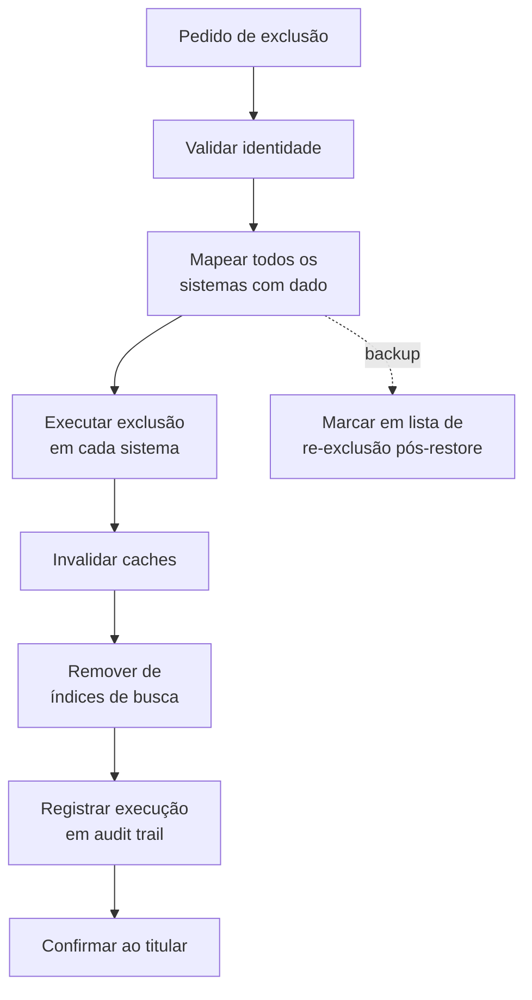

### Data masking

Ambiente de desenvolvimento e staging precisam de dados realistas pra testar, mas não podem ter dados reais de produção — um banco de dev com CPF e cartão de crédito real é breach esperando acontecer.

**Static masking**: cópia do banco de produção com dados sensíveis substituídos antes de importar no ambiente. "João Silva" vira "Usuário 48291", CPF real vira CPF gerado, email vira `user_48291@test.internal`. Ferramentas: `pg_anonymize`, `Delphix`, scripts customizados. Executa uma vez na geração do snapshot.

**Dynamic masking**: o dado real existe no storage, mas a query retorna mascarado dependendo de quem consulta. DBA vê o dado real, dev vê mascarado. SQL Server, Postgres (com extensões), Snowflake suportam nativamente. Vantagem: não precisa de cópia separada. Desvantagem: complexidade de configuração e risco de bypass.

A regra prática é: se o ambiente não precisa do dado real pra funcionar, ele não deveria ter o dado real. Masking estático em dump de staging é o mínimo.

### Anonimização vs pseudonimização

São coisas diferentes com implicações regulatórias distintas:

**Pseudonimização** substitui identificadores diretos por tokens (`user_id = abc123` em vez de `CPF = 123.456.789-00`), mas mantém a possibilidade de re-identificar com a chave de mapeamento. GDPR ainda considera dado pseudonimizado como dado pessoal — porque a re-identificação é possível.

**Anonimização** remove a possibilidade de re-identificação, mesmo com dados adicionais. Dado anonimizado não é dado pessoal sob GDPR — está fora do escopo regulatório. Mas anonimizar de verdade é difícil.

O ataque clássico: dataset "anonimizado" com idade, CEP e gênero. Pesquisa de Latanya Sweeney mostrou que 87% da população americana é identificável com apenas essas 3 variáveis. Remover nome e CPF não é anonimização se os quasi-identifiers permitem re-linkagem.

Técnicas de anonimização robusta: **k-anonymity** (cada registro é indistinguível de pelo menos k-1 outros), **l-diversity** (dentro de cada grupo k-anônimo, atributos sensíveis têm pelo menos l valores distintos), **differential privacy** (adiciona ruído calibrado que garante matematicamente que a presença ou ausência de um indivíduo não muda significativamente o resultado de queries agregadas — usado pelo US Census 2020 e por Apple/Google em analytics de uso).

### Cross-border data

Onde o dado está fisicamente armazenado importa legalmente. GDPR restringe transferência de dados pessoais de cidadãos europeus pra fora do EEA (European Economic Area). LGPD tem regras similares pro Brasil. Schrems II (decisão do tribunal europeu em 2020) invalidou o Privacy Shield USA-EU, complicando transferências pra servidores americanos.

Implicações práticas: se seu SaaS atende clientes europeus e roda em `us-east-1`, você pode estar em violação. Soluções: região dedicada na EU (`eu-west-1`, `eu-central-1`), data residency configuration por tenant, processamento local com resultado agregado enviado pra central.

Cloud providers oferecem ferramentas: AWS Data Residency, GCP Assured Workloads, Azure Data Boundary. Mas a responsabilidade de configurar corretamente é sua — o provider oferece a infra, compliance é do operador.

> [!info] Regra prática
> Se você processa dados pessoais de cidadãos de outra jurisdição, consulte advogado antes de arquiteto. A solução técnica depende do enquadramento legal, e "fazer deploy na EU" pode não ser suficiente se subprocessadores (analytics, logging, CDN) estão em outra jurisdição.

---

## 17 · Operações e resposta a incidentes

> [!abstract] Resumo da categoria
> Confiabilidade não termina no código — ela é mantida em produção por processos operacionais. Runbooks que funcionam, resposta a incidentes que é praticada, postmortems que geram mudança real, on-call que não queima pessoas. A diferença entre equipe que resolve incidente em 15 minutos e equipe que leva 3 horas raramente é habilidade técnica — é processo e preparação.

### Runbooks como artefato de engenharia

Runbook é documentação operacional que diz o que fazer quando algo acontece: "alerta X disparou → verifique Y → se Z, execute comando W". A maioria das equipes tem runbooks. Pouquíssimas tratam como artefato de engenharia.

A diferença:

| Runbook wiki | Runbook engenharia |
|---|---|
| Escrito uma vez, nunca atualizado | Versionado no repo, revisado em PR |
| Texto livre, ambíguo | Passos numerados, comandos copicáveis |
| "Verifique se está ok" | "Execute `kubectl get pods -n payment` — espere 3/3 Running" |
| Nunca testado | Testado em simulação periódica |
| Ninguém sabe onde está | Linkado no alerta que o dispara |

O teste é: alguém de on-call às 3h da manhã, com sono e estresse, consegue seguir esse runbook e resolver o problema? Se a resposta for "depende de quem está de on-call", o runbook falhou.

Automação é o destino natural: se o runbook tem passos mecânicos ("reinicie o pod X", "limpe o cache Y"), eles deveriam ser scripts. Runbook que pode ser automatizado e não foi é dívida técnica operacional.

> [!danger] Runbook não testado é ficção
> Se o runbook diz "execute o script de failover em `/opt/scripts/failover.sh`" e ninguém testou se o script funciona no ambiente atual, com as permissões atuais, com os paths atuais — o runbook é ficção com formatação bonita.

### Incident response

Incidente é qualquer evento que degrada ou interrompe serviço pra usuários. O ciclo de vida tem fases claras:

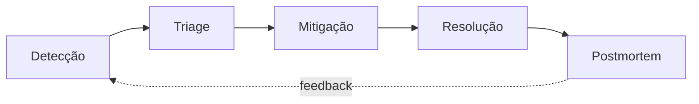

**Detecção**: alerta automático ou report de usuário. Quanto mais rápido, menos impacto. Métricas, smoke tests, logs — tudo converge aqui. MTTD (Mean Time To Detect) é a métrica.

**Triage**: qual a severidade? Quantos usuários afetados? Está piorando ou estável? A decisão é: quem precisa ser envolvido e qual a urgência. Classificação errada desperdiça tempo (sev-1 pra coisa menor) ou multiplica dano (sev-3 pra outage total).

**Mitigação**: parar o sangramento, não necessariamente achar a causa. Rollback do deploy, revert da config, scale up, switch de tráfego. O objetivo é restaurar serviço, não entender por quê — entender vem depois.

**Resolução**: fix definitivo, depois que o serviço está estável. Pode ser horas ou dias depois da mitigação.

**Postmortem**: análise estruturada. Sem ela, o mesmo incidente acontece de novo.

### Postmortem blameless

O postmortem blameless é prática fundamental da engenharia de confiabilidade moderna. A premissa é: pessoas cometem erros porque o sistema permite. Culpar a pessoa não melhora o sistema — entender por que o erro foi possível e fácil melhora.

O formato (popularizado pelo Google SRE book):

1. **Timeline**: cronologia factual do incidente (timestamps, ações, consequências)
2. **Impacto**: quantos usuários, por quanto tempo, qual o custo
3. **Fatores contribuintes**: não "root cause" (singular e simplificador), mas todos os fatores que precisaram se alinhar pro incidente acontecer
4. **O que funcionou**: defesas que limitaram o impacto
5. **O que não funcionou**: defesas que falharam ou não existiam
6. **Action items**: com owner e deadline, não "devemos melhorar X"

> [!warning] "Root cause: human error" não é root cause
> Se alguém rodou `DROP TABLE` em produção, a pergunta não é "por que essa pessoa fez isso?" — é "por que o sistema permite que um comando destrutivo rode em produção sem confirmação, sem backup verificado, sem blast radius limitado?" Culpar a pessoa encerra a análise antes de chegar no sistema.

### On-call design

On-call é o mecanismo de "alguém está responsável por responder incidentes fora do horário comercial". Mal desenhado, queima pessoas. Bem desenhado, é sustentável.

Princípios de on-call saudável:

- **Rotação**: ninguém fica de on-call permanente. Rotação semanal é padrão (equipes pequenas) ou diária (equipes grandes).
- **Escalação**: se o on-call primário não responde em N minutos, escala pro secundário. Se ninguém responde, escala pra gestão.
- **Toil budget**: se o on-call gasta >25% do tempo em trabalho repetitivo mecânico (toil), invista em automação. On-call que só apaga incêndio não tem tempo pra prevenir.
- **Cobertura de runbook**: cada alerta que pode disparar durante on-call tem runbook. Alerta sem runbook é "acorde às 3h e descubra sozinho".
- **Compensação**: on-call é trabalho extra. Comp time, pagamento adicional, ou algum reconhecimento formal. Ignorar isso é exploração.

### Comunicação durante incidente

Incidente sem comunicação disciplinada gera caos: N pessoas investigando a mesma coisa, stakeholders perguntando "o que está acontecendo?" a cada 5 minutos, informação fragmentada em DMs privados.

Estrutura mínima:

- **Status page** (pública): comunica pro mundo externo. "Estamos cientes do problema, investigando. Próxima atualização em 30 minutos." Mesmo se você não sabe a causa, comunicar que está ciente é melhor que silêncio.
- **Canal de incidente** (interno): um lugar central (canal Slack dedicado, war room) onde toda comunicação sobre o incidente acontece. Não em DMs, não em threads soltas.
- **Cadência de update**: a cada N minutos (30 é padrão), alguém posta update estruturado: o que sabemos, o que estamos fazendo, ETA da próxima ação. Mesmo que o update seja "sem novidade, continuamos investigando" — a ausência de update gera mais ansiedade que update vazio.

### War rooms e incident commander

Em incidentes grandes (sev-1, múltiplas equipes afetadas), coordenação informal não funciona. O padrão Incident Command System (ICS, adaptado de bombeiros) define roles claros:

**Incident Commander (IC)**: coordena, não executa. Decide prioridades, delega investigação, controla comunicação. Não está debugando código — está garantindo que as pessoas certas estão trabalhando nas coisas certas. O IC pode ser a pessoa menos técnica da sala; o que importa é capacidade de coordenação.

**Communications Lead**: escreve updates pro status page e stakeholders. Libera o IC e os engenheiros de parar pra escrever updates.

**Technical Lead**: lidera a investigação técnica. Decide qual hipótese testar primeiro, qual mitigação aplicar.

A armadilha em equipes pequenas é achar que "não precisa de IC porque somos 4 pessoas". Mesmo com 4, sem IC definido, todos fazem tudo: debugam, comunicam, decidem — e o resultado é que ninguém coordena. Definir IC leva 10 segundos ("eu sou IC, fulano investiga, ciclano comunica") e muda completamente a eficácia.

---

## 18 · API design patterns

> [!abstract] Resumo da categoria
> API é contrato. Contrato mal desenhado vira dívida que escala com o número de consumidores — cada integrador que adota o contrato torna mudanças mais caras. Os patterns aqui não são estilo ou preferência; são soluções pra problemas reais de escala, confiabilidade e evolução que todo sistema eventualmente encontra.

### Pagination: cursor vs offset

Offset pagination (`?page=2&limit=20` → `OFFSET 20 LIMIT 20`) é intuitiva mas quebra em escala. O banco precisa percorrer e descartar os primeiros N registros pra chegar no offset — `OFFSET 100000` é lento. Pior: se registros são inseridos ou removidos entre páginas, o cliente vê duplicatas ou perde itens.

Cursor pagination (`?after=cursor_abc&limit=20`) usa um ponteiro opaco pro último item visto. O banco busca diretamente a partir desse ponto, sem percorrer tudo antes. Performance constante independente da posição. Sem duplicatas em inserção/remoção porque o cursor aponta pra item específico.

| | Offset | Cursor |
|---|---|---|
| Performance em página alta | degradada (O(offset)) | constante |
| Estabilidade com mutação | instável (duplicatas/gaps) | estável |
| "Pular pra página 50" | trivial | impossível |
| Implementação | simples | mais complexa |

**Keyset pagination** é a variante mais performática: usa a combinação de colunas do ORDER BY como cursor. `WHERE (created_at, id) > ('2026-05-01', 'abc') ORDER BY created_at, id LIMIT 20`. Index-backed, sem OFFSET.

Regra prática: se a API é consumida por frontend com scroll infinito, cursor. Se precisa de "ir pra página N" (raro em API, comum em UI interna), offset com limite de profundidade. Em qualquer caso, estabeleça `max_limit` (nunca permita `?limit=999999`).

### Bulk operations

Endpoint que aceita 1 item por request é simples mas ineficiente quando o cliente precisa operar em 1000 itens — 1000 requests com overhead de rede, auth, parsing cada. Bulk endpoint aceita lista: `POST /items/batch` com body `[{...}, {...}, ...]`.

O problema sutil é **partial success**: dos 1000 itens, 997 passam e 3 falham validação. O que retornar? Opções:

- **All-or-nothing**: se 1 falha, nenhum é processado. Simples, mas frustrante pro cliente que precisa consertar 3 e reenviar 1000.
- **Partial success com relatório**: processa o que pode, retorna status individual por item. Status HTTP 207 (Multi-Status) ou corpo com array de resultados. Mais complexo mas mais útil.

```json
{
  "results": [
    { "index": 0, "status": "created", "id": "item_1" },
    { "index": 1, "status": "created", "id": "item_2" },
    { "index": 2, "status": "error", "error": "validation_failed", "field": "price" }
  ],
  "summary": { "total": 3, "created": 2, "failed": 1 }
}
```

Idempotência em batch é cada item ter sua chave — não o batch inteiro. Se o cliente retenta o batch, itens já processados são deduplicados individualmente.

### Webhooks e event subscriptions

Webhook inverte a direção da comunicação: em vez de o cliente pollar ("tem algo novo?"), o servidor envia pro cliente quando algo acontece. Economiza requests, reduz latência de notificação.

Mas webhook é uma promessa de delivery que é difícil de cumprir:

- **Delivery guarantee**: o endpoint do cliente pode estar fora. Precisa de retry com backoff. Quantas tentativas? Stripe faz 3 dias com backoff exponencial, começando em ~1 minuto.
- **Ordering**: eventos podem chegar fora de ordem. Webhook de "payment.succeeded" pode chegar antes de "payment.created" se o segundo retry demorou. O consumidor precisa ser tolerante a ordem.
- **Signature verification**: sem assinatura, qualquer pessoa que descubra o endpoint pode enviar eventos falsos. HMAC com shared secret é o padrão: `Stripe-Signature: t=timestamp,v1=hmac_hex`.
- **Subscription lifecycle**: como o cliente se registra? Como atualiza o endpoint? Como cancela? API explícita de webhook management é o mínimo.

> [!warning] Webhook sem retry é fire-and-forget
> Se o endpoint do cliente retorna 500 e você não retenta, o evento se perdeu. Webhook sem retry é notificação best-effort, não delivery guarantee. Documente explicitamente qual é o contrato.

### Rate limiting do lado consumidor

A seção 4 cobriu rate limiting do lado servidor (proteção). Aqui o foco é o lado do **consumidor** — como um bom cliente de API respeita os limites do provider.

**Respeite `Retry-After`**: quando o provider retorna 429 (Too Many Requests) com header `Retry-After: 30`, o cliente deve esperar 30 segundos antes de retentar. Cliente que ignora e retenta imediatamente está atacando, não consumindo.

**Client-side throttling**: em vez de bater no rate limit e tratar 429, mantenha contador local e desacelere antes de atingir o limite. Se a API permite 100 req/min, limite a 80 req/min no cliente — margem pra burst.

**Adaptive rate**: monitore a taxa de 429s. Se começar a receber, reduza concorrência multiplicativamente. Se parar, aumente aditivamente. AIMD de novo — o mesmo padrão de TCP congestion control, aplicado a APIs.

Ser bom consumidor de API é interesse próprio: provedores banlam, throttleiam ou degradam prioridade de clientes abusivos. Bom comportamento = melhor serviço.

### API gateways

API gateway é proxy reverso especializado que centraliza funcionalidades cross-cutting na entrada do sistema: autenticação, rate limiting, logging, transformação de request/response, roteamento por versão.

Sem gateway, cada serviço implementa auth, rate limiting, logging individualmente. Com gateway, implementa uma vez. Trade-off: é um single point of failure a mais, e pode virar bottleneck se mal dimensionado.

Gateways maduros: Kong, AWS API Gateway, Envoy (como edge proxy), Traefik. Em Kubernetes, o padrão Ingress/Gateway API cobre parte do que um gateway faz.

O antipattern é colocar lógica de negócio no gateway. Gateway é infraestrutura — auth, rate limit, transform, route. Se tem `if (user.plan == premium)` no gateway, isso é lógica de negócio que escapou pro lugar errado e vai ser impossível de testar com o resto da aplicação.

### Hypermedia e discoverability

HATEOAS (Hypermedia As The Engine Of Application State) é o princípio REST de incluir links nas respostas que indicam o que o cliente pode fazer a seguir. Em vez do cliente hardcodar URLs, ele segue links retornados pelo servidor.

```json
{
  "id": "order_123",
  "status": "pending",
  "_links": {
    "self": "/orders/order_123",
    "cancel": "/orders/order_123/cancel",
    "payment": "/orders/order_123/pay"
  }
}
```

Quando funciona bem: APIs de navegação onde os caminhos possíveis dependem do estado (pedido pendente tem link "cancel", pedido pago não tem). O cliente não precisa saber a regra — segue os links disponíveis.

Quando é overhead: APIs consumidas por SPAs com rotas hardcoded, APIs internas entre serviços com contrato fixo, qualquer contexto onde o cliente já sabe os endpoints. A maioria das APIs no mundo real não implementa HATEOAS completo — e tudo bem. Saber que existe é mais útil do que aplicar dogmaticamente.

### Content negotiation e evolução

Como a API evolui sem quebrar consumidores? Três abordagens dominantes:

**Versão no path** (`/v1/users`, `/v2/users`): mais explícito, mais fácil de rotear, mais fácil de entender. Desvantagem: URLs mudam entre versões, clients precisam atualizar base URL.

**Versão no header** (`Accept: application/vnd.api.v2+json`): URL estável, versão é metadata. Mais "RESTful" em teoria. Desvantagem: mais difícil de testar (curl precisa de header extra), menos visível.

**Versão no query** (`?version=2`): compromisso prático. URL estável com parâmetro. GitHub API v3 usa isso pra preview features.

Na prática, versão no path é a mais adotada porque é a mais simples de implementar, testar e documentar. O mais importante não é qual estratégia, mas ter uma — e manter a versão anterior rodando pelo tempo documentado no contrato de deprecation. "Versão velha morre sem aviso" é a forma mais rápida de perder confiança de integradores.

**Content negotiation** (`Accept`/`Content-Type`) resolve outro problema: o mesmo endpoint pode retornar JSON ou CSV dependendo do que o cliente pede. `Accept: application/json` → JSON. `Accept: text/csv` → CSV. Útil pra APIs que servem dados tanto pra frontends quanto pra ferramentas de análise.

---

## 19 · Infraestrutura como código

> [!abstract] Resumo da categoria
> Infraestrutura criada manualmente (clicar no console AWS, SSH pra configurar servidor) não é reprodutível, não é auditável, não é versionável e não é testável. Infrastructure as Code (IaC) traz as mesmas práticas que tornaram software confiável — versionamento, review, teste, automação — pra camada de infraestrutura. O resultado é que "provisionar ambiente novo" deixa de ser projeto de dias e vira pipeline de minutos.

### IaC princípios

O princípio central é **declarativo sobre imperativo**: em vez de dizer "crie um bucket, depois configure a policy, depois habilite encryption" (imperativo — script de passos), você declara o estado desejado ("quero um bucket com essa policy e encryption") e a ferramenta calcula o que precisa fazer pra chegar lá.

```hcl
# Terraform (declarativo): descreve o estado desejado
resource "aws_s3_bucket" "data" {
  bucket = "myapp-data-prod"
}
resource "aws_s3_bucket_server_side_encryption_configuration" "data" {
  bucket = aws_s3_bucket.data.id
  rule {
    apply_server_side_encryption_by_default {
      sse_algorithm = "aws:kms"
    }
  }
}
```

Ferramentas dominantes: **Terraform** (HCL, multi-cloud, o mais adotado), **Pulumi** (usa linguagens reais — TypeScript, Python, Go — em vez de DSL), **AWS CDK** (TypeScript/Python → CloudFormation), **CloudFormation** (YAML/JSON, AWS-only). Cada uma tem trade-offs de portabilidade, expressividade e ecossistema.

A vitória sobre scripts shell: a ferramenta declarativa sabe o estado atual, sabe o estado desejado, e calcula o diff (`terraform plan`). Script shell não sabe o estado atual — executa cegamente e pode criar recurso duplicado, falhar no meio deixando estado parcial, ou pular passo que já foi feito. Declarativo é idempotente por design; imperativo precisa ser feito idempotente com esforço.

### Immutable infrastructure

O paradigma é: servidores não são consertados, são substituídos. Em vez de SSH no servidor pra aplicar patch (mutable — o servidor muda de estado ao longo do tempo), você cria nova imagem (AMI, container image) com o patch, deploya instâncias novas, remove as velhas.

| | Mutable | Immutable |
|---|---|---|
| Atualização | SSH + apt upgrade / ansible | nova imagem + rolling deploy |
| Estado do servidor | drift ao longo do tempo | idêntico ao template sempre |
| Debug | "esse servidor tem config especial?" | todos são iguais |
| Rollback | reverter mudanças aplicadas (difícil) | voltar pra imagem anterior (trivial) |
| Reprodução | impossível sem snapshot | rebuild da imagem |

> [!danger] SSH em produção pra "fix rápido" é o começo do drift
> Um fix aplicado manualmente em 1 de 10 servidores cria estado inconsistente. Esse servidor se comporta diferente dos outros. Ninguém documenta o fix. Próximo deploy sobrescreve. Ou pior: não sobrescreve, e agora esse servidor tem configuração que nenhum outro tem, e daqui a 6 meses ninguém sabe por quê.

Container (Docker) é a implementação mais comum de immutable infrastructure em 2026: imagem buildada no CI, testada, publicada em registry, deployada em Kubernetes. O mesmo container roda em dev, staging e produção — diferenças vêm de variáveis de ambiente, não do container.

### GitOps

GitOps leva IaC ao extremo: o repositório git é a **única** fonte de verdade pro estado da infraestrutura e das aplicações. Qualquer mudança passa por PR → review → merge → reconciliação automática.

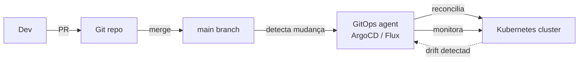

O **reconciliation loop** é o coração: o agente (ArgoCD, Flux) compara continuamente o estado no cluster com o declarado no git. Se alguém muda algo manualmente no cluster, o agente detecta drift e reverte pro estado do git. Nenhuma mudança manual sobrevive.

Benefícios em cascata: auditoria total (todo PR no git), rollback trivial (`git revert` + reconcilia), environment promotion via PR (merge de staging pra prod), permissões simplificadas (devs fazem PR, só o agente tem acesso ao cluster).

### Drift detection

Drift é divergência entre o estado declarado (código) e o estado real (infraestrutura rodando). Acontece quando alguém muda algo manualmente (console da AWS, `kubectl edit`), quando automação externa altera recurso, ou quando provider faz mudança unilateral.

Sem detecção de drift, você acha que `terraform apply` é no-op (nada pra mudar) mas a realidade está diferente do código. Próximo apply pode sobrescrever mudança manual importante, ou pior, pode não perceber que um security group foi alterado pra permitir acesso externo.

Defesas: `terraform plan` periódico em CI (alerta se plan != no-op), GitOps com reconciliação contínua (ArgoCD reconcilia a cada 3 minutos por padrão), AWS Config Rules (detecta drift em recursos AWS), ferramentas específicas como `driftctl`.

> [!info] Drift zero é aspiração, não realidade
> Em infraestrutura complexa, algum drift é inevitável (provider atualiza metadata, tag automática de cost allocation). O objetivo não é drift zero — é drift **visível e controlado**. Drift invisível é o perigo.

### Environment parity

Dev, staging e produção deveriam ser o mais parecidos possível. Quanto maior a diferença, menos os testes em staging preveem o comportamento em produção.

Diferenças comuns que causam bugs: SQLite em dev vs Postgres em prod (comportamento de transação diferente), file system local em dev vs S3 em prod (paths, latência, falhas), single instance em dev vs cluster em prod (race conditions só aparecem com múltiplas instâncias), mock de serviço externo em dev vs serviço real em prod.

O 12-Factor App (fator 10: Dev/prod parity) prescreve minimizar três gaps: time (deploy logo após escrever), personnel (quem escreveu deploya), tools (mesma tech stack). Docker Compose é a ferramenta prática que mais ajudou: `docker-compose up` sobe banco, cache, fila, serviço — tudo igual à produção (ou próximo) em minutos.

A paridade perfeita é inviável (produção tem load balancer, DNS, CDN, escala) e cara. O pragmático é: tech stack idêntica (mesmo banco, mesmo cache, mesma fila), configuração parametrizada (variáveis de ambiente, não branches de código), dados de teste realistas (não 3 registros — milhares, com edge cases).

### Secrets management em IaC

O problema é simples de enunciar e difícil de resolver: IaC precisa de secrets (database password, API keys, certificates) mas código em git não pode ter secrets. Se o Terraform precisa do password do RDS pra configurar o banco, onde fica o password?

**Nunca no git**: nem em `terraform.tfvars`, nem em variável de ambiente do CI commitada, nem "temporariamente" num branch privado. Secrets em git são permanentes — mesmo deletados, estão no histórico. Ferramentas como `truffleHog` e `gitleaks` escaneiam repositórios inteiros buscando secrets vazados.

Soluções por camada de maturidade:

1. **Variáveis de ambiente no CI** (mínimo): secrets vivem no Vault do CI (GitHub Actions Secrets, GitLab CI Variables). Nunca no código.
2. **Secret manager externo**: HashiCorp Vault, AWS Secrets Manager, GCP Secret Manager. Terraform lê o secret do manager em runtime. Secret nunca toca o repo.
3. **Sealed secrets** (Kubernetes): secret criptografado no git que só o controller no cluster consegue decriptar. Seguro no repo, útil em GitOps.
4. **External secrets operator**: controller no Kubernetes que sincroniza secrets de manager externo (Vault, AWS SM) automaticamente. Secret nunca precisa existir no git, nem sealed.

Rotação automática fecha o ciclo: secret manager gera novo password, propaga pra aplicação (via restart ou hot-reload), revoga o antigo. Terraform não deveria ser o mecanismo de rotação — ele é pra provisionar, não pra operar. Secret rotation é processo operacional contínuo, não evento de deploy.

---

## TL;DR — Top 26 pra decorar

> [!success] Se for guardar um subconjunto pequeno, são estes — cobrem 80% do que separa sistema robusto de sistema frágil

| # | Princípio | Hook em uma linha |
|---|---|---|
| 1 | **Idempotência** | Base de retry seguro |
| 2 | **Atomicidade** | Sem estado pela metade |
| 3 | **Consistência** | Invariantes protegidas |
| 4 | **Isolamento** | Concorrência sem interferência |
| 5 | **Durabilidade** | Confirmado = não some |
| 6 | **Timeout em tudo** | Espera infinita é bug |
| 7 | **Retry com backoff + jitter** | Sem jitter, thundering herd |
| 8 | **Circuit breaker** | Não amplifica outage |
| 9 | **Backpressure** | Fila não vira bomba |
| 10 | **Outbox + Inbox** | Par simétrico de event-driven sério |
| 11 | **Liveness ≠ Readiness** | Fundamental em orquestração |
| 12 | **Idempotency key + TTL** | Contrato de retry |
| 13 | **Validação na borda** | Trust boundary explícita |
| 14 | **Auth + Authz + Least Privilege** | Três coisas distintas |
| 15 | **Single source of truth** | Sem duplicação não-sincronizada |
| 16 | **Versionamento + Backwards/Forwards** | Evolução sem big bang |
| 17 | **Logs + Métricas + Traces** | Três pilares de observabilidade |
| 18 | **Graceful degradation** | Degrada antes de cair |
| 19 | **Reversibilidade + Rollback** | Todo passo destrutivo tem volta |
| 20 | **Statelessness quando possível** | Base de escala horizontal |
| 21 | **Service discovery** | Rede não é estática — saiba onde está cada coisa |
| 22 | **Lock files** | Build reprodutível ou build roleta |
| 23 | **Contract testing** | Contrato entre serviços verificável no CI |
| 24 | **Classificação de dados** | Classifica antes de proteger |
| 25 | **Runbooks testados** | Runbook não testado é ficção |
| 26 | **IaC declarativo** | Infra manual é infra irreplicável |

---

## Gaps que escapam de listas comuns

> [!danger] Estes matam em produção e raramente aparecem em listas genéricas

- **Fencing tokens** — locks distribuídos sem fencing são teatro. Caso clássico: Redlock.
- **Clock skew** — relógios físicos divergem mesmo com NTP; comparações são frágeis.
- **Tail latency amplification** — em fan-out, p99 do agregado é p99 do pior.
- **Cold start** — instância nova mente sobre capacidade até aquecer.
- **Connection pooling exhaustion** — DDoS interno mais comum.
- **Rate limiting ≠ backpressure** — proteção contra runaway, não pressão de fluxo.
- **Leases** — alternativa elegante a locks (TTL embutido, auto-cleanup).
- **Hedged requests** — pra cortar p99 em sistemas fan-out.
- **Anti-corruption layer** — tradução nas bordas entre domínios.
- **Distributed deadlock** — deadlocks entre serviços (A espera B, B espera A via HTTP) são invisíveis pra detecção tradicional de banco.
- **Semantic versioning trust** — semver é convenção social, não garantia. Patch version pode ter breaking change que o autor não percebeu.
- **Config drift em longo prazo** — feature flags esquecidas, env vars que ninguém sabe o que fazem, config que divergiu entre ambientes sem registro.
- **Thundering herd no cache** — cache TTL expira, mil requests batem no banco ao mesmo tempo. Defesa: jitter no TTL + request coalescing (só um request repopula).

---

## Referências

### Livros
- **Kleppmann, M.** — *Designing Data-Intensive Applications* (O'Reilly). O livro de referência absoluto sobre o tema.
- **Nygard, M.** — *Release It!* (Pragmatic). Stability patterns: circuit breaker, bulkhead, etc.
- **Evans, E.** — *Domain-Driven Design* (Addison-Wesley). Modelagem de domínios complexos.
- **Beyer, B. et al.** — *Site Reliability Engineering* (Google/O'Reilly). SLO, error budget, postmortems.

### Web
- [Jepsen.io](https://jepsen.io) — testes empíricos de consistência em bancos reais (Kyle Kingsbury).
- [12factor.net](https://12factor.net) — config e operação de apps modernas.
- [Aphyr — How to Build a Distributed Lock with Redis](https://martin.kleppmann.com/2016/02/08/how-to-do-distributed-locking.html) — caso clássico de fencing tokens.
- [aws.amazon.com/builders-library](https://aws.amazon.com/builders-library/) — papers operacionais da Amazon.

### Papers e talks fundamentais
- **Dynamo** (Amazon, 2007) — eventual consistency, vector clocks, hinted handoff.
- **Spanner** (Google, 2012) — TrueTime, consistência global, transações distribuídas.
- **Chubby** (Google, 2006) — distributed locks, Paxos em prática.
- **The Tail at Scale** (Dean & Barroso, Google, 2013) — tail latency amplification e defesas.
- **Phil Karlton** — "There are only two hard things in Computer Science: cache invalidation and naming things."
- **Peter Deutsch** — "Fallacies of Distributed Computing" (anos 90, ainda válidas).

---

> [!note] Histórico
> Documento consolidado em 2026-05-11. Expandido em 2026-05-17 com categorias 12-19 (rede, dependências, concorrência aplicação, testes, data lifecycle, operações, API design, IaC). Atualizar conforme novos padrões e gaps aparecerem na prática.
