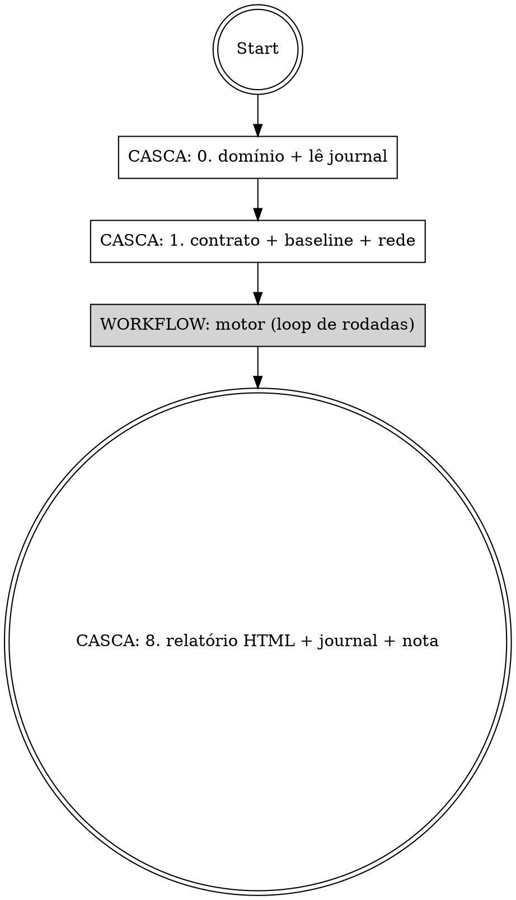
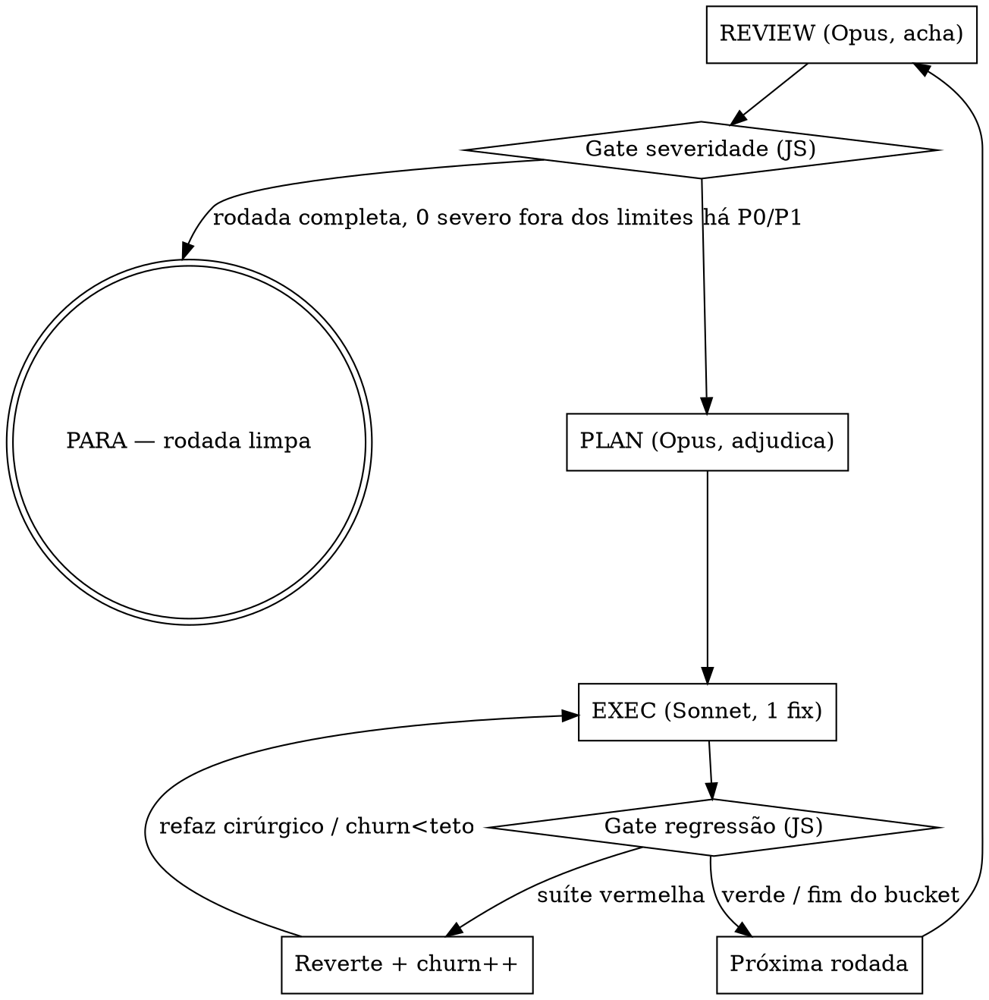

# /qa-loop — Loop de review→conserto disciplinado

Revisa código num loop e **para quando não vale mais a pena** — não quando chega a zero.
Ancora no **plano de implementação**: o código não pode "melhorar" e afastar do que foi combinado.

Substitui três skills: o esqueleto de loop multi-agente do antigo `/qa`, as lentes paralelas do
antigo `/rev6`, e a disciplina de regression-gate + baseline do antigo `/iterate` — tudo num fluxo só.

## A ideia central (por que existe)

Um loop "conserte até zero erros" tratado como convergente sobre um problema **assintótico**
(scrubber/parser/ranker/regex/prompt — espaço de input infinito) nunca para sozinho: um finder
adversarial SEMPRE acha mais um. "Zero findings" é assíntota, não estado. A skill troca o critério por
**"uma rodada inteira sem finding novo de severidade real fora dos limites já aceitos"** — e gasta a
maior parte da disciplina em **não gerar regressões** ao consertar.

## A arquitetura em uma frase — motor = Workflow, casca = skill

O **motor** (revisar → planejar → consertar → checar, em N rodadas) roda como **um único Workflow
determinístico** (a tool `Workflow`). Cada papel é um agente com o modelo certo: **Opus Revisor**
(independente) acha, **Opus Planejador** (adversarial, árbitro único) adjudica, **Sonnet Executor**
conserta um fix por vez. O gate de regressão, o gate de severidade, o churn detector e a parada são
**lógica do script (código JS)** — não "o Opus lembrar de aplicar a regra a cada rodada".

A **casca** (esta skill, no loop principal Opus) faz só o que o Workflow **não consegue**: os 2 toques
humanos. O Workflow roda em background e **não pergunta nada no meio**, então:
1. **Antes** de disparar o Workflow — classifica o domínio (pergunta 1× se ambíguo) e lê o journal.
2. **Depois** do Workflow retornar — gera o relatório HTML + journal e pede a nota 0-10.

> Invocar `/qa-loop` **é** o opt-in pra orquestração multi-agente — a skill instrui a chamar `Workflow`.
> Por que Workflow e não sub-agente solto: sub-agente solto seria o Opus disparando Task ad-hoc (a regra
> do Pedro condena, e o guard `PreToolUse(Agent)` acorda a cada fix). Por que não Agent Team: o fluxo é um
> pipeline fechado, não conversa aberta entre teammates. Workflow dá determinismo + telemetria + resumível.

## Input

```
/qa-loop <alvo> [--plan=<path>] [--floor=P1] [--max-rounds=6] [--domain=auto] [--headless]
```

- `<alvo>` — caminho/pasta, diff ref (`HEAD~3..HEAD`, `staged`), PR (`#123`), ou descrição natural do que foi implementado.
- `--plan` — o plano de implementação a auditar contra (`.claude/plans/*.md`, `docs/specs/*.md`). Se ausente, tenta achar o plano mais recente; se não houver, roda em modo "review sem plano" (sem o bucket plan-drift/plan-flaw, só implementação — e avisa que está sem âncora).
- Knobs (todos com default, abaixo).

## Parâmetros / knobs

| Knob | Default | O que faz |
|---|---|---|
| `reviewer_model` | `opus` / effort `high` | Modelo do Opus Revisor (acha — não julga severidade). |
| `planner_model` | `opus` / effort `high` | Modelo do Opus Planejador (árbitro único: rubrica + buckets + sequência). |
| `executor_model` | `sonnet` / effort `high` | Modelo do Sonnet Executor (aplica 1 fix por vez). |
| `severity_floor` | `P1` | Conserta P0/P1; P2/P3 viram candidato a accepted-limit. **Load-bearing**: define "finding de severidade real". |
| `max_rounds` | `6` | **TRAVA DE INCÊNDIO, NÃO META.** Quem decide a parada é o gate de severidade. |
| `domain` | `auto` | `auto` infere; `convergent` (tem comando pass/fail objetivo) ou `asymptotic`. |
| `regression_gate` | `on` | Sempre on — é o coração. |
| `triage_threshold` | `2` | Com ≥2 findings (ou qualquer alargamento de regra), o PLAN vira tabela formal; com 1, decisão inline. |
| `churn_threshold` | `2` | ≥N regressões auto-infligidas na mesma função → escala (para de remendar). |
| `headless` | `off` | Modo não-interativo (pro `/sovai`) — nunca pergunta, alertas de plano não viram fix. |

Precedência (R3): **flag de invocação > `.claude/qa-loop.config.md` do projeto > default acima.**

## Fluxo



O loop interno (dentro do Workflow), por rodada:



---

## CASCA — Passo 0 · Classificar domínio + ler journal

**Pergunta binária e barata:** "existe UM comando objetivo com pass/fail (testes/build/lint/um curl com `jq -e`)?"

- **Convergente** — sim, há alvo objetivo. O comando vira um **sinal de parada adicional** (para também quando ele passa, exit 0, sem regressão lint/typecheck — a lógica herdada do antigo `/iterate`). Teto alto.
- **Assintótico** (default pra heurística — scrubber/parser/ranker/regex/prompt/classificador/"achar todos os bugs") — não há estado-alvo binário. Governa o gate de severidade. **É o caso primário desta skill.**

Se ambíguo e **não headless**, pergunta 1× ao Pedro. Se headless, assume `asymptotic` (mais conservador).

**Lê o journal (R7)** antes de disparar o motor: do `.claude/qa-loop.config.md` do projeto puxa os
`accepted_limits` ratificados + as `invariants` vivas; de `~/.claude/qa-loop/journal/learnings.md` puxa
os aprendizados cross-projeto que afinam os prompts do Revisor/Planejador. Tudo isso vira **args do Workflow**.

> ⚠️ Erro que mata o loop: tratar assintótico como convergente → loop infinito. A pergunta tem que ser real, não um carimbo.

## CASCA — Passo 1 · Declarar contrato + baseline + rede de regressão

Fixa e **anuncia no header**: teto de rodadas (safety-cap), `severity_floor`, o plano-âncora, e a **camada de
rede de regressão** disponível (ver Guard-rails → fallback em camadas). Snapshot do nº de erros de
lint/typecheck ANTES da rodada 1 (`baseline_errors`) — é o que detecta regressão estrutural. Declara
honestamente o blast-radius que a rede NÃO cobre. Esses valores entram nos args do Workflow.

---

## WORKFLOW — o motor (loop de rodadas)

A casca dispara a tool `Workflow` com o script abaixo. **Esqueleto de referência — o princípio, não código
imutável.** Os três schemas (`FINDINGS`, `PLAN`, `EXEC_RESULT`) são o que torna os gates determinísticos: o
script lê campos estruturados, não texto solto.

```javascript
export const meta = {
  name: 'qa-loop-engine',
  description: 'Motor de QA: Opus revisa, Opus planeja, Sonnet conserta — para por retornos decrescentes',
  phases: [{ title: 'Review' }, { title: 'Plan' }, { title: 'Exec' }],
}

// args (vindos da casca): { target, planPath, severityFloor, maxRounds, domain,
//   safetyLayer, churnThreshold, acceptedLimits[], invariants[], learnings }
const sevRank = s => ({P0:3, P1:2, P2:1, P3:0}[s] ?? 0)
const floor = sevRank(args.severityFloor || 'P1')
let acceptedLimits = args.acceptedLimits || []
let invariants = args.invariants || []
const churn = {}                 // { 'arquivo:função': nº de regressões }
const rounds = []
let cleanRound = false, churnEscalated = false, r = 0

while (!cleanRound && r < args.maxRounds && !churnEscalated) {
  r++; phase(`Rodada ${r}`)

  // REVIEW — 1 Opus Revisor INDEPENDENTE. Checklist de 6 dimensões (1 agente, não 6).
  // Rodada 1 = sweep completo; 2+ = caça-regressão nas mudanças + ângulos frescos;
  // a rodada que CONFIRMA a parada re-roda o checklist completo. Só ACHA — não julga severidade.
  const review = await agent(reviewPrompt({ round: r, acceptedLimits, invariants }),
    { model: 'opus', effort: 'high', phase: 'Review', schema: FINDINGS })

  // GATE de severidade (JS) — sobre rodada COMPLETA (todo ângulo retornou).
  const severe = review.findings.filter(f =>
    sevRank(f.severity) >= floor && !isAccepted(f, acceptedLimits))
  if (review.complete && severe.length === 0) {
    rounds.push({ r, review, corrections: [], regressions: 0, alerts: [] }); cleanRound = true; break
  }

  // PLAN — Opus Planejador ADVERSARIAL = árbitro único (R2). Adjudica "procede?" contra a rubrica,
  // roteia nos 3 buckets, triagem por severidade E risco-de-conflito, sequencia. Rodada 1 pesada; 2+ = só o DELTA.
  const plan = await agent(planPrompt({ review, round: r, invariants, acceptedLimits }),
    { model: 'opus', effort: 'high', phase: 'Plan', schema: PLAN })

  // EXEC — Sonnet, SÓ bucket 1, EM SÉRIE (o gate roda a suíte entre fixes; pares de risco exigem ordem).
  const corrections = []; let regressions = 0
  for (const fix of plan.bucket1) {
    const res = await agent(execPrompt({ fix, invariants, safetyLayer: args.safetyLayer }),
      { model: 'sonnet', effort: 'high', phase: 'Exec', schema: EXEC_RESULT })
    // GATE de regressão (JS) — quem decide keep/revert é o script/Opus, NÃO o Sonnet.
    if (res.suiteRegressed) {
      regressions++; churn[fix.fn] = (churn[fix.fn] || 0) + 1
      await revertAndMaybeRedo(fix, res)            // reverte; refaz cirúrgico OU escala (mini-agent opus)
      if (churn[fix.fn] >= (args.churnThreshold || 2)) { churnEscalated = true; break }
    } else {
      corrections.push(res)
      if (res.newInvariant) invariants.push(res.newInvariant)   // invariante viva pras próximas rodadas
    }
  }

  acceptedLimits = acceptedLimits.concat(plan.proposedLimits || [])   // propostos (não ratificados — R6)
  rounds.push({ r, review, plan, corrections, regressions, alerts: plan.alerts || [] })
}

return {
  rounds, acceptedLimits, invariants, churn,
  planFlawAlerts: rounds.flatMap(x => x.alerts),
  telemetry: rounds.map(x => ({ round: x.r, corrections: x.corrections.length, regressions: x.regressions,
    findings_by_sev: tallyBySev(x.review.findings) })),
  stopReason: cleanRound ? 'no-severe-finding' : churnEscalated ? 'churn-escalated' : 'max-rounds',
}
```

**Schemas (JSON Schema, resumidos):**
- `FINDINGS` — `{ complete: boolean, findings: [{ id, file, line, severity: 'P0'|'P1'|'P2'|'P3', dimension, problem, fix_direction }] }`. `complete=false` se algum ângulo não retornou → NUNCA conta como rodada limpa.
- `PLAN` — `{ bucket1: [{ id, fn, severity, conflict_risk, order, fix_direction }], drift: [...], alerts: [...], proposedLimits: [...], invariants: [...] }`.
- `EXEC_RESULT` — `{ fix_id, fn, test_name, suiteRegressed: boolean, newInvariant?, note }`.

### Os passos do motor, em detalhe

**REVIEW = 1 Opus Revisor (R1).** Um único Opus cobre as **6 dimensões como CHECKLIST** (arquitetura ·
backend · frontend · contratos fullstack · correção · UX) — **não** 6 agentes. Recebe o material inteiro + o
**plano-âncora** + os accepted-limits vivos (não re-reportar) + as invariantes vivas (não violar). Formato de
cada finding: `P{0-3} — {arquivo:linha} — {problema} — {direção de fix, SEM código}`. Inclui sempre: "compare
contra o PLANO — sinalize onde a implementação DIVERGE do planejado, mesmo que o código pareça bom". **Regra
dura:** se algum ângulo do checklist não foi coberto → `complete=false`, jamais "achou zero".

**PLAN = Opus Planejador adversarial, árbitro único (R2).** Entre "achou" e "consertar". 4 sub-passos:
(a) consolida + dedup os findings; (b) **rotula cada um por BUCKET** (impl / plan-drift / plan-flaw);
(c) triagem do bucket 1 por severidade **e risco de conflito** (3 sinais checáveis ANTES de editar — dois
fixes na mesma função / fix que ALARGA regra genérica / fix que viola invariante viva); (d) sequencia
(extensão-enumerada primeiro, alargamento por último com negative-tests, agrupa por função). **Mandato
adversarial:** default a REJEITAR um finding (ou um accepted-limit) a não ser que se justifique contra a
rubrica. **Gerar ≠ julgar** — o Revisor acha, o Planejador é quem carimba a severidade (mata a oscilação
entre rodadas). Rodada 1 = plano pesado; 2+ processam só o DELTA.

**EXEC = Sonnet Executor (R1).** SÓ bucket 1, **um fix por vez**, na ordem do PLAN: (1) **test-first (red)** —
escreve o teste que reproduz o finding e vê falhar; o teste recebe **nome com a invariante**
(`test_atravessa_placeholder_pro_par_aws`); (2) **fix cirúrgico** — menor mudança, **extensão enumerada >
alargamento de regra**; (3) **roda a SUÍTE INTEIRA**; (4) reporta. O Sonnet **nunca** toca bucket 2/3.

**GATE de regressão (código, não LLM).** O `EXEC_RESULT.suiteRegressed` é objetivo (a suíte passou ou não).
Vermelho → **reverte** + `churn++`; o Opus decide refazer cirúrgico (troca difuso por extensão enumerada /
exceção mais específica) ou escalar. **Segurança não delega ao Sonnet.**

**Bucket 2 (plan-drift) e bucket 3 (plan-flaw)** nunca viram edição do Sonnet (R4 e a constraint central abaixo).

---

## CONSTRAINT CENTRAL — QA ancorado no plano (3 buckets)

A skill **não é só review de código** — audita **fidelidade ao plano** a cada rodada. Todo finding é roteado
em **3 buckets** no PLAN:

1. **Implementação** — código diverge do plano, bug, ou regressão. → fila de conserto (Sonnet, com gate).
2. **Plan-drift (R4)** — um "fix" otimizaria o código mas **afastaria o comportamento do que foi pedido/planejado**. → **restaura pro plano automaticamente** E o desvio sobe no bucket de alertas como **candidato a mudança-de-plano** pro Pedro julgar. O plano vence a "melhoria", mesmo que o agente ache que faz sentido mudar. Drift é uma **classe de regressão** — não pausa.
3. **Plano/arquitetura falho** — o **plano em si** é falho (decisão de arquitetura que gera problema crítico). → **bucket de ALERTA**. NUNCA consertado/implementado no loop. Sobe pro Pedro no relatório: "apresento e julgamos". É insumo pro planejamento, não trabalho de QA.

> A skill **enforça** o plano; não o **redesenha**. Só o bucket 1 vira edição. "QA é QA."

## Rubrica de severidade (R2) — 3 faixas, escrita, aplicada pelo árbitro único

- **P0/P1 (acima do floor)** — exige gatilho **objetivo** OU **ancorado no plano**: quebra comportamento do
  plano · classe de segurança (secret, injection, authz) · teste/build/lint falha · bug com repro determinístico.
- **P2/P3 (abaixo do floor)** — opinião de qualidade **sem** divergência do plano e **sem** falha objetiva
  (naming, gosto, micro-refator). **Picuinha nunca sobe sozinha** — só vira P1 com bug concreto anexado.
- O **Opus Planejador é o ÁRBITRO ÚNICO** que aplica a rubrica. Não são N LLMs cada um carimbando — é um juiz,
  rubrica escrita, severidade comparável entre rodadas (e na telemetria).

## Config em 3 camadas (R3) — `.claude/qa-loop.config.md` (VERSIONADO)

Fora da pasta ignorada `.claude/qa-loop/`. Versionado de propósito — viaja com o projeto. Contém:
- **Knobs** do projeto (floor, max_rounds, churn_threshold) que sobrescrevem o default.
- **Rubrica do projeto** — ajustes de severidade específicos do alvo.
- **Accepted-limits permanentes** (ratificados pelo Pedro — ver R6) + **invariantes vivas**.
- **Flags de invocação** padrão.

Precedência: **flag > config do projeto > default da skill.**

## Critério de parada (gate de severidade primário, teto = trava)

**PARA se qualquer um:**
- **[PRIMÁRIO]** uma rodada INTEIRA completou (`complete=true`) E produziu ZERO findings novos de severidade
  ≥ `floor` FORA dos accepted-limits. → rodada limpa.
- **[TRAVA]** atingiu `max_rounds` → reporta "teto atingido sem convergir" (ALARME, não sucesso).
- **[ESCALADA]** churn escalou (≥`churn_threshold` regressões na mesma função).
- **[CONVERGENTE]** o comando-alvo passa (exit 0) sem regressão lint/typecheck.

> O teto NÃO é meta. Quem decide é o gate de severidade — para na rodada 2 se convergiu rápido, vai até o teto
> se ainda acha P0. Cravar um número fixo agora seria o erro simétrico ao "até zero". A telemetria (passo 8) é
> que vai dizer, com o tempo, se vale cravar.

## "Vale a pena" (R5) — retornos decrescentes + risco de regressão, NUNCA tokens

O eixo "vale a pena" é o **gate de severidade** (retornos decrescentes) + o **regression gate / churn detector**
(risco de regressão — o churn é o "agora gera mais regressão que conserto, para"). **Tokens = número PASSIVO no
journal, nunca eixo de parada nem framing de "custo".**

---

## CASCA — Passo 8 · Verificação de saída + Relatório (humano) + Journal (agêntico) — R7

Quando o Workflow retorna, a casca roda a suíte completa + checks de integração, e produz **DOIS artefatos com
públicos distintos**:

### (A) Relatório HUMANO — gerador de actionables, via a skill `/visual` como parceira

**INVOQUE a skill `/visual`** pra renderizar (não reimplemente template nem daemon): o `/visual` já traz a
hierarquia, o "pedido se explica sozinho", o vocabulário banido, o daemon de live-sync e a semântica de copy.
Você passa o conteúdo estruturado (do `return` do Workflow); o `/visual` resolve template + daemon + path + abre.

Estrutura do relatório (no topo → fundo):
- **Gráfico único (SVG inline) — findings por severidade:** barras empilhadas P0/P1/P2/P3 por rodada, com a
  linha de severidade real (P0+P1) sobreposta — mostra a composição E a queda (retornos decrescentes) no mesmo
  lugar. Um gráfico só, porque com 4-5 rodadas dois lado a lado apertam. + **tabela por rodada** com as
  considerações **DENTRO da linha** (colapsável), NÃO um listão depois. Read-only.
- **4 categorias de ACTIONABLE** — o que sobe pro Pedro deixa de ser "alerta genérico" e vira 4 seções, cada
  achado um **`feedback-item` SELECIONÁVEL** (os valores internos `keep`/`change`/`remove` ficam, mas os labels
  viram **"✓ Vira ação" / "✏️ Ação c/ ajuste" / "✗ Descartar"** — o `/visual` autoriza relabelar). Cada item é
  **auto-explicável**: título humano (1 linha, sem jargão de código) + porquê/impacto (1-2 linhas) + onde (path);
  o detalhe técnico fica no colapsável.
  - **Estado inicial NEUTRO (regra dura): todo `feedback-item` nasce SEM seleção — sem radio `checked`, sem classe
    `state-*`.** Nenhuma categoria entra pré-marcada como "✓ Vira ação", e isso vale **especialmente pras Sugestões**:
    o loop ter PROPOSTO um refator/drift NÃO é "sim" do Pedro — é candidato a decisão dele. Razão dupla: (1) força a
    decisão ativa (não assume "sim" sem querer); (2) mantém o contador honesto — ele conta `input:checked`, então
    pré-marcar só a APARÊNCIA (classe `state-keep` sem `checked`) dessincroniza: o item parece selecionado e o contador
    segue em **0**. O progresso começa em **0 de N** e só sobe no clique.

  O mapeamento (a partir do `return`):
  1. **Importantes — recomendação** ← `planFlawAlerts` P0/P1 (decisões de arquitetura do plano: "apresento e julgamos").
  2. **Sugestões de melhoria** ← `plan-drift` (candidatos a mudança de plano) + refators propostos pelo loop.
  3. **Limitações atuais** (não quebram, mas importam) ← `acceptedLimits` propostos + churn hotspots.
  4. **Extras** (opcionais) ← P2/P3 documentados (picuinhas abaixo do floor, nice-to-have).
- **Fechamento** (`feedback-box`): progresso + observação geral + botões "Aprovar tudo" / "Copiar feedback".

**Seleção live → próximo plano (o ciclo fecha aqui).** O Pedro marca os itens, diz **"ok"**, e a casca lê
`~/.claude/visual-state/latest.json` (o daemon do `/visual`) e **monta o próximo plano só com os itens marcados
"✓ Vira ação" / "✏️ Ação c/ ajuste"** (a nota do "ajuste" entra como refinamento). Copy/paste é o fallback
quando o daemon está off. É assim que o relatório de QA vira o INPUT do próximo plano, sem retrabalho.

Polish: densidade controlada (sem parágrafo longo), hierarquia por cor + `sev`-tag, cada categoria com peso
visual distinto. Linguagem humana. (Ver `EXAMPLE-REPORT.html`.)

Se não headless, pergunta o **veredito 0-10** do Pedro (1 pergunta opcional/skipável) — a âncora subjetiva.

### (B) Journal AGÊNTICO — markdown verborrágico, pra "futuro-eu" (3 camadas)

NÃO é pro Pedro ler — é o agente passando informação pra ele mesmo do futuro **melhorar a skill**. (Ver `EXAMPLE-JOURNAL.md`.)

1. **Telemetria quantitativa** — JSONL append-only, 1 linha/sessão, pra calibrar nº de loops/rubrica. Os números
   **saem do `return` do Workflow** — não é contabilidade extra.
   - **Por projeto:** `<projeto>/.claude/qa-loop/telemetry.jsonl` (no `.gitignore`).
   - **Agregado cross-projeto:** `~/.claude/qa-loop/journal/telemetry.jsonl` (sobrevive a reinstalar o plugin).
2. **Aprendizado da SKILL** — `~/.claude/qa-loop/journal/learnings.md` (cross-projeto, acumula): findings
   exaustivos sobre onde o **próprio PROCESSO de QA** acertou/errou + **AÇÃO concreta pra futuro-eu**. Ex.:
   "Pedro rebaixou P1→P2 num finding de naming → AÇÃO: rubrica — naming enganoso só é P1 com bug concreto";
   "regressão escapou do gate porque o teste-red não cobria a interação entre estágios → o checklist do Revisor
   precisa de uma linha sobre interação". Registra também o que FUNCIONOU (pra não regredir o prompt).
3. **Memória de QA do PROJETO** — versionada, junto da config (`.claude/qa-loop.config.md`): invariantes vivas,
   accepted-limits ratificados, churn hotspots (funções acopladas), plan-flaws recorrentes.

### O loop fecha: a skill LÊ o journal no INÍCIO de cada sessão (passo 0)

A memória do projeto semeia os accepted-limits + invariantes; os aprendizados da skill afinam a rubrica/prompt.
É assim que "melhora com o uso" — **agêntico + humano-no-loop** (os aprendizados viram refino do skill por
mim/Pedro periodicamente). **Zero auto-tuning automático no v1.** (Por que não autoresearch: o método do Karpathy
depende de UMA métrica escalar barata e comparável entre runs, que review NÃO tem; o keep/discard dele já existe
aqui no lugar certo — é o regression gate, que decide por teste objetivo.)

Schema da telemetria (1 objeto por linha):
```json
{"ts":"<ISO>","target":"<path/desc>","domain":"asymptotic","severity_floor":"P1","max_rounds_config":6,"rounds_run":3,"corrections_per_round":[5,1,0],"last_round_with_severe_finding":2,"regressions_self_inflicted":1,"accepted_limits":1,"plan_flaw_alerts":1,"tokens_per_round":[...],"stop_reason":"no-severe-finding","pedro_score_0_10":null}
```
`last_round_with_severe_finding` (mediana entre sessões assintóticas) é a resposta empírica ao "3 loops?".

---

## Guard-rails operacionais

### Regression gate por conserto (o maior ROI)
A suíte inteira a cada conserto converte 4 dos 5 mecanismos de regressão de "descoberto 3 rodadas depois" em
"falha na mesma edição". É o GATE de regressão do motor. Não pule, não bata só o teste novo.

### Os 5 mecanismos de regressão (operacionalizados)
- **A — alargamento de escopo:** consertar um falso-negativo alargando uma regra genérica cria falso-positivo em outro canto. → **extensão enumerada > alargamento**; negative-tests logo após. Prevenido no PLAN.
- **B — ordem de curto-circuito:** exceção (early-return) antes da regra principal engole o caso de interseção. → ordene checagens positivas fortes ANTES das exceções; teste a interseção. Pego pelo gate.
- **C — proxy sintático grosseiro:** uma propriedade superficial (tem "/", é numérico) usada como semântica vale pros dois lados da fronteira. → combine sinais; na dúvida, inverta o default pro lado seguro. Pego pelo gate.
- **D — conflito entre correções:** a correção K+n viola a invariante da correção K. → teste **nomeado com a invariante**; suíte inteira a cada conserto. Prevenido no PLAN (invariantes vivas) + pego pelo gate.
- **E — interação entre estágios:** um estágio deixa resíduo que outro consome. → cada estágio neutraliza o que processou; teste a INTERAÇÃO entre estágios. Pego pelo gate.

### Fallback em camadas quando NÃO há suíte de testes
"Cumprir 100%" aqui = **honestidade 100%** sobre a rede, nunca fingir segurança. Detecte na ordem e declare o
blast-radius-não-coberto, baixando o teto conforme a rede enfraquece:

- **Camada 1 — Suíte de testes (rede completa).** Detecta: `test` script em **package.json** · jest/vitest/mocha em devDependencies · `pytest` em **pyproject.toml**/**setup.cfg** · **Cargo.toml**→`cargo test` · **go.mod**→`go test ./...` · target `test` em **Makefile**. Teto normal.
- **Camada 2 — Testes-de-caracterização gerados** dos próprios teste-red do gate. Cobre SÓ os findings já tocados — declara isso. Começa vazia (rodada 1 roda com menos rede).
- **Camada 3 — Lint + typecheck baseline.** Detecta: **eslint.config.\***/**.eslintrc.\***/**biome.json**→lint; **tsconfig.json**/**pyproject.toml**(ruff/mypy/pyright)→typecheck. Pega tipo/sintaxe, **NÃO comportamento**. Teto 2.
- **Camada 4 — Jornada Playwright** (alvo com UX). Print + análise da tela a cada conserto (não só DOM). Cobre só o caminho roteirizado. Teto 2.
- **Camada 5 — Sem rede.** NÃO roda como se houvesse proteção. Declara em linguagem humana ("sem testes, sem lint/types, sem jornada — cada conserto é aposta cega; rodo no máx 1 rodada de críticos e paro"). Teto 1.

A camada escolhida (e o que ela não cobre) é arg do Workflow, entra no header da rodada e no relatório.

### Churn detector
Por **FUNÇÃO** (não arquivo): conta edições + regressões auto-infligidas. ≥`churn_threshold` regressões na mesma
função → **escala** (para de remendar; sinaliza "acoplamento alto: refatora pra detectores independentes OU aceita
os limites"). É lógica do script do motor.

### Accepted-limits (R6) — proposto, nunca enterrado sozinho
Vivo, **ancorado ao alvo**. O loop **PROPÕE** (`plan.proposedLimits`); o Planejador adjudica se procede; mas só
vira **PERMANENTE** quando o Pedro move pra `.claude/qa-loop.config.md`. **Critério explícito de entrada** (é
genuinamente espaço-de-input-infinito? ou só difícil?) — não é o lixo do que cansou de consertar; um bug real
classificado como limite some pra sempre. **Headless propõe + reporta, nunca grava permanente.**

### Findings arquiteturais (não viram teste-red)
"A abordagem é frágil", "acoplamento alto", "naming enganoso" não reproduzem por teste determinístico. →
**excluídos do regression gate; só reportados** (viram bucket plan-flaw / alerta, ou P2 documentado). Nunca
consertados automaticamente sem rede.

---

## Modo headless (pro /sovai)

Com `--headless`: o loop NUNCA pergunta nada (auto-classifica domínio como assintótico se ambíguo, usa os
defaults, pula o veredito 0-10). **Alertas de plan-flaw continuam NÃO virando fix** — ficam no relatório pro
Pedro revisar depois. Headless ≠ licença pra re-planejar nem pra ratificar accepted-limit. O relatório da
`/qa-loop` vira a seção final de QA do report do `/sovai`.

## Quando NÃO usar

- Sem nada implementado pra revisar → recuse.
- Aplicar fix sem rede de regressão E sem aceitar o teto-1 da Camada 5 → declare a cegueira, não finja.
- Tarefa puramente convergente de 1 passo que você já sabe consertar → só conserte, não embrulhe num loop.

## Regras de segurança

- Nunca declarar "rodada limpa" sem `complete=true` (todos os ângulos do checklist cobertos).
- Nunca consertar um finding de bucket plan-drift no sentido que afasta do plano; nunca implementar um plan-flaw.
- Nunca rodar como se houvesse rede de regressão quando não há (Camada 5 é declaração explícita, não fallback silencioso).
- O teto é trava, não meta — não pare só porque "rodou N vezes" se ainda há severidade real.
- Quem decide keep/revert de um fix é o Opus/script, nunca o Sonnet. Segurança não delega.
