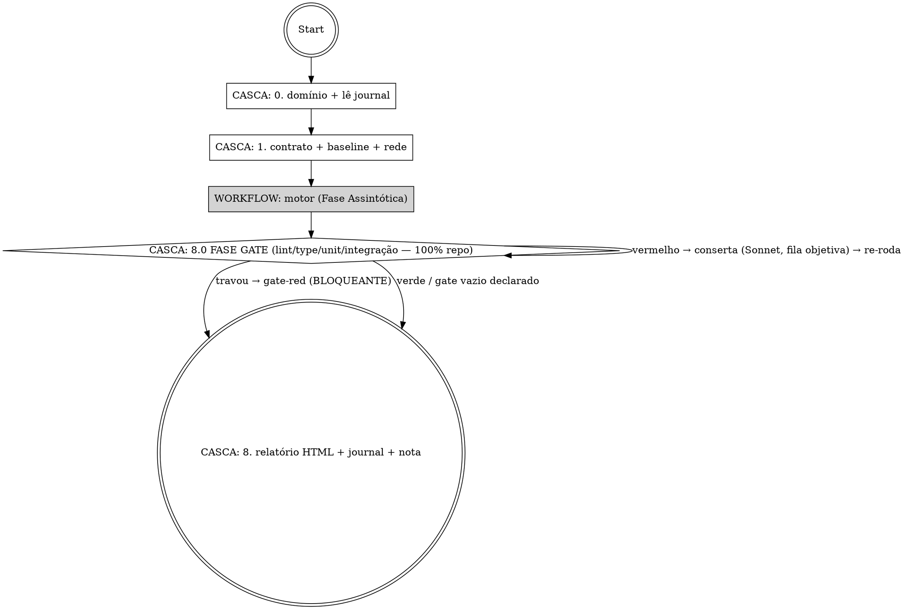
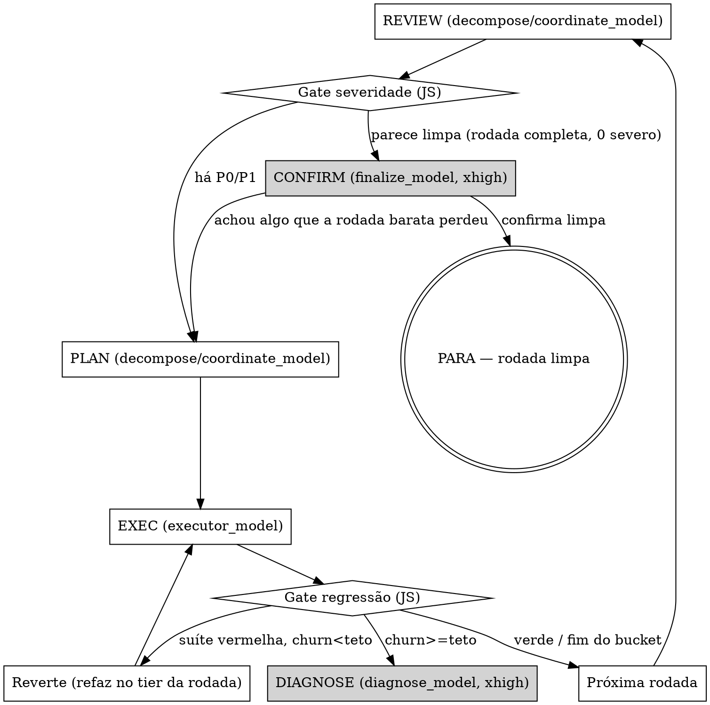

# /qa-loop — Loop de review→conserto disciplinado

Revisa código num loop e **para quando não vale mais a pena** — não quando chega a zero.
Ancora no **plano de implementação**: o código não pode "melhorar" e afastar do que foi combinado.

Substitui três skills: o esqueleto de loop multi-agente do antigo `/qa`, as lentes paralelas do
antigo `/rev6`, e a disciplina de regression-gate + baseline do antigo `/iterate` — tudo num fluxo só.

## A ideia central (por que existe)

Um loop "conserte até zero erros" tratado como convergente sobre um problema **assintótico**
(scrubber/parser/ranker/regex/prompt — espaço de input infinito) nunca para sozinho: um finder
adversarial SEMPRE acha mais um. "Zero findings" é assíntota, não estado. A skill troca o critério por
**"uma rodada inteira sem finding novo de severidade real fora dos limites já aceitos"** — e gasta a
maior parte da disciplina em **não gerar regressões** ao consertar. (Esse é o eixo **assintótico**. O outro
eixo — os checks objetivos lint/type/unit/integração — é **absoluto** e vive na Fase Gate; ver "As duas fases".)

## A arquitetura em uma frase — motor = Workflow, casca = skill

O **motor** (revisar → planejar → consertar → checar, em N rodadas) roda como **um único Workflow
determinístico** (a tool `Workflow`). Cada papel é um agente com o modelo certo: **Opus Revisor**
(independente) acha, **Opus Planejador** (adversarial, árbitro único) adjudica, **Sonnet Executor**
conserta um fix por vez. O gate de regressão, o gate de severidade, o churn detector e a parada são
**lógica do script (código JS)** — não "o Opus lembrar de aplicar a regra a cada rodada".

A **casca** (esta skill, no loop principal Opus) faz só o que o Workflow **não consegue**: os 2 toques
humanos. O Workflow roda em background e **não pergunta nada no meio**, então:
1. **Antes** de disparar o Workflow — classifica o domínio (pergunta 1× se ambíguo) e lê o journal.
2. **Depois** do Workflow retornar — gera o relatório HTML + journal e pede a nota 0-10.

> Invocar `/qa-loop` **é** o opt-in pra orquestração multi-agente — a skill instrui a chamar `Workflow`.
> Por que Workflow e não sub-agente solto: sub-agente solto seria o Opus disparando Task ad-hoc (a regra
> do Pedro condena, e o guard `PreToolUse(Agent)` acorda a cada fix). Por que não Agent Team: o fluxo é um
> pipeline fechado, não conversa aberta entre teammates. Workflow dá determinismo + telemetria + resumível.

## As duas fases — máquina assintótica + gate absoluto

A skill roda **duas fases com lógicas próprias que convivem** — não uma máquina só. Cada finding pertence
a UMA delas, e cada fase tem seu próprio critério de "pronto". Confundir as duas é o erro que esta seção
existe pra matar: tratar um erro de type como "finding de severidade rebaixável", ou tratar um cheiro de
código como "tem que zerar".

**Fase Assintótica** — revisão de código, aderência ao plano (os 3 buckets), findings de **severidade
variável** (P0-P3), accepted-limits, parada por **retornos decrescentes**. **e2e/Playwright vive aqui**:
cobertura parcial e honesta, vira *actionable* no relatório — **não bloqueia**. É todo o corpo desta skill
(os passos abaixo descrevem ela).

**Fase Gate** — lint, type-check, teste unitário, teste de integração e afins. **Absolutista: 100% verde
no repo inteiro ou não passou.** Binário. Sem severidade, sem julgamento, sem accepted-limit, sem "não vale
a pena". É portão. Os checks **nunca foram** da fase assintótica — são a Fase Gate. Detalhe operacional no
Passo 8.0 (gate de saída) + na seção "Detecção de rede".

> As fases **não são sequenciais no tempo**. O gate é **invariante de saída**, protegido continuamente pelo
> regression-net por-fix do motor (a suíte roda a cada conserto). A skill só declara **sucesso da sessão**
> quando AS DUAS fecham: a Fase Assintótica chega a uma **rodada limpa** (seu evento interno — retornos
> decrescentes) E a Fase Gate fica 100% verde. "Rodada limpa" é o desfecho do motor; "sucesso da sessão" é das
> duas juntas. Gate vermelho **nunca** é sucesso — a casca seta `stopReason='gate-red'`.

## Input

```
/qa-loop <alvo> [--plan=<path>] [--floor=P1] [--max-rounds=6] [--domain=auto] [--headless]
```

- `<alvo>` — caminho/pasta, diff ref (`HEAD~3..HEAD`, `staged`), PR (`#123`), ou descrição natural do que foi implementado.
- `--plan` — o plano de implementação a auditar contra (`.claude/plans/*.md`, `docs/specs/*.md`). Se ausente, tenta achar o plano mais recente; se não houver, roda em modo "review sem plano" (sem o bucket plan-drift/plan-flaw, só implementação — e avisa que está sem âncora).
- Knobs (todos com default, abaixo).

## Modelo & effort por etapa (R8) — contrato em `references/r8-tiers.md`

Cada etapa do motor dispara no tier certo pro PESO da decisão ali — nunca "Opus em tudo" nem "Sonnet em
tudo". O tier de cada etapa (modelo · effort · knob) e a semântica dos knobs são o **contrato R8
compartilhado** com o `/sovai`, vendorado em **`references/r8-tiers.md`** (fonte: `_shared/r8-tiers.md` —
não editar a cópia à mão; `scripts/sync-shared.sh --check` pega drift). Trocar o tier de uma etapa lá vale
pros dois motores. A tabela completa (Etapa · Modelo · Effort · Knob + o que cada knob significa + a regra de
tier por rodada) está no arquivo. Abaixo, só **onde cada knob entra NESTE motor** (revisa→planeja→conserta):

| Knob | Onde no motor |
|---|---|
| `decompose_model` | REVIEW + PLAN da **rodada 1** (sweep completo + plano pesado). |
| `coordinate_model` | REVIEW + PLAN das **rodadas 2+** (caça-regressão + delta). |
| `executor_model` | EXEC — Sonnet aplica 1 fix do bucket 1 por vez. |
| `mechanical_model` | Fila objetiva da **Fase Gate** (Passo 8.0) — lint/type/unit/integração, sem julgamento. |
| `diagnose_model` | Escalada de **churn** — mesma função regrediu ≥ `churn_threshold` → diagnóstico de raiz, não mais remendo. |
| `finalize_model` | **Confirm-pass** — antes de declarar rodada limpa, um re-sweep completo dedicado roda aqui; não confia no resultado mais barato (`coordinate_model`) da rodada que pareceu limpa. |

## Parâmetros / knobs

Os **6 model-knobs** (`decompose_model`, `coordinate_model`, `executor_model`, `mechanical_model`,
`diagnose_model`, `finalize_model`) com seus defaults de modelo/effort vivem no contrato R8
(`references/r8-tiers.md`) — não repito os defaults aqui pra não reintroduzir o drift. Os knobs de
**comportamento** do loop:

| Knob | Default | O que faz |
|---|---|---|
| `severity_floor` | `P1` | Conserta P0/P1; P2/P3 viram candidato a accepted-limit. **Load-bearing**: define "finding de severidade real". |
| `max_rounds` | `6` | **TRAVA DE INCÊNDIO, NÃO META.** Quem decide a parada é o gate de severidade. |
| `domain` | `auto` | `auto` infere; `convergent` (tem comando pass/fail objetivo) ou `asymptotic`. |
| `regression_gate` | `on` | Sempre on — é o coração. |
| `triage_threshold` | `2` | Com ≥2 findings (ou qualquer alargamento de regra), o PLAN vira tabela formal; com 1, decisão inline. |
| `churn_threshold` | `2` | ≥N regressões auto-infligidas na mesma função → escala pro `diagnose_model` (para de remendar). |
| `headless` | `off` | Modo não-interativo (pro `/sovai`) — nunca pergunta, alertas de plano não viram fix. |

Precedência (R3): **flag de invocação > `.claude/qa-loop.config.md` do projeto > default acima.**

## Fluxo



O loop interno (dentro do Workflow), por rodada:



Tier por rodada: **rodada 1** = `decompose_model` (Opus xhigh, planejamento inicial); **rodadas 2+** =
`coordinate_model` (Opus high, coordenação rotineira). O nó CONFIRM é dedicado — sempre `finalize_model`
(Opus xhigh), nunca o tier da rodada que pareceu limpa. DIAGNOSE também é dedicado — sempre `diagnose_model`
(Opus xhigh), disparado só quando o churn escala (mesma função regredindo repetidamente).

---

## CASCA — Passo 0 · Classificar domínio + ler journal

**Toda sessão roda AS DUAS fases** (ver "As duas fases"). A pergunta de domínio NÃO roteia a skill pra um
lado só — ela faz duas coisas: define o **conteúdo da Fase Gate** E calibra o teto da Fase Assintótica.

**Pergunta binária e barata:** "existe UM comando objetivo com pass/fail (testes/build/lint/type/um curl com `jq -e`)?"

- **Convergente** — sim, há checks objetivos. Eles **compõem a Fase Gate** (Passo 8.0): lint/type/unit/
  integração rodam ao fim como portão absoluto (100% verde no repo inteiro, ou `stopReason='gate-red'`).
  Quanto mais forte a suíte, mais forte o gate; o alvo objetivo também dá teto alto pra Fase Assintótica.
- **Assintótico** (default pra heurística — scrubber/parser/ranker/regex/prompt/classificador/"achar todos
  os bugs") — não há estado-alvo binário pro review; governa o gate de **severidade** e a parada por
  retornos decrescentes da Fase Assintótica. **É o caso primário desta skill.** **O domínio NÃO decide se há
  Fase Gate:** se o projeto tem checks objetivos (até um scrubber tem lint+unit), eles compõem a Fase Gate
  absoluta igual ao caso convergente — o domínio só muda o teto/severidade da fase assintótica. Só SEM nenhum
  check objetivo a **Fase Gate fica vazia, declarada honesto** — nunca finge gate.

Se ambíguo e **não headless**, pergunta 1× ao Pedro. Se headless, assume `asymptotic` (mais conservador).

**Lê o journal (R7)** antes de disparar o motor: do `.claude/qa-loop.config.md` do projeto puxa os
`accepted_limits` ratificados + as `invariants` vivas; de `~/.claude/qa-loop/journal/learnings.md` puxa
os aprendizados cross-projeto que afinam os prompts do Revisor/Planejador. Tudo isso vira **args do Workflow**.

> ⚠️ Erro que mata o loop: tratar assintótico como convergente → loop infinito. A pergunta tem que ser real, não um carimbo.

## CASCA — Passo 1 · Declarar contrato + baseline + rede de regressão

Fixa e **anuncia no header**: teto de rodadas (safety-cap), `severity_floor`, o plano-âncora, e a **camada de
rede de regressão** disponível (ver Guard-rails → Detecção de rede). Snapshot do nº de erros de
lint/typecheck ANTES da rodada 1 (`baseline_errors`) — é o que a **rede de regressão DURANTE o loop** usa pra
pegar regressão estrutural (não piorar o baseline mid-loop). ⚠️ Isso é a rede in-loop, **NÃO o gate**: a
**Fase Gate de saída** (Passo 8.0) exige lint/type/unit/integração **absolutamente 0** no fim, pré-existentes
incluídos — o baseline tolera no meio, o gate não tolera no fim. Declara honestamente o blast-radius que a rede
NÃO cobre. Esses valores entram nos args do Workflow.

---

## WORKFLOW — o motor (loop de rodadas)

A casca dispara a tool `Workflow` com o script abaixo. **Esqueleto de referência — o princípio, não código
imutável.** Os três schemas (`FINDINGS`, `PLAN`, `EXEC_RESULT`) são o que torna os gates determinísticos: o
script lê campos estruturados, não texto solto.

```javascript
export const meta = {
  name: 'qa-loop-engine',
  description: 'Motor de QA: tier por etapa (R8) — decompose/coordinate/executor/mechanical/diagnose/finalize',
  phases: [{ title: 'Review' }, { title: 'Plan' }, { title: 'Exec' }, { title: 'Confirm' }],
}

// args (vindos da casca): { target, planPath, severityFloor, maxRounds, domain,
//   safetyLayer, churnThreshold, acceptedLimits[], invariants[], learnings }
const sevRank = s => ({P0:3, P1:2, P2:1, P3:0}[s] ?? 0)
const floor = sevRank(args.severityFloor || 'P1')
let acceptedLimits = args.acceptedLimits || []
let invariants = args.invariants || []
const churn = {}                 // { 'arquivo:função': nº de regressões }
const rounds = []
let cleanRound = false, churnEscalated = false, r = 0
let touchedLastRound = [], openFindings = []   // delta pro REVIEW das rodadas 2+

// Tier por rodada (R8 — tabela única com /sovai): rodada 1 = decompose_model (xhigh,
// planejamento inicial); rodadas 2+ = coordinate_model (high, coordenação rotineira).
const tierFor = round => round === 1
  ? { model: 'opus', effort: 'xhigh' }   // decompose_model
  : { model: 'opus', effort: 'high' }    // coordinate_model

while (!cleanRound && r < args.maxRounds && !churnEscalated) {
  r++; phase(`Rodada ${r}`)
  const tier = tierFor(r)

  // REVIEW — 1 Opus Revisor INDEPENDENTE, no tier da rodada. Checklist de 6 dimensões
  // (1 agente, não 6). Rodada 1 = sweep completo do material inteiro (decompose_model);
  // 2+ = DELTA (coordinate_model): só os arquivos tocados pelos fixes da rodada anterior
  // + findings abertos — caça-regressão, não releitura do material inteiro.
  const review = await agent(reviewPrompt({ round: r, acceptedLimits, invariants,
      scope: r === 1 ? 'full' : { touchedFiles: touchedLastRound, openFindings } }),
    { model: tier.model, effort: tier.effort, phase: 'Review', schema: FINDINGS, agentType: 'voltagent-qa-sec:code-reviewer' })

  // GATE de severidade (JS) — sobre rodada COMPLETA (todo ângulo retornou).
  const severe = review.findings.filter(f =>
    sevRank(f.severity) >= floor && !isAccepted(f, acceptedLimits))

  if (review.complete && severe.length === 0) {
    // CONFIRM — finalize_model (Opus xhigh, R8 "revisão final e integração"). Re-sweep
    // completo DEDICADO antes de declarar limpa — não confia no resultado mais barato
    // (coordinate_model) da rodada que pareceu limpa.
    const confirm = await agent(reviewPrompt({ round: r, acceptedLimits, invariants, confirming: true }),
      { model: 'opus', effort: 'xhigh', phase: 'Confirm', schema: FINDINGS, agentType: 'voltagent-qa-sec:security-auditor' })   // finalize_model
    const confirmSevere = confirm.findings.filter(f =>
      sevRank(f.severity) >= floor && !isAccepted(f, acceptedLimits))
    if (confirm.complete && confirmSevere.length === 0) {
      rounds.push({ r, review, confirm, corrections: [], regressions: 0, alerts: [] })
      cleanRound = true; break
    }
    // o confirm-pass achou algo que a rodada barata perdeu — processa, não ignora.
    review.findings = review.findings.concat(confirm.findings)
  }

  // PLAN — Opus Planejador ADVERSARIAL = árbitro único (R2), no MESMO tier da rodada.
  // Adjudica "procede?" contra a rubrica, roteia nos 3 buckets, triagem por severidade
  // E risco-de-conflito, sequencia. Rodada 1 (decompose_model) pesada; 2+ (coordinate_model) = só o DELTA.
  const plan = await agent(planPrompt({ review, round: r, invariants, acceptedLimits }),
    { model: tier.model, effort: tier.effort, phase: 'Plan', schema: PLAN, agentType: 'voltagent-qa-sec:error-detective' })

  // EXEC — Sonnet (executor_model), SÓ bucket 1, EM SÉRIE (o gate roda a suíte entre
  // fixes; pares de risco exigem ordem).
  const corrections = []; let regressions = 0
  for (const fix of plan.bucket1) {
    const res = await agent(execPrompt({ fix, invariants, safetyLayer: args.safetyLayer }),
      { model: 'sonnet', effort: 'high', phase: 'Exec', schema: EXEC_RESULT, agentType: 'voltagent-core-dev:backend-developer' })   // executor_model
    // GATE de regressão (JS) — quem decide keep/revert é o script/Opus, NÃO o Sonnet.
    if (res.suiteRegressed) {
      regressions++; churn[fix.fn] = (churn[fix.fn] || 0) + 1
      if (churn[fix.fn] >= (args.churnThreshold || 2)) {
        // DIAGNOSE — diagnose_model (Opus xhigh, R8 "diagnóstico após falhas repetidas").
        // Não é mais "refaz cirúrgico" — é a causa raiz do acoplamento que faz a mesma
        // função regredir de novo a cada tentativa.
        await agent(diagnosePrompt({ fix, churnCount: churn[fix.fn], invariants }),
          { model: 'opus', effort: 'xhigh', phase: 'Diagnose', agentType: 'voltagent-qa-sec:architect-reviewer' })   // diagnose_model
        churnEscalated = true; break
      }
      await revertAndMaybeRedo(fix, res, tier)   // reverte; refaz cirúrgico no tier DA RODADA
    } else {
      corrections.push(res)
      if (res.newInvariant) invariants.push(res.newInvariant)   // invariante viva pras próximas rodadas
    }
  }

  acceptedLimits = acceptedLimits.concat(plan.proposedLimits || [])   // propostos (não ratificados — R6)
  touchedLastRound = corrections.flatMap(c => c.files_touched || [])  // delta do REVIEW da próxima rodada
  openFindings = review.findings.filter(f => !corrections.some(c => c.fix_id === f.id))
  rounds.push({ r, review, plan, corrections, regressions, alerts: plan.alerts || [] })
}

return {
  rounds, acceptedLimits, invariants, churn,
  planFlawAlerts: rounds.flatMap(x => x.alerts),
  telemetry: rounds.map(x => ({ round: x.r, corrections: x.corrections.length, regressions: x.regressions,
    findings_by_sev: tallyBySev(x.review.findings) })),
  stopReason: cleanRound ? 'no-severe-finding' : churnEscalated ? 'churn-escalated' : 'max-rounds',
}
```

**Schemas (JSON Schema, resumidos):**
- `FINDINGS` — `{ complete: boolean, findings: [{ id, file, line, severity: 'P0'|'P1'|'P2'|'P3', dimension, problem, fix_direction }] }`. `complete=false` se algum ângulo não retornou → NUNCA conta como rodada limpa.
- `PLAN` — `{ bucket1: [{ id, fn, severity, conflict_risk, order, fix_direction }], drift: [...], alerts: [...], proposedLimits: [...], invariants: [...] }`.
- `EXEC_RESULT` — `{ fix_id, fn, files_touched: [...], test_name, suiteRegressed: boolean, newInvariant?, note }`.

> Os `agentType: voltagent-*` nos spawns são otimização de persona — se o agent type não existir na
> máquina, spawne sem `agentType` (o motor não depende deles).

### Os passos do motor, em detalhe

**REVIEW = 1 Opus Revisor (R1), no tier da rodada (R8).** Um único Opus cobre as **6 dimensões como
CHECKLIST** (arquitetura · backend · frontend · contratos fullstack · correção · UX) — **não** 6 agentes.
**Rodada 1** roda em `decompose_model` (xhigh — sweep completo): recebe **o material inteiro** + o
**plano-âncora** + os accepted-limits vivos (não re-reportar) + as invariantes vivas (não violar).
**Rodadas 2+** rodam em `coordinate_model` (high) e recebem **o DELTA, não o material inteiro**: os arquivos
tocados pelos fixes da rodada anterior + os findings ainda abertos + accepted-limits/invariantes (pequenos) —
caça-regressão nas mudanças + ângulos frescos sobre elas. Formato de cada finding:
`P{0-3} — {arquivo:linha} — {problema} — {direção de fix, SEM código}`. Inclui sempre: "compare
contra o PLANO — sinalize onde a implementação DIVERGE do planejado, mesmo que o código pareça bom" (nas
rodadas 2+, restrito ao delta). **Regra dura:** se algum ângulo do checklist não foi coberto →
`complete=false`, jamais "achou zero".

**CONFIRM = Opus dedicado em `finalize_model` (xhigh, R8 "revisão final e integração").** Quando uma rodada
parece limpa (`complete && severe.length===0`), o motor NÃO declara vitória direto — dispara um re-sweep
completo independente em `finalize_model`, sempre xhigh, **mesmo que a rodada que pareceu limpa tenha rodado
em `coordinate_model`**. Só confirma limpa se o confirm-pass TAMBÉM achar zero; senão os findings do
confirm-pass entram no PLAN da mesma rodada — o resultado mais barato nunca tem a palavra final.

**PLAN = Opus Planejador adversarial, árbitro único (R2), no MESMO tier da rodada.** Entre "achou" e
"consertar". 4 sub-passos: (a) consolida + dedup os findings; (b) **rotula cada um por BUCKET** (impl /
plan-drift / plan-flaw); (c) triagem do bucket 1 por severidade **e risco de conflito** (3 sinais checáveis
ANTES de editar — dois fixes na mesma função / fix que ALARGA regra genérica / fix que viola invariante viva);
(d) sequencia (extensão-enumerada primeiro, alargamento por último com negative-tests, agrupa por função).
**Mandato adversarial:** default a REJEITAR um finding (ou um accepted-limit) a não ser que se justifique
contra a rubrica. **Gerar ≠ julgar** — o Revisor acha, o Planejador é quem carimba a severidade (mata a
oscilação entre rodadas). Rodada 1 (`decompose_model`) = plano pesado; 2+ (`coordinate_model`) processam só o
DELTA.

**EXEC = Sonnet Executor em `executor_model` (R1).** SÓ bucket 1, **um fix por vez**, na ordem do PLAN:
(1) **test-first (red)** — escreve o teste que reproduz o finding e vê falhar; o teste recebe **nome com a
invariante** (`test_atravessa_placeholder_pro_par_aws`); (2) **fix cirúrgico** — menor mudança, **extensão
enumerada > alargamento de regra**; (3) **roda a SUÍTE INTEIRA**; (4) reporta. O Sonnet **nunca** toca
bucket 2/3.

**GATE de regressão (código, não LLM).** O `EXEC_RESULT.suiteRegressed` é objetivo (a suíte passou ou não).
Vermelho → **reverte** + `churn++`; o Opus (no tier da rodada) decide refazer cirúrgico (troca difuso por
extensão enumerada / exceção mais específica) — até `churn_threshold`. A partir do threshold, escala pra
`diagnose_model` (Opus xhigh, R8 "diagnóstico após falhas repetidas"): não é mais "refaz cirúrgico", é achar
a causa raiz do acoplamento. **Segurança não delega ao Sonnet.**

**Bucket 2 (plan-drift) e bucket 3 (plan-flaw)** nunca viram edição do Sonnet (R4 e a constraint central abaixo).

---

## CONSTRAINT CENTRAL — QA ancorado no plano (3 buckets)

A skill **não é só review de código** — audita **fidelidade ao plano** a cada rodada. Todo finding é roteado
em **3 buckets** no PLAN:

1. **Implementação** — código diverge do plano, bug, ou regressão. → fila de conserto (Sonnet, com gate).
2. **Plan-drift (R4)** — um "fix" otimizaria o código mas **afastaria o comportamento do que foi pedido/planejado**. → **restaura pro plano automaticamente** E o desvio sobe no bucket de alertas como **candidato a mudança-de-plano** pro Pedro julgar. O plano vence a "melhoria", mesmo que o agente ache que faz sentido mudar. Drift é uma **classe de regressão** — não pausa.
3. **Plano/arquitetura falho** — o **plano em si** é falho (decisão de arquitetura que gera problema crítico). → **bucket de ALERTA**. NUNCA consertado/implementado no loop. Sobe pro Pedro no relatório: "apresento e julgamos". É insumo pro planejamento, não trabalho de QA.

> A skill **enforça** o plano; não o **redesenha**. Só o bucket 1 vira edição. "QA é QA."

## Rubrica de severidade (R2) — 3 faixas, escrita, aplicada pelo árbitro único

- **P0/P1 (acima do floor)** — exige gatilho **objetivo** OU **ancorado no plano**: quebra comportamento do
  plano · classe de segurança (secret, injection, authz) · bug com repro determinístico. *(Falha objetiva de
  lint/type/unit/integração NÃO entra nesta escada — é da **Fase Gate**, absoluta e separada.)*
- **P2/P3 (abaixo do floor)** — opinião de qualidade **sem** divergência do plano e **sem** falha objetiva
  (naming, gosto, micro-refator). **Picuinha nunca sobe sozinha** — só vira P1 com bug concreto anexado.
- O **Opus Planejador é o ÁRBITRO ÚNICO** que aplica a rubrica. Não são N LLMs cada um carimbando — é um juiz,
  rubrica escrita, severidade comparável entre rodadas (e na telemetria).

## Config em 3 camadas (R3) — `.claude/qa-loop.config.md` (VERSIONADO)

Fora da pasta ignorada `.claude/qa-loop/`. Versionado de propósito — viaja com o projeto. Contém:
- **Knobs** do projeto (floor, max_rounds, churn_threshold) que sobrescrevem o default.
- **Rubrica do projeto** — ajustes de severidade específicos do alvo.
- **Accepted-limits permanentes** (ratificados pelo Pedro — ver R6) + **invariantes vivas**.
- **Flags de invocação** padrão.

Precedência: **flag > config do projeto > default da skill.**

## Critério de parada (DUAS condições: Fase Assintótica + Fase Gate)

A skill só declara **sucesso** quando AS DUAS fecham. São critérios independentes.

**Fase Assintótica — para se qualquer um (gate de severidade primário, teto = trava):**
- **[PRIMÁRIO]** uma rodada INTEIRA completou (`complete=true`) E produziu ZERO findings novos de severidade
  ≥ `floor` FORA dos accepted-limits **E o confirm-pass dedicado (`finalize_model`, xhigh) concordou** —
  rodada limpa nunca é declarada só pelo resultado mais barato (`coordinate_model`) que pareceu limpo.
- **[TRAVA]** atingiu `max_rounds` → reporta "teto atingido sem convergir" (ALARME, não sucesso).
- **[ESCALADA]** churn escalou (≥`churn_threshold` regressões na mesma função) → passa por `diagnose_model`
  (xhigh) antes de virar `churn-escalated`.

**Fase Gate — condição ABSOLUTA de sucesso (não é "parada por retorno decrescente"):**
- **Sucesso EXIGE a Fase Gate 100% verde** (lint/type/unit/integração no repo inteiro, incluindo
  pré-existentes). Vermelho → vira fila de conserto; se travar, `stopReason='gate-red'` (fracasso
  explícito, **nunca** sucesso). e2e/Playwright **NÃO** entra aqui — é Fase Assintótica, vira actionable.
- Projeto sem checks objetivos → Fase Gate **vazia, declarada honesto** (não é sucesso fingido nem gate-red).

> O teto NÃO é meta. Quem decide é o gate de severidade — para na rodada 2 se convergiu rápido, vai até o teto
> se ainda acha P0. Cravar um número fixo agora seria o erro simétrico ao "até zero". A telemetria (passo 8) é
> que vai dizer, com o tempo, se vale cravar.

## "Vale a pena" (R5) — retornos decrescentes + risco de regressão, NUNCA tokens

O eixo "vale a pena" é o **gate de severidade** (retornos decrescentes) + o **regression gate / churn detector**
(risco de regressão — o churn é o "agora gera mais regressão que conserto, para"). **Tokens = número PASSIVO no
journal, nunca eixo de parada nem framing de "custo".**

---

## CASCA — Passo 8 · Fase Gate (saída) + Relatório (humano) + Journal (agêntico) — R7

Quando o Workflow retorna, a casca executa a **Fase Gate** e SÓ ENTÃO produz os artefatos.

### Passo 8.0 · FASE GATE — o portão absoluto de saída

Antes de qualquer relatório, a casca roda os **checks objetivos do projeto** como portão binário:

- **Cache verde (consulta → grava):** `source "${CLAUDE_PLUGIN_ROOT}/lib/green-cache.sh"`. Antes de rodar a
  fila, `green_cache_check <repo-root> full`: **HIT** → declara o gate verde via cache e **reporta** no
  relatório ("gate 100% via cache — tree `<hash>`, gravado por `<writer>` às `<ts>`") sem re-executar.
  **MISS** → roda a fila normal; ao fechar 100% verde, `green_cache_mark <repo-root> full qa-loop-gate`.
  **Gate vermelho nunca grava.** Falha do helper (sem git, fora de repo) → MISS silencioso, roda tudo.
  Cache HIT não é burla: é a mesma fila, verde, no mesmo tree-hash — qualquer edição invalida.
- **O que roda:** lint + type-check + teste unitário + teste de integração. **A detecção reusa as camadas
  já definidas** (ver "Detecção de rede"): unit/integração = Camada 1; lint/type = Camada 3. **e2e marcado**
  (`@pytest.mark.e2e`, specs Playwright, script `e2e`) é **EXCLUÍDO daqui** → vira actionable na Fase
  Assintótica (lento demais e dependente de ambiente pra ser portão).
- **Escopo: repo inteiro, absoluto.** Exige TODO o lint/type/unit/integração do repo **100% verde —
  incluindo erros pré-existentes não-relacionados à revisão**. "Tá errado = corrige = fim." Sem severidade,
  sem accepted-limit, sem "retornos decrescentes". (Mesma disciplina do `/ship`, rodada mais cedo.) Se o
  projeto oferece um runner com escopo próprio (`scripts/run_app_tests.sh`, target de Makefile,
  `pnpm --filter`, `cargo test -p`), use-o **pra rodar no ambiente certo** — nunca pra encolher o que
  precisa passar; em monorepo de múltiplos ambientes é o que evita falso-vermelho de import.
- **Vermelho → conserta em `mechanical_model` (fila objetiva, FORA do roteamento de buckets).** Erro de
  lint/type/unit/integração é objetivo e determinístico — não precisa do julgamento de severidade do
  REVIEW→PLAN, nem do tier caro do `executor_model`. Vai direto pra uma fila de conserto do Sonnet em
  `mechanical_model` (sonnet/medium, R8 "operações mecânicas e bem delimitadas" — mesmo regression gate por
  conserto), re-roda o gate, até verde. **Não passa pelos 3 buckets** (esses são pro review subjetivo da fase
  assintótica). Se travar de verdade (erro que exige decisão de arquitetura), **NÃO declara sucesso** — e o
  conserto que travou escala pra `diagnose_model` (xhigh) antes de virar `gate-red`.
- **Quem seta o `stopReason` FINAL é a CASCA, não o motor.** O motor (Workflow) reporta o stopReason da fase
  assintótica (`no-severe-finding` / `churn-escalated` / `max-rounds`); a casca, pós-gate, computa o stopReason
  da sessão — **promove a `gate-red`** quando o gate trava vermelho, e mantém o do motor quando o gate fecha
  verde. O relatório **lidera** com "GATE VERMELHO — bloqueante" sempre que `gate-red`.
- **Transparência (anti-violação-de-surgical-changes).** O conserto repo-wide é real, mas o relatório
  **separa duas pilhas** — "consertos da revisão" vs "débito pré-existente que precisei zerar pro gate ficar
  verde" — cada uma com seu diff, pra o Pedro ver e reverter o que quiser.
- **Sem checks no projeto → Fase Gate vazia, declarada honesto** ("sem checks objetivos — só a fase
  assintótica rodou"). Nunca finge portão.

Passada a Fase Gate, a casca produz **DOIS artefatos com públicos distintos**:

### (A) Relatório HUMANO — gerador de actionables, via a skill `/visual` como parceira

**INVOQUE a skill `/visual`** pra renderizar (não reimplemente template nem daemon): o `/visual` já traz a
hierarquia, o "pedido se explica sozinho", o vocabulário banido, o daemon de live-sync e a semântica de copy.
Você passa o conteúdo estruturado (do `return` do Workflow); o `/visual` resolve template + daemon + path + abre.

Estrutura do relatório (no topo → fundo):
- **Faixa de STATUS DA FASE GATE (topo de tudo, read-only):** verde "gate 100% — N checks" ou vermelho
  "GATE VERMELHO — bloqueante" (`stopReason='gate-red'`). Se houve conserto repo-wide, **separa duas pilhas**
  com diff — "consertos da revisão" vs "débito pré-existente zerado" — pra o Pedro revisar/reverter. Fica
  ACIMA de tudo: um gate vermelho é a primeira coisa que ele vê.
- **Gráfico único (SVG inline) — findings por severidade:** barras empilhadas P0/P1/P2/P3 por rodada, com a
  linha de severidade real (P0+P1) sobreposta — mostra a composição E a queda (retornos decrescentes) no mesmo
  lugar. Um gráfico só, porque com 4-5 rodadas dois lado a lado apertam. + **tabela por rodada** com as
  considerações **DENTRO da linha** (colapsável), NÃO um listão depois. Read-only.
- **4 categorias de ACTIONABLE** — o que sobe pro Pedro deixa de ser "alerta genérico" e vira 4 seções, cada
  achado um **`feedback-item` SELECIONÁVEL** (os valores internos `keep`/`change`/`remove` ficam, mas os labels
  viram **"✓ Vira ação" / "✏️ Ação c/ ajuste" / "✗ Descartar"** — o `/visual` autoriza relabelar). Cada item é
  **auto-explicável**: título humano (1 linha, sem jargão de código) + porquê/impacto (1-2 linhas) + onde (path);
  o detalhe técnico fica no colapsável.
  - **Estado inicial NEUTRO (regra dura): todo `feedback-item` nasce SEM seleção — sem radio `checked`, sem classe
    `state-*`.** Nenhuma categoria entra pré-marcada como "✓ Vira ação", e isso vale **especialmente pras Sugestões**:
    o loop ter PROPOSTO um refator/drift NÃO é "sim" do Pedro — é candidato a decisão dele. Razão dupla: (1) força a
    decisão ativa (não assume "sim" sem querer); (2) mantém o contador honesto — ele conta `input:checked`, então
    pré-marcar só a APARÊNCIA (classe `state-keep` sem `checked`) dessincroniza: o item parece selecionado e o contador
    segue em **0**. O progresso começa em **0 de N** e só sobe no clique.

  O mapeamento (a partir do `return`):
  1. **Importantes — recomendação** ← `planFlawAlerts` P0/P1 (decisões de arquitetura do plano: "apresento e julgamos").
  2. **Sugestões de melhoria** ← `plan-drift` (candidatos a mudança de plano) + refators propostos pelo loop.
  3. **Limitações atuais** (não quebram, mas importam) ← `acceptedLimits` propostos + churn hotspots.
  4. **Extras** (opcionais) ← P2/P3 documentados (picuinhas abaixo do floor, nice-to-have).
- **Fechamento** (`feedback-box`): progresso + observação geral + botões "Aprovar tudo" / "Copiar feedback".

**Seleção live → próximo plano (o ciclo fecha aqui).** O Pedro marca os itens, diz **"ok"**, e a casca lê
`~/.claude/visual-state/latest.json` (o daemon do `/visual`) e **monta o próximo plano só com os itens marcados
"✓ Vira ação" / "✏️ Ação c/ ajuste"** (a nota do "ajuste" entra como refinamento). Copy/paste é o fallback
quando o daemon está off. É assim que o relatório de QA vira o INPUT do próximo plano, sem retrabalho.

Polish: densidade controlada (sem parágrafo longo), hierarquia por cor + `sev`-tag, cada categoria com peso
visual distinto. Linguagem humana. (Ver `EXAMPLE-REPORT.html`.)

Se não headless, pergunta o **veredito 0-10** do Pedro (1 pergunta opcional/skipável) — a âncora subjetiva.

### (B) Journal AGÊNTICO — markdown verborrágico, pra "futuro-eu" (3 camadas)

NÃO é pro Pedro ler — é o agente passando informação pra ele mesmo do futuro **melhorar a skill**. (Ver `EXAMPLE-JOURNAL.md`.)

1. **Telemetria quantitativa** — JSONL append-only, 1 linha/sessão, pra calibrar nº de loops/rubrica. Os números
   **saem do `return` do Workflow** — não é contabilidade extra.
   - **Por projeto:** `<projeto>/.claude/qa-loop/telemetry.jsonl` (no `.gitignore`).
   - **Agregado cross-projeto:** `~/.claude/qa-loop/journal/telemetry.jsonl` (sobrevive a reinstalar o plugin).
2. **Aprendizado da SKILL** — `~/.claude/qa-loop/journal/learnings.md` (cross-projeto, acumula): findings
   exaustivos sobre onde o **próprio PROCESSO de QA** acertou/errou + **AÇÃO concreta pra futuro-eu**. Ex.:
   "Pedro rebaixou P1→P2 num finding de naming → AÇÃO: rubrica — naming enganoso só é P1 com bug concreto";
   "regressão escapou do gate porque o teste-red não cobria a interação entre estágios → o checklist do Revisor
   precisa de uma linha sobre interação". Registra também o que FUNCIONOU (pra não regredir o prompt).
3. **Memória de QA do PROJETO** — versionada, junto da config (`.claude/qa-loop.config.md`): invariantes vivas,
   accepted-limits ratificados, churn hotspots (funções acopladas), plan-flaws recorrentes.

### O loop fecha: a skill LÊ o journal no INÍCIO de cada sessão (passo 0)

A memória do projeto semeia os accepted-limits + invariantes; os aprendizados da skill afinam a rubrica/prompt.
É assim que "melhora com o uso" — **agêntico + humano-no-loop** (os aprendizados viram refino do skill por
mim/Pedro periodicamente). **Zero auto-tuning automático no v1.** (Por que não autoresearch: o método do Karpathy
depende de UMA métrica escalar barata e comparável entre runs, que review NÃO tem; o keep/discard dele já existe
aqui no lugar certo — é o regression gate, que decide por teste objetivo.)

Schema da telemetria (1 objeto por linha):
```json
{"ts":"<ISO>","target":"<path/desc>","domain":"asymptotic","severity_floor":"P1","max_rounds_config":6,"rounds_run":3,"corrections_per_round":[5,1,0],"last_round_with_severe_finding":2,"regressions_self_inflicted":1,"accepted_limits":1,"plan_flaw_alerts":1,"tokens_per_round":[...],"stop_reason":"no-severe-finding","pedro_score_0_10":null}
```
`last_round_with_severe_finding` (mediana entre sessões assintóticas) é a resposta empírica ao "3 loops?".

---

## Guard-rails operacionais

### Regression gate por conserto (o maior ROI)
A suíte inteira a cada conserto converte 4 dos 5 mecanismos de regressão de "descoberto 3 rodadas depois" em
"falha na mesma edição". É o GATE de regressão do motor. Não pule, não bata só o teste novo.

### Os 5 mecanismos de regressão (operacionalizados)
- **A — alargamento de escopo:** consertar um falso-negativo alargando uma regra genérica cria falso-positivo em outro canto. → **extensão enumerada > alargamento**; negative-tests logo após. Prevenido no PLAN.
- **B — ordem de curto-circuito:** exceção (early-return) antes da regra principal engole o caso de interseção. → ordene checagens positivas fortes ANTES das exceções; teste a interseção. Pego pelo gate.
- **C — proxy sintático grosseiro:** uma propriedade superficial (tem "/", é numérico) usada como semântica vale pros dois lados da fronteira. → combine sinais; na dúvida, inverta o default pro lado seguro. Pego pelo gate.
- **D — conflito entre correções:** a correção K+n viola a invariante da correção K. → teste **nomeado com a invariante**; suíte inteira a cada conserto. Prevenido no PLAN (invariantes vivas) + pego pelo gate.
- **E — interação entre estágios:** um estágio deixa resíduo que outro consome. → cada estágio neutraliza o que processou; teste a INTERAÇÃO entre estágios. Pego pelo gate.

### Detecção de rede — DOIS usos da mesma detecção
As camadas abaixo são detectadas UMA vez e servem a **dois propósitos distintos**:
1. **Regression net DURANTE o loop** (Fase Assintótica) — a suíte roda a cada conserto pra pegar regressão
   auto-infligida na hora. Aqui "cumprir 100%" = **honestidade 100%** sobre a rede, nunca fingir segurança;
   com rede fraca, baixa o teto e declara o blast-radius não-coberto.
2. **Fase Gate de SAÍDA** (Passo 8.0) — portão absoluto: **só as Camadas 1 e 3** (unit/integração + lint/type)
   compõem o gate e têm que estar 100% verdes no repo pra declarar sucesso. A Camada 2 (caracterização, escopo
   parcial) e a Camada 4 (e2e, dependente de ambiente) ficam **de FORA** do gate — são da fase assintótica.
   Aqui NÃO há "teto" nem "retorno decrescente" — é binário. ("Teto" só governa o nº de rodadas da fase
   assintótica quando a rede é fraca; não toca o gate.)

Detecte na ordem:

- **Camada 1 — Suíte de testes (unit + integração).** Detecta: `test` script em **package.json** · jest/vitest/mocha em devDependencies · `pytest` em **pyproject.toml**/**setup.cfg** · **Cargo.toml**→`cargo test` · **go.mod**→`go test ./...` · target `test` em **Makefile**. **→ compõe a Fase Gate (absoluta).** e2e marcado (`@pytest.mark.e2e`) é separado daqui → Camada 4.
- **Camada 2 — Testes-de-caracterização gerados** dos próprios teste-red do gate. Cobre SÓ os findings já tocados — declara isso. Net da Fase Assintótica (não é portão absoluto). Começa vazia (rodada 1 roda com menos rede).
- **Camada 3 — Lint + typecheck.** Detecta: **eslint.config.\***/**.eslintrc.\***/**biome.json**→lint; **tsconfig.json**/**pyproject.toml**(ruff/mypy/pyright)→typecheck. **→ compõe a Fase Gate (absoluta).** Era "net teto 2" — virou portão: um erro de type não é net fraco, é falha binária.
- **Camada 4 — Jornada Playwright / e2e** (alvo com UX). Print + análise da tela (não só DOM). Cobre só o caminho roteirizado. **Fase Assintótica** — vira actionable, **não bloqueia** (lento e dependente de ambiente). Teto 2.
- **Camada 5 — Sem rede objetiva.** Fase Gate **vazia, declarada honesto**. A Fase Assintótica NÃO roda como se houvesse proteção ("sem testes, sem lint/types, sem jornada — cada conserto é aposta cega; rodo no máx 1 rodada de críticos e paro"). Teto 1.

A camada escolhida (e o que ela não cobre) é arg do Workflow, entra no header da rodada e no relatório.

### Churn detector
Por **FUNÇÃO** (não arquivo): conta edições + regressões auto-infligidas. ≥`churn_threshold` regressões na mesma
função → **escala** (para de remendar; sinaliza "acoplamento alto: refatora pra detectores independentes OU aceita
os limites"). É lógica do script do motor.

### Accepted-limits (R6) — proposto, nunca enterrado sozinho
Vivo, **ancorado ao alvo**. O loop **PROPÕE** (`plan.proposedLimits`); o Planejador adjudica se procede; mas só
vira **PERMANENTE** quando o Pedro move pra `.claude/qa-loop.config.md`. **Critério explícito de entrada** (é
genuinamente espaço-de-input-infinito? ou só difícil?) — não é o lixo do que cansou de consertar; um bug real
classificado como limite some pra sempre. **Headless propõe + reporta, nunca grava permanente.**

**Finding de Fase Gate (lint/type/unit/integração vermelho) é INELEGÍVEL a accepted-limit** — erro objetivo
nunca vira "limite aceito" nem P2 rebaixado. Só findings da Fase Assintótica podem virar limite; o gate é
absoluto por definição.

### Findings arquiteturais (não viram teste-red)
"A abordagem é frágil", "acoplamento alto", "naming enganoso" não reproduzem por teste determinístico. →
**excluídos do regression gate; só reportados** (viram bucket plan-flaw / alerta, ou P2 documentado). Nunca
consertados automaticamente sem rede.

---

## Modo headless (pro /sovai)

Com `--headless`: o loop NUNCA pergunta nada (auto-classifica domínio como assintótico se ambíguo, usa os
defaults, pula o veredito 0-10). **Alertas de plan-flaw continuam NÃO virando fix** — ficam no relatório pro
Pedro revisar depois. Headless ≠ licença pra re-planejar nem pra ratificar accepted-limit. O relatório da
`/qa-loop` vira a seção final de QA do report do `/sovai`.

**A Fase Gate (absoluta) vale em headless também** — o gate vermelho não pergunta nada, mas entra no
relatório como bloqueante (`stopReason='gate-red'`), virando item de "Bloqueios (precisam de você)" no
report do `/sovai`. Conserto de fundamento (lint/type/unit/integração) está no mandato do headless; re-planejar
um plan-flaw, não.

## Quando NÃO usar

- Sem nada implementado pra revisar → recuse.
- Aplicar fix sem rede de regressão E sem aceitar o teto-1 da Camada 5 → declare a cegueira, não finja.
- Tarefa puramente convergente de 1 passo que você já sabe consertar → só conserte, não embrulhe num loop.

## Regras de segurança

- Nunca declarar "rodada limpa" sem `complete=true` (todos os ângulos do checklist cobertos).
- **Nunca declarar SUCESSO com a Fase Gate vermelha.** lint/type/unit/integração do repo têm que estar 100%
  verdes (incluindo pré-existentes); se travar, `stopReason='gate-red'`, nunca "sucesso". Erro objetivo nunca
  vira accepted-limit nem P2 rebaixado.
- **Fase Gate é repo-inteiro-absoluto, mas com transparência:** o relatório separa "conserto da revisão" de
  "débito pré-existente zerado" (com diff) — conserto repo-wide nunca é silencioso (respeita surgical-changes).
- Nunca consertar um finding de bucket plan-drift no sentido que afasta do plano; nunca implementar um plan-flaw.
- Nunca rodar como se houvesse rede de regressão quando não há (Camada 5 é declaração explícita, não fallback silencioso).
- O teto é trava, não meta — não pare só porque "rodou N vezes" se ainda há severidade real.
- Quem decide keep/revert de um fix é o Opus/script, nunca o Sonnet. Segurança não delega.
