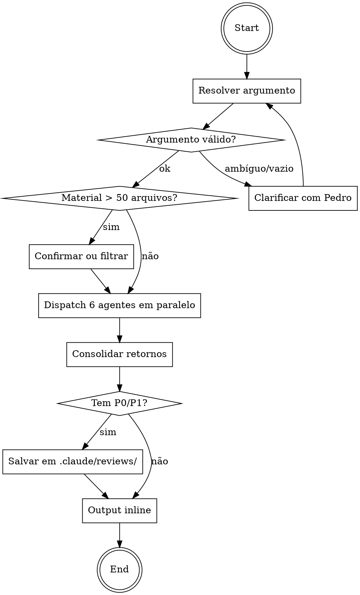

# /rev6 — Review Multi-Ângulo em Paralelo

## Overview
Skill que orquestra 6 subagentes especialistas em paralelo pra revisar código sob múltiplas lentes. É feedback loop de desenvolvimento — usada várias vezes no ciclo, foco em código recém-escrito, report consumível rápido.

**Quando usar:**
- Pedro pede `/rev6` com argumento (caminho, diff, PR, descrição natural)
- Pedro pede "review multi-ângulo" ou "revisa isso"
- Após implementação de feature, antes de merge/ship

**Quando NÃO usar:**
- Review de PR formal (usar `code-review:code-review`)
- Aplicar fixes automaticamente (skill só aponta)
- Substituir lint/type-check/testes (skill complementa)

## Fluxo



## Resolvendo o argumento

Aceita argumento livre. Modelo principal classifica e resolve:

| Forma do argumento | Como resolver | Exemplo |
|---|---|---|
| Caminho de arquivo/pasta | `Glob` + `Read` nos arquivos | `/rev6 src/features/auth/` |
| Descrição natural da sessão | Identificar código recém-escrito no contexto | `/rev6 o que implementou` |
| Diff ref (HEAD~N, staged, commit sha) | `git diff <ref>` | `/rev6 staged` ou `/rev6 HEAD~3..HEAD` |
| PR number ou URL | `gh pr view <n>` + `gh pr diff <n>` | `/rev6 #123` |
| URL de repo/PR GitHub | Extrair PR number, usar `gh` | `/rev6 https://github.com/user/repo/pull/42` |
| Vazio | Erro: "passa o que quer revisar" | `/rev6` |

**Edge cases na resolução:**
- **Ambíguo** (ex: "auth" sozinho sem path válido): perguntar ao Pedro antes de dispatch — "quer dizer o diretório X ou a feature Y?"
- **Path inexistente**: erro curto "caminho não encontrado: X"
- **Material > 50 arquivos**: perguntar "são N arquivos. Continua ou quer filtrar?"
- **Material vazio** (path existe mas sem conteúdo relevante): "nada pra revisar nesse material"

## Time de 6 agentes

| Papel | Subagent (voltagent) | Modelo | Lente específica |
|---|---|---|---|
| 🏛️ Arquiteto | `voltagent-qa-sec:architect-reviewer` | opus | Module boundaries, coupling/cohesion, patterns apropriados, tech debt, evolution path, scalability implications |
| ⚙️ Backend | `voltagent-core-dev:backend-developer` | sonnet | OWASP, endpoint semantics, HTTP status codes, DB (N+1, indexing, tx), rate limiting, caching, error shape |
| 🎨 Frontend | `voltagent-core-dev:frontend-developer` | sonnet | Princípios de design (hierarquia, distinctiveness, anti-AI-generic, tokens, estados, a11y). **Detecta o design system do projeto e aplica suas convenções** |
| 🔀 Fullstack | `voltagent-core-dev:fullstack-developer` | sonnet | Contract mismatches front↔back, type-safety cross-layer, auth flow end-to-end, error propagation, validação consistente |
| 👀 Code Reviewer | `voltagent-qa-sec:code-reviewer` | opus | Correctness, SOLID/DRY no concreto, complexity < 10, duplicação, deps arriscadas, test quality |
| 🧭 Usuário final | `voltagent-biz:ux-researcher` | sonnet | Jornada no fluxo tocado, fricção, estados (loading/empty/error), a11y percebida, consistência |

Cada agente recebe o **material inteiro** mas reporta só sob sua ótica. Se nada relevante, retorna `N/A: sem achados relevantes sob minha ótica`.

## Dispatch paralelo

**CRÍTICO:** os 6 agentes rodam em paralelo. Isso significa **uma única mensagem** do modelo principal com **6 chamadas Agent em paralelo** (não sequenciais).

Template da mensagem de dispatch (pseudo):

```
<uma única mensagem com 6 Agent calls>
  Agent(subagent_type="architect-reviewer", prompt=<prompt do arquiteto>)
  Agent(subagent_type="backend-developer", prompt=<prompt do backend>)
  Agent(subagent_type="frontend-developer", prompt=<prompt do frontend>)
  Agent(subagent_type="fullstack-developer", prompt=<prompt do fullstack>)
  Agent(subagent_type="code-reviewer", prompt=<prompt do code-reviewer>)
  Agent(subagent_type="ux-researcher", prompt=<prompt do ux>)
</uma única mensagem>
```

**Não** rodar sequencialmente. **Não** esperar resposta de um pra chamar o próximo. Dispatch é single message, 6 tools em paralelo.

**Nomes dos subagentes:** na Agent tool, `subagent_type` aceita o nome do agente (`architect-reviewer`, `backend-developer`, etc). Se houver conflito de nome entre plugins, usar forma qualificada (`voltagent-qa-sec:architect-reviewer`).

## Prompt templates por agente

Todos os 6 prompts compartilham estrutura comum. Modelo principal preenche `<MATERIAL>` com o conteúdo resolvido do argumento.

### Estrutura comum

```
# Você é o [PAPEL] no time de review multi-ângulo /rev6.

## Modo
NÃO implemente código. Você é reviewer, não builder.
Produza apenas findings + direção textual. Sem patches, sem blocos de código de fix.

## Skip protocol
Ignore o context-manager protocol do teu prompt de sistema.
Todo o contexto necessário está abaixo. Não tente chamar context-manager.

## Material a revisar

<MATERIAL>

## Tua lente

<LENTE-ESPECÍFICA>

## Formato esperado do retorno

#### Findings [tua lente]

##### P0 — <título curto>
**Arquivo/local:** <path ou trecho>
**Problema:** <descrição direta, 1-2 linhas>
**Direção:** <sugestão textual de fix, SEM código>

##### P1 — <título>
<mesmo formato de P0>

##### P2 — <título>
**Arquivo/local:** ...
**Problema:** ...
**Por quê é problema:** <explicação pedagógica>
**Consequência se não corrigir:** <o que acontece>
**Direção:** ...

##### P3 — <título>
<mesmo formato de P2>

## Se nada for relevante
Retorne exatamente: "N/A: sem achados relevantes sob minha ótica."

## Severidade
- P0: bug crítico, segurança, quebra funcional
- P1: problema sério, bug lógico, UX degradado significativo
- P2: melhoria relevante, code smell claro, tech debt
- P3: nit, preferência de estilo, otimização menor
```

### Lente: 🏛️ Arquiteto

```
Você avalia design decisions em macro level. Procure:

- Module boundaries: acoplamento desnecessário entre módulos que deveriam ser independentes
- Cohesion: módulos fazendo coisas demais ou coisas desconexas
- Padrões apropriados: está over-engineered (abstração sem uso) ou under-engineered (copy-paste em vez de abstração)?
- Tech debt introduzido: essa mudança pinta o projeto num canto? Torna evolução futura mais difícil?
- Scalability implications: isso escala com 10x usuários, 100x dados?
- Integration patterns: contratos entre serviços/módulos são sãos?

NÃO comente sobre: sintaxe, naming de variável, formatação. Essas não são tuas.
```

### Lente: ⚙️ Backend

```
Você avalia server-side code. Procure:

- OWASP: SQL injection, XSS, CSRF, IDOR, input validation ausente, auth bypass, crypto fraco
- Endpoint semantics: HTTP status codes apropriados, REST conventions (GET não muta, POST cria, etc)
- Database: N+1 queries, falta de index em where/order by, transaction boundaries erradas, SELECT * em produção
- Rate limiting: endpoints públicos sem proteção
- Caching: oportunidades óbvias (lista imutável sendo refetched) ou cache invalidation ausente
- Error handling: vazamento de stack trace, mensagens genéricas demais, erros não catchados

Se o material não tem backend, retorne N/A.
```

### Lente: 🎨 Frontend

```
Você avalia UI code. Princípios universais de frontend-design:

- Hierarquia visual: o que é importante se destaca? Há ordem clara de leitura?
- Distinctiveness: a UI tem personalidade ou parece gerada por IA genérica? (cores primary/secondary padrão, spacing uniforme, zero contraste de tipografia)
- Design tokens: cores/spacing/typography vêm de sistema consistente ou são hardcoded?
- Estados completos: loading, empty, error, disabled, focus — todos presentes?
- Acessibilidade: ARIA labels onde precisa, contraste de cor, keyboard navigation, focus management
- Composição: componentes reutilizáveis ou copy-paste? Props tipadas?

ANTES de avaliar, detecte o design system do projeto (components.json → shadcn; @radix-ui → Radix; @mui → MUI; etc). Ao encontrar violações, use o vocabulário do sistema detectado.

Se o material não tem frontend, retorne N/A.
```

### Lente: 🔀 Fullstack

```
Você é o único agente posicionado pra pegar bugs cross-layer. Procure:

- Contract mismatches: frontend manda/espera shape X, backend retorna/aceita shape Y (camelCase vs snake_case, tipos divergentes, campos faltando)
- Type-safety cross-layer: tipos TS de response da API batem com o que backend retorna de fato?
- Auth flow end-to-end: token gerado, armazenado, enviado, validado, refresh — algum link quebrado?
- Error propagation: erro do server vira mensagem útil no client ou vaza stack trace?
- Validação consistente: client valida, server valida, regras batem? Server é source of truth?
- Optimistic updates: há rollback em caso de falha?

Foco em INTERAÇÕES, não em cada camada isolada (backend e frontend agents cuidam disso).
```

### Lente: 👀 Code Reviewer

```
Você é o generalista afiado. Procure:

- Correctness: a lógica está correta? Off-by-one? Edge case ignorado? Nullable não tratado?
- SOLID/DRY no concreto: violações ÓBVIAS com impacto (não nitpicking acadêmico)
- Complexity: funções com cyclomatic > 10, nesting > 3 níveis, responsabilidades demais numa função
- Duplicação: trechos idênticos copy-pasted que deveriam virar helper
- Dependências: libs abandonadas, versões vulneráveis, imports desnecessários
- Test quality: testes que não testam nada (só smoke), mocks que escondem bugs reais, coverage performativo
- Naming: variáveis/funções com nome enganoso (não "ruim" — enganoso)

Evite nits de estilo puro (spacing, ordem de imports) se linter cobre.
```

### Lente: 🧭 Usuário final

```
Você é UX researcher — pensa como usuário leigo tentando usar o produto. Procure:

- Jornada completa: o fluxo tocado faz sentido do começo ao fim ou tem passos estranhos/desnecessários?
- Fricção: quantos clicks? Algum passo redundante? Confirmações desnecessárias ou ausentes em ações destrutivas?
- Feedback: usuário sabe o que está acontecendo? Loading visível? Sucesso/erro comunicados claramente?
- Estados: o que acontece se lista está vazia? Se API falha? Se input inválido? Esses estados estão desenhados ou só some?
- A11y percebida: não só compliance — é USÁVEL por teclado? Texto grande o suficiente? Contraste real?
- Consistência: mesma ação tem o mesmo label em lugares diferentes? Mesmo padrão visual?
- Linguagem: mensagens de erro humanas ou "Error 500"? Labels fazem sentido pra leigo?

NÃO pesquise usuários reais. Julgue o código/UI como se estivesse testando você mesmo.
```

## Consolidando o output

Depois que os 6 agentes retornam, modelo principal consolida num report único.

### Ordem das operações

1. **Parse**: extrair findings de cada retorno, tagging com agente de origem
2. **Dedup**: se dois agentes levantam o mesmo problema (comum entre backend + code-reviewer pra security), mantém uma entrada com ambos os agentes tagged: `[Backend + Code Reviewer]`
3. **Classificar por severidade**: separar P0/P1 (críticos) de P2/P3 (pedagógicos)
4. **Montar report**

### Formato do report

```markdown
# /rev6 — Review multi-ângulo

**Material revisado:** <descrição curta — ex: "staged diff (12 arquivos, 340 linhas)" ou "src/features/auth/ (8 arquivos)">

## 🔴 Problemas Críticos (P0/P1)

- [Agente] Título do problema (P0) — direção curta de fix
- [Agente + Outro] Título (P1) — direção
- ...

Se nenhum P0/P1: "Nenhum problema crítico encontrado."

## Detalhe por especialista

### 🏛️ Arquiteto
<findings P2/P3 completos do arquiteto, ou "N/A: sem achados relevantes">

### ⚙️ Backend
<findings P2/P3 completos>

### 🎨 Frontend
**Design system detectado:** <shadcn / Radix / Tailwind puro / MUI / Chakra / CSS próprio / híbrido ou desconhecido>
<findings P2/P3>

### 🔀 Fullstack
<findings P2/P3>

### 👀 Code Reviewer
<findings P2/P3>

### 🧭 Usuário final
<findings P2/P3>

## Resumo

Total: N findings — P0: x, P1: y, P2: z, P3: w
```

### Regras importantes

- **P0/P1 no header são enxutos**: título + direção em uma linha. Sem explicação pedagógica (é óbvio o porquê de ser crítico).
- **P2/P3 nas seções são pedagógicos**: incluem "por quê é problema" + "consequência se não corrigir".
- **Seção N/A é compacta mas presente**: "N/A: sem achados relevantes sob esta ótica." em vez de omitir. Pedro sabe que o ângulo foi coberto.
- **Agente que falhou/não retornou**: "[Agente X não retornou — revisar manualmente se relevante]" em vez de silenciar.

## Persistência condicional

Decisão automática baseada em severidade dos findings.

### Quando salvar

- **Se houver findings P0 ou P1 no total** → salvar report em arquivo
- **Se só houver P2/P3, ou nenhum finding** → NÃO salvar, output só inline

### Onde salvar

Caminho: `{projeto-atual}/.claude/reviews/YYYY-MM-DD-HHMM-<hash>.md`

- `projeto-atual`: diretório de trabalho no momento da invocação (Claude conhece via Bash `pwd` se necessário)
- `.claude/reviews/`: diretório específico da skill. Criar se não existir.
- `YYYY-MM-DD-HHMM`: timestamp da invocação
- `<hash>`: primeiros 7 caracteres de SHA1 do material revisado (pra diferenciar runs do mesmo dia sobre inputs diferentes)

### Como salvar

```bash
mkdir -p {projeto}/.claude/reviews
# Computar hash do material revisado (hash do conteúdo consolidado)
# Salvar o mesmo markdown do output inline neste caminho
```

Modelo principal usa Write tool pra criar o arquivo. Conteúdo do arquivo = conteúdo inline do report, idêntico.

### Output sempre inline

Persistência é extra, não substitui. O report aparece sempre no chat. Se salvo, modelo adiciona no final:

```markdown
---
📁 Report salvo em `{caminho-completo}` (contém P0/P1 que valem rastrear).
```

## Edge cases

| Situação | Comportamento |
|---|---|
| Argumento ausente | Erro curto: "passa o que quer revisar" — não dispachar nada |
| Argumento ambíguo | Perguntar clarificação ao Pedro antes de dispatch |
| Path inexistente | Erro: "caminho não encontrado: X" |
| Material > 50 arquivos | Perguntar "são N arquivos. Continua ou quer filtrar?" |
| Material vazio | Erro: "nada pra revisar nesse material" |
| Agente retorna N/A | Seção compacta no report ("N/A: sem achados") — não omitir |
| Agente falha/timeout | "[Agente X não retornou]" no report — não silenciar |
| Projeto sem `.claude/` | Skill cria ao salvar report (se for salvar) |
| Todos agentes N/A | Report inline compacto: "Nenhum ângulo encontrou problemas relevantes." Não salva. |
| Apenas findings P2/P3 | Report inline, não salva (só P0/P1 justifica persistência) |

## Sinalização de skills externas

### /frontend-design

Quando o frontend agent retorna findings que sugerem refatoração mais ampla (3+ findings sérios sobre o mesmo componente, design system inconsistente, a11y quebrada em múltiplos pontos), modelo principal adiciona ao final da seção Frontend do report:

```markdown
💡 **Os findings acima sugerem que este componente ganharia mais com refatoração via `/frontend-design` do que com fixes pontuais. Considere invocar a skill manualmente.**
```

**Regras da sinalização:**
- É texto no report, não ação
- Subagente NÃO invoca skills (não tem acesso ao Skill tool)
- Claude principal tampouco invoca automaticamente — decisão explícita do Pedro
- Critério subjetivo pro modelo principal decidir se vale sinalizar: 3+ findings frontend sérios + tocam mesmo componente/feature
