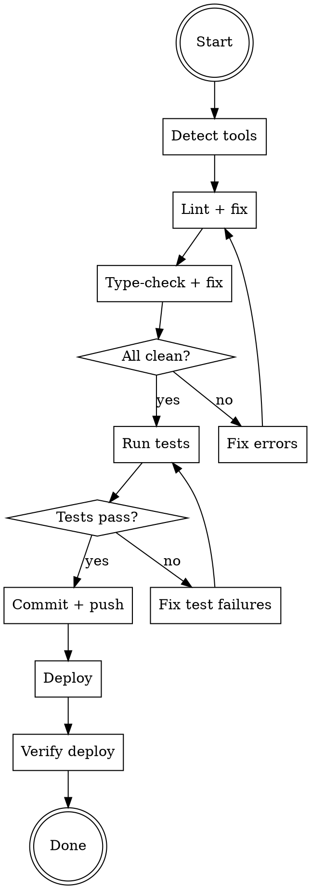

# Ship — Lint, Commit, Push, Deploy

## Overview
Single command to take verified code from local to production. Enforces quality gates at each step — if any step fails, stop and fix before continuing.

## Flow

## Process

### 1. Detect Project Tools

Check project config files to identify the right tools. Do NOT assume — read the configs.

| Look for | Tool |
|----------|------|
| **eslint.config.***, **.eslintrc.*** | ESLint |
| **biome.json** | Biome |
| **tsconfig.json** | tsc |
| **pyproject.toml** (ruff/mypy/pyright) | ruff, mypy, pyright |
| **setup.cfg**, **tox.ini** | flake8, mypy |

If the project has a `lint` or `check` script in **package.json** or **Makefile**, prefer that — it's already configured.

### 2. Lint + Type-Check (Fix ALL Errors)

Run lint and type-check. Fix ALL errors found — including pre-existing ones in files you touched or nearby. Zero errors is the target.

**Loop until clean:**
1. Run linter with auto-fix flag if available (`--fix`, `--unsafe-fix`)
2. Run type-checker
3. If errors remain, fix manually
4. Re-run both until zero errors

**Do NOT skip pre-existing errors.** If the linter reports it, fix it.

### 2.5. Run Tests (Hard Gate)

Detect and run the full test suite before committing anything.

| Look for | Tool |
|----------|------|
| `test` script in **package.json** | `npm test` (or `yarn test` / `pnpm test`) |
| `jest` / `vitest` / `mocha` in devDependencies | run directly if no script |
| `pytest` in **pyproject.toml** / **setup.cfg** | `pytest` |
| **Cargo.toml** | `cargo test` |
| **go.mod** | `go test ./...` |
| `test` target in **Makefile** | `make test` |

**If no test runner is found**, log a warning and continue — but note the absence.

**Loop until all pass:**
1. Run the full test suite
2. If all pass → advance to Commit + Push
3. If any fail → **stop here**
   - Report which tests failed and the exact errors
   - Fix the failures — pre-existing failures are **not acceptable** for deploy
   - Re-run until zero failures
   - Only then advance

**This gate cannot be bypassed.** Even if Pedro instructs to proceed with failing tests, do not advance. The correct path is: fix the failures, re-run the suite, then resume the ship flow.

> The `pre-deploy-test-check` hook (bundled with this plugin) enforces this gate at the harness level — it intercepts deploy commands and blocks them if the test suite fails.

### 3. Commit + Push

Follow the standard commit flow:
1. `git status` — review what changed
2. `git diff` — review the actual changes
3. `git log --oneline -5` — match commit message style
4. Stage specific files (no `git add -A` — avoid secrets/binaries)
5. Write a concise commit message (focus on "why")
6. `git push` to the current tracking branch

**If no tracking branch exists**, ask Pedro before pushing to a new remote branch.

### 4. Deploy

Deploy method depends on the project. Detect from:

| Look for | Deploy method |
|----------|--------------|
| **ecosystem.config.js**, PM2 in scripts | `pm2 restart` or `pm2 deploy` |
| **docker-compose.yml** | `docker compose up -d --build` |
| **Dockerfile** only | Build + deploy per project convention |
| **vercel.json**, `.vercel` | `vercel --prod` |
| **netlify.toml** | `netlify deploy --prod` |
| **deploy.sh**, **Makefile deploy** | Run the project's deploy script |
| SSH/VPS pattern in scripts | SSH deploy per project convention |

**If deploy method is unclear**, ask Pedro. Do NOT guess.

### 5. Verify Deploy

After deploy, verify the service is running:
- Check process status (pm2 status, docker ps, curl health endpoint)
- Verify config values survived the deploy (especially .env files on VPS)
- Show evidence to Pedro

**If verification fails**, diagnose and fix. Do not report as done.

## Safety Rules

- **Never deploy without passing lint + type-check first**
- **Never deploy with failing tests** — even pre-existing failures. If tests fail at gate 2.5, fix them before continuing. This gate cannot be bypassed.
- **Never force-push** without explicit permission
- **Check .env files** — they may be overwritten by git operations on VPS
- **Back up server-specific config** before `git reset --hard` or `git pull` on a server
- **Ask before deploying to production** if there's a staging environment available

## When NOT to Use

- Code hasn't been tested/verified yet — test first, ship after
- During a merge freeze (check project memory)
- When only documentation changed and no deploy is needed — just commit+push, skip deploy
